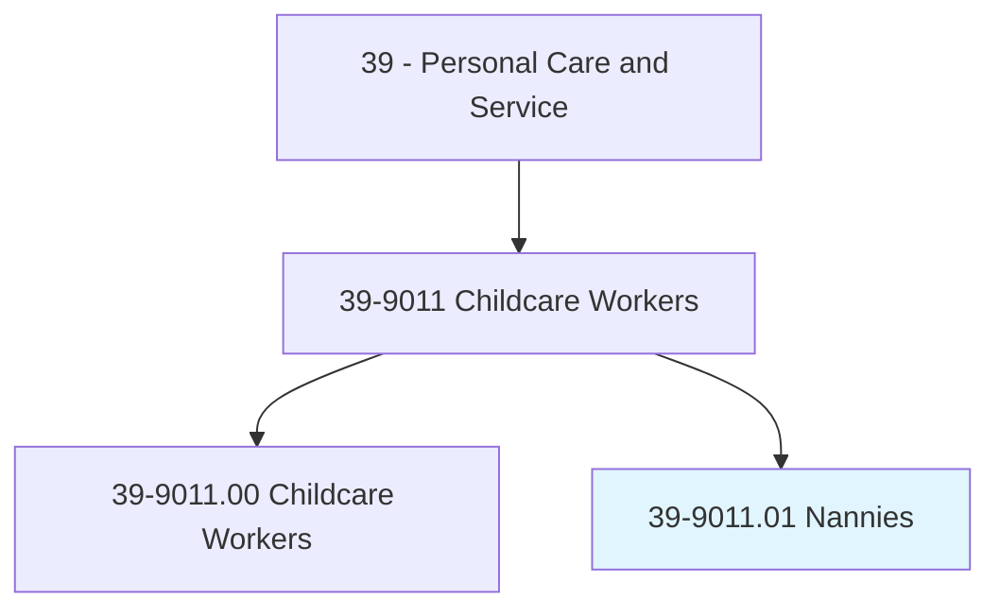
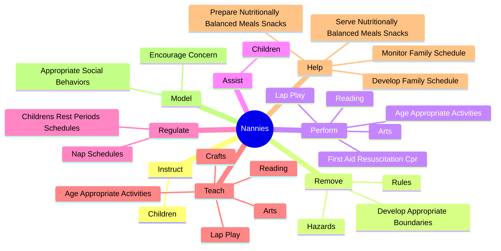
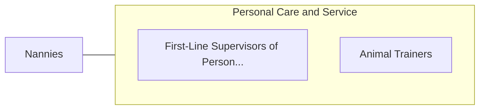

# Nannies

> Care for children in private households and provide support and expertise to parents in satisfying children's physical, emotional, intellectual, and social needs. Duties may include meal planning and preparation, laundry and clothing care, organization of play activities and outings, discipline, intellectual stimulation, language activities, and transportation.

## Overview

Nannies is a specialized variant within the Personal Care and Service category. Care for children in private households and provide support and expertise to parents in satisfying children's physical, emotional, intellectual, and social needs. 

## Classification Hierarchy

## Key Statistics

| Metric | Value |
|--------|-------|
| SOC Code | 39-9011.01 |
| Category | [Personal Care and Service](/occupations/PersonalService/index) |
| Task Count | 69 |
| Source | O*NET |

## Core Tasks

### instruct.Children

Nannies instruct children as part of their core responsibilities.

**Actions:**
- `instruct.Children.in.SafeBehavior`
- `instruct.Children.in.SeekingAdultAssistanceWhenCrossingStreet`
- `instruct.Children.in.AvoidingContact.with.UnsafeObjects`
- `instruct.Children.in.Development.of.HealthHabits`

### remove.Hazards

Nannies remove hazards as part of their core responsibilities.

**Actions:**
- `remove.Hazards.to.create.SafeEnvironmentForChildren`
- `remove.DevelopAppropriateBoundaries.to.create.SafeEnvironmentForChildren`
- `remove.Rules.to.create.SafeEnvironmentForChildren`

### perform.FirstAidResuscitationCpr

Nannies perform first aid resuscitation cpr as part of their core responsibilities.

**Actions:**
- `perform.FirstAidResuscitationCpr`
- `perform.AgeAppropriateActivities.to.encourage.IntellectualDevelopmentOfChildren`
- `perform.LapPlay.to.encourage.IntellectualDevelopmentOfChildren`
- `perform.Reading.to.encourage.IntellectualDevelopmentOfChildren`

## Skills & Competencies

### Technical Skills
- **Customer Service** - Advanced
- **Personal Care** - Advanced
- **Service Delivery** - Advanced

### Soft Skills
- **Communication** - Essential
- **Problem Solving** - Essential
- **Critical Thinking** - Important
- **Teamwork** - Important
- **Adaptability** - Important

## Related Occupations

## Industries

This occupation is found across multiple industries. See [Industries](/industries) for sector-specific employment data.

## Career Progression

---

*Source: O*NET 39-9011.01 - ONETOccupation*
