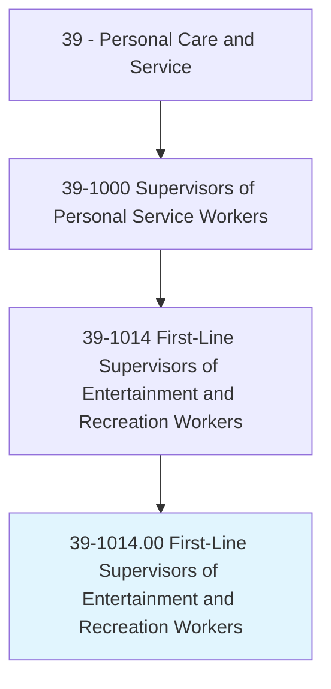
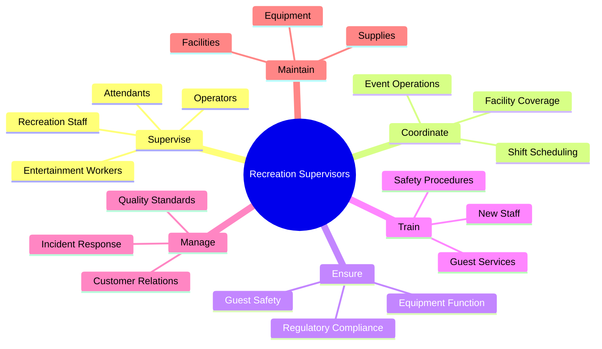
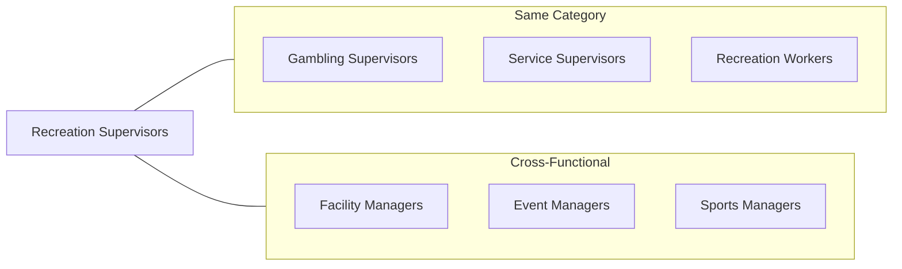
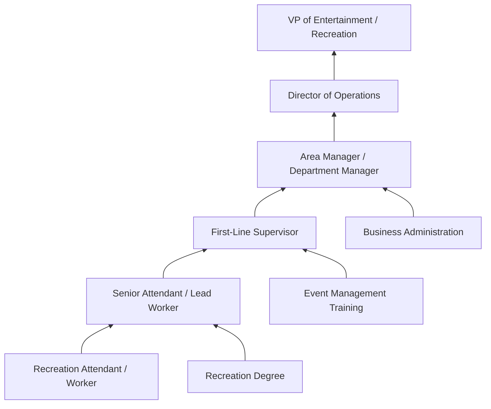

# First-Line Supervisors of Entertainment and Recreation Workers, Except Gambling Services

> Directly supervise and coordinate activities of entertainment and recreation related workers.

## Overview

First-Line Supervisors of Entertainment and Recreation Workers oversee staff who provide entertainment and recreational services to the public. They manage workers at amusement parks, sports venues, theaters, fitness centers, recreation facilities, and entertainment venues. These supervisors coordinate staffing, ensure safety compliance, maintain equipment, train employees, and create positive experiences for guests and patrons. They balance operational efficiency with the primary goal of delivering enjoyable, safe entertainment and recreation experiences.

## Classification Hierarchy



## Key Statistics

| Metric | Value |
|--------|-------|
| SOC Code | 39-1014.00 |
| Job Zone | 3 (Medium Preparation) |
| Category | [Personal Care and Service](/occupations/PersonalService/index) |
| Core Tasks | 12+ |
| Source | O*NET |

## Core Tasks



### supervise.RecreationWorkers

Recreation Supervisors direct and oversee entertainment and recreation staff operations.

**Actions:**
- `supervise.Attendants.to.ensure.GuestSatisfaction` - Monitor staff performance in guest interactions
- `supervise.RideOperators.to.maintain.SafetyStandards` - Oversee amusement ride operations
- `supervise.RecreationStaff.to.coordinate.Activities` - Direct recreation program delivery
- `supervise.Workers.to.ensure.QualityService` - Maintain entertainment service excellence

### coordinate.Operations

Supervisors manage scheduling and operational logistics for entertainment facilities.

**Actions:**
- `coordinate.ShiftScheduling.for.StaffCoverage` - Ensure adequate staffing across all areas
- `coordinate.EventOperations.for.SpecialPrograms` - Manage event-specific staffing and logistics
- `coordinate.FacilityCoverage.for.PeakPeriods` - Plan for high-traffic times
- `coordinate.Activities.between.Departments` - Ensure smooth interdepartmental operations

### ensure.GuestSafety

Supervisors prioritize safety across all entertainment and recreation activities.

**Actions:**
- `ensure.GuestSafety.through.ProcedureEnforcement` - Implement safety protocols
- `ensure.EquipmentFunction.through.RegularInspections` - Monitor attraction and equipment safety
- `ensure.RegulatoryCompliance.with.SafetyStandards` - Meet OSHA and industry requirements
- `ensure.EmergencyPreparedness.through.TrainingDrills` - Maintain readiness for incidents

### train.Staff

Supervisors develop employee skills and ensure consistent service delivery.

**Actions:**
- `train.NewEmployees.on.OperatingProcedures` - Onboard staff with facility-specific training
- `train.Staff.on.SafetyProtocols` - Ensure all workers understand safety requirements
- `train.Workers.on.GuestServiceStandards` - Develop customer service excellence
- `train.Team.on.EmergencyResponse` - Prepare staff for incident handling

### manage.CustomerRelations

Supervisors handle guest concerns and maintain positive visitor experiences.

**Actions:**
- `manage.CustomerComplaints.to.resolve.Issues` - Address guest concerns promptly
- `manage.GuestExperience.to.ensure.Satisfaction` - Monitor and improve visitor experiences
- `manage.IncidentResponse.to.protect.Guests` - Handle emergencies professionally
- `manage.Feedback.to.improve.Services` - Use guest input for continuous improvement

## Skills & Competencies

### Technical Skills
- **Safety Management** - Expert
- **Facility Operations** - Advanced
- **Equipment Maintenance Oversight** - Advanced
- **Event Coordination** - Advanced
- **Emergency Response** - Expert
- **Regulatory Compliance** - Advanced
- **Scheduling Systems** - Intermediate

### Soft Skills
- **Leadership** - Critical
- **Communication** - Critical
- **Problem Solving** - Essential
- **Customer Service** - Essential
- **Stress Management** - Essential
- **Team Building** - Important
- **Adaptability** - Important

## Related Occupations



## Industries

- [Arts, Entertainment, and Recreation](/industries/ArtsEntertainment) - Primary Employment
- [Amusement Parks and Arcades](/industries/Entertainment/RecreationIndustries/AmusementParks/index) - High Employment
- [Fitness and Recreation Centers](/industries/FitnessCenters) - High Employment
- [Spectator Sports](/industries/SpectatorSports) - Moderate Employment
- [Museums and Historical Sites](/industries/Museums) - Moderate Employment
- [Accommodation (Resorts)](/industries/Accommodation) - Moderate Employment

## Industry Variations

### Amusement and Theme Parks
Focus on ride operations, attraction safety, guest flow management, and entertainment show coordination. High emphasis on safety protocols and crowd management.

### Sports and Recreation Facilities
Supervision of fitness instructors, lifeguards, recreation coordinators, and facility attendants. Focus on program delivery and equipment maintenance.

### Entertainment Venues
Management of ushers, ticket takers, concession workers, and event staff. Emphasis on crowd control, guest services, and event execution.

### Outdoor Recreation
Oversight of guides, activity leaders, and facility staff at campgrounds, ski resorts, and adventure parks. Strong focus on safety and environmental compliance.

### Museums and Cultural Venues
Supervision of docents, tour guides, exhibit attendants, and visitor services staff. Focus on educational programming and preservation of exhibits.

### Cruise and Resort Entertainment
Coordination of entertainment staff, activity directors, and recreation workers in hospitality settings. Integration of guest experience across multiple venues.

## Career Progression



## Education & Training

| Requirement | Details |
|-------------|---------|
| Typical Education | High school diploma; associate's or bachelor's degree preferred for advancement |
| Work Experience | 2-4 years in entertainment, recreation, or hospitality |
| On-the-Job Training | Moderate - facility procedures, safety protocols, management training |
| Common Certifications | CPR/First Aid, Crowd Management, Industry-specific safety certifications |

## Safety and Compliance Requirements

| Requirement | Description |
|-------------|-------------|
| OSHA Compliance | Knowledge of workplace safety regulations |
| ADA Requirements | Understanding of accessibility standards |
| Industry Standards | ASTM (amusement rides), pool safety, fire codes |
| Emergency Training | First aid, evacuation procedures, incident response |
| Background Check | Required for positions involving minors |

## Departments

This occupation typically works in:
- [Guest Services](/departments/GuestServices)
- [Recreation Programs](/departments/RecreationPrograms)
- [Attractions Operations](/departments/Attractions)
- [Entertainment](/departments/Entertainment)
- [Facility Operations](/departments/FacilityOperations)

## GraphDL Semantic Structure

```
Namespace: occupations.org.ai
Entity: FirstLineSupervisorsOfEntertainmentAndRecreationWorkersExceptGamblingServices

Relationships:
- supervises.RecreationWorkers
- supervises.EntertainmentAttendants
- supervises.AmusementOperators
- coordinatesWith.FacilityManagement
- coordinatesWith.EventCoordinators
- reportsTo.OperationsManager
- ensures.GuestSafety
- manages.FacilityOperations
```

---

*Source: O*NET 39-1014.00 - ONETOccupation*
