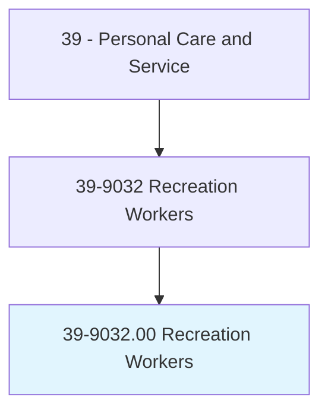
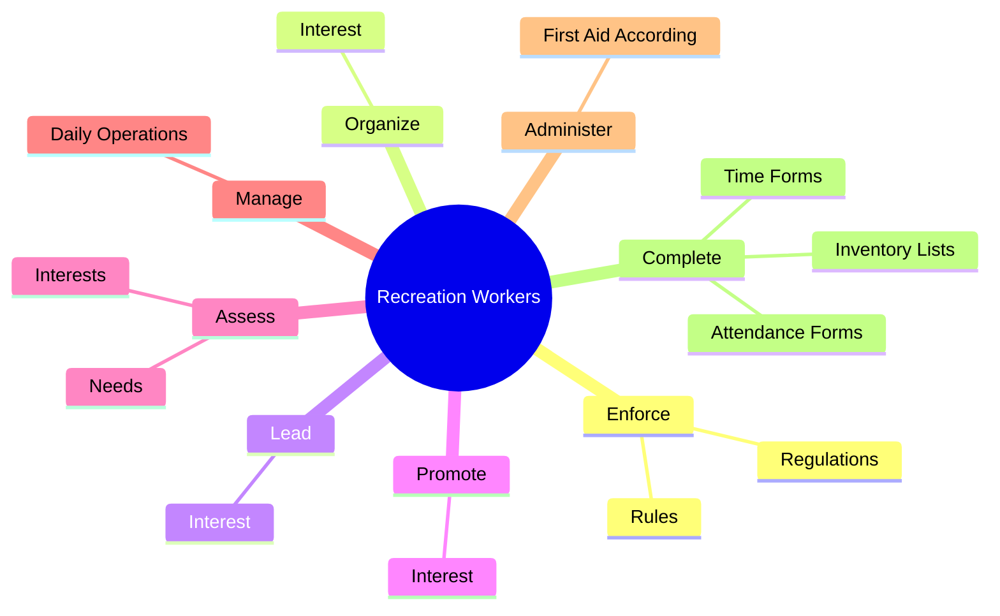
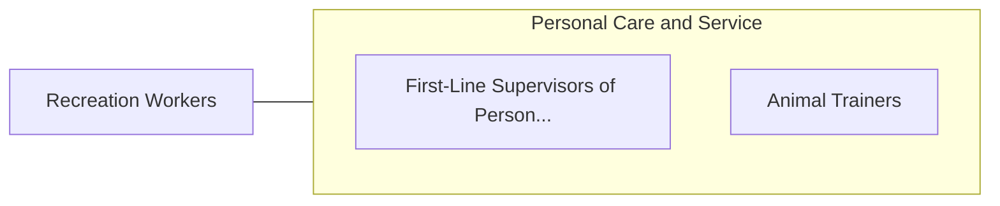

# Recreation Workers

> Conduct recreation activities with groups in public, private, or volunteer agencies or recreation facilities. Organize and promote activities, such as arts and crafts, sports, games, music, dramatics, social recreation, camping, and hobbies, taking into account the needs and interests of individual members.

## Overview

Recreation Workers is an occupation within the Personal Care and Service category. Conduct recreation activities with groups in public, private, or volunteer agencies or recreation facilities. 

## Classification Hierarchy

## Key Statistics

| Metric | Value |
|--------|-------|
| SOC Code | 39-9032.00 |
| Category | [Personal Care and Service](/occupations/PersonalService/index) |
| Task Count | 98 |
| Source | O*NET |

## Core Tasks

### enforce.Rules

Recreation Workers enforce rules as part of their core responsibilities.

**Actions:**
- `enforce.Rules.of.RecreationalFacilities.to.maintain.Discipline`
- `enforce.Rules.of.EnsureSafety`
- `enforce.Regulations.of.RecreationalFacilities.to.maintain.Discipline`
- `enforce.Regulations.of.EnsureSafety`

### organize.Interest

Recreation Workers organize interest as part of their core responsibilities.

**Actions:**
- `organize.Interest.in.RecreationalActivities`
- `organize.Interest.in.Arts`
- `organize.Interest.in.Crafts`
- `organize.Interest.in.Sports`

### lead.Interest

Recreation Workers lead interest as part of their core responsibilities.

**Actions:**
- `lead.Interest.in.RecreationalActivities`
- `lead.Interest.in.Arts`
- `lead.Interest.in.Crafts`
- `lead.Interest.in.Sports`

## Skills & Competencies

### Technical Skills
- **Customer Service** - Advanced
- **Personal Care** - Advanced
- **Service Delivery** - Advanced

### Soft Skills
- **Communication** - Essential
- **Problem Solving** - Essential
- **Critical Thinking** - Important
- **Teamwork** - Important
- **Adaptability** - Important

## Related Occupations

## Industries

This occupation is found across multiple industries. See [Industries](/industries) for sector-specific employment data.

## Career Progression

---

*Source: O*NET 39-9032.00 - ONETOccupation*
