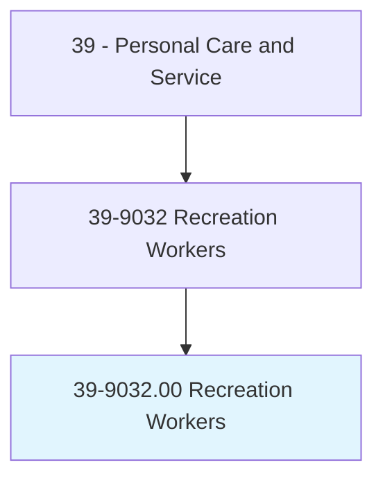
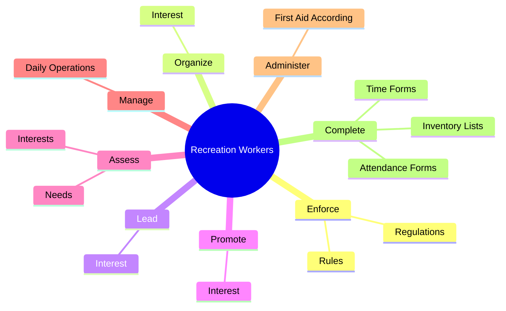
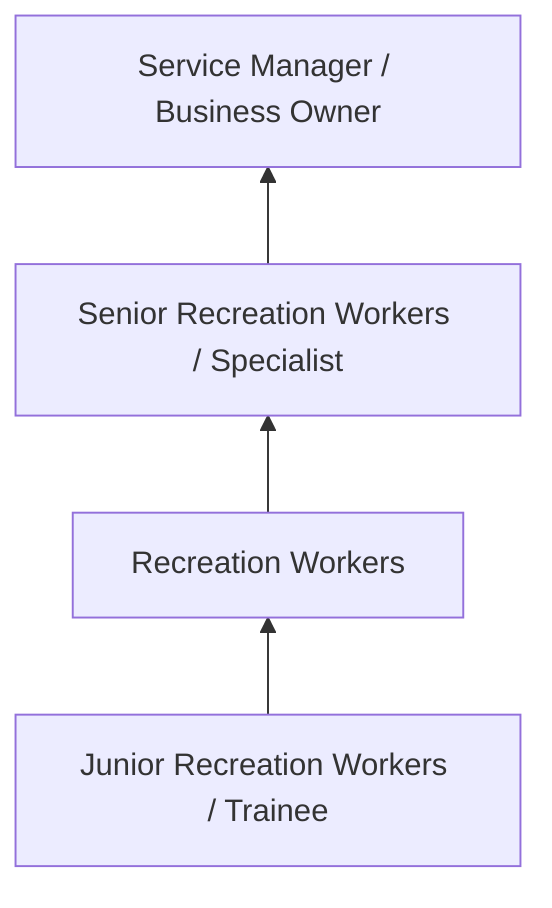
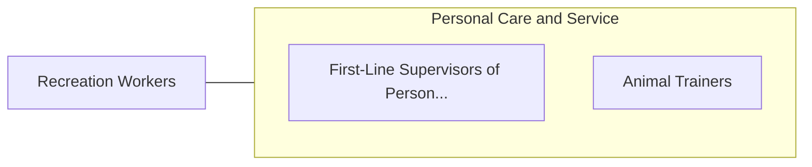

# Recreation Workers

> Conduct recreation activities with groups in public, private, or volunteer agencies or recreation facilities. Organize and promote activities, such as arts and crafts, sports, games, music, dramatics, social recreation, camping, and hobbies, taking into account the needs and interests of individual members.

## Overview

Recreation Workers professionals conduct recreation activities with groups in public, private, or volunteer agencies or recreation facilities. This occupation falls within the Personal Care and Service category and requires a combination of specialized knowledge, technical skills, and practical experience.

These professionals work across diverse settings and organizational contexts, applying their expertise to meet the demands of their field. They must stay current with industry standards, emerging practices, and regulatory requirements that affect their work. The role demands both independent judgment and collaborative skills, as practitioners regularly interact with colleagues, stakeholders, and the public.

As the field continues to evolve, Recreation Workers professionals increasingly leverage technology and data-driven approaches to enhance their effectiveness. Career opportunities span the public and private sectors, with demand influenced by economic conditions, demographic shifts, and technological advancement.

## Classification Hierarchy



## Key Statistics

| Metric | Value |
|--------|-------|
| SOC Code | 39-9032.00 |
| Job Zone | N/A |
| Category | [Personal Care and Service](/occupations/PersonalService/index) |
| Core Tasks | 98+ |
| Salary Range | $25,000 - $60,000 |
| Median Salary | $35,000 |
| Growth Outlook | 8% (Faster than average) |
| Source | O*NET |

## Core Tasks



### oversee.Purchase

Recreation Workers oversee purchase as part of their core responsibilities.

**Actions:**
- `oversee.Purchase.of.RecreationFacilities` - Oversee the purchase, planning, design, construction, and upkeep of recreatio...
- `oversee.Purchase.of.Areas` - Oversee the purchase, planning, design, construction, and upkeep of recreatio...
- `oversee.Planning.of.RecreationFacilities` - Oversee the purchase, planning, design, construction, and upkeep of recreatio...
- `oversee.Planning.of.Areas` - Oversee the purchase, planning, design, construction, and upkeep of recreatio...
- `oversee.Design.of.RecreationFacilities` - Oversee the purchase, planning, design, construction, and upkeep of recreatio...

### explain.Principles

Recreation Workers explain principles as part of their core responsibilities.

**Actions:**
- `explain.Principles.to.ParticipantsInRecreationalActivities` - Explain principles, techniques, and safety procedures to participants in recr...
- `explain.Principles.to.demonstrate.UseOfMaterials` - Explain principles, techniques, and safety procedures to participants in recr...
- `explain.Principles.to.Equipment` - Explain principles, techniques, and safety procedures to participants in recr...
- `explain.Techniques.to.ParticipantsInRecreationalActivities` - Explain principles, techniques, and safety procedures to participants in recr...
- `explain.Techniques.to.demonstrate.UseOfMaterials` - Explain principles, techniques, and safety procedures to participants in recr...

### assess.Needs

Recreation Workers assess needs as part of their core responsibilities.

**Actions:**
- `assess.Needs.of.IndividualsPlanActivitiesAccordingly` - Assess the needs and interests of individuals and groups and plan activities ...
- `assess.Needs.of.GroupsPlanActivitiesAccordingly` - Assess the needs and interests of individuals and groups and plan activities ...
- `assess.Needs.of.GivenAvailableEquipment` - Assess the needs and interests of individuals and groups and plan activities ...
- `assess.Needs.of.Facilities` - Assess the needs and interests of individuals and groups and plan activities ...
- `assess.Interests.of.IndividualsPlanActivitiesAccordingly` - Assess the needs and interests of individuals and groups and plan activities ...

### organize.Interest

Recreation Workers organize interest as part of their core responsibilities.

**Actions:**
- `organize.Interest.in.RecreationalActivities` - Organize, lead, and promote interest in recreational activities, such as arts...
- `organize.Interest.in.Arts` - Organize, lead, and promote interest in recreational activities, such as arts...
- `organize.Interest.in.Crafts` - Organize, lead, and promote interest in recreational activities, such as arts...
- `organize.Interest.in.Sports` - Organize, lead, and promote interest in recreational activities, such as arts...
- `organize.Interest.in.Games` - Organize, lead, and promote interest in recreational activities, such as arts...


## Skills & Competencies

### Technical Skills
- **Service Delivery** - Advanced
- **Customer Relations** - Advanced
- **Scheduling and Planning** - Proficient
- **Safety and Hygiene** - Proficient
- **Specialty Skills** - Proficient
- **Point-of-Sale Systems** - Proficient

### Soft Skills
- **Customer Service** - Critical
- **Communication** - Critical
- **Patience** - Essential
- **Adaptability** - Essential
- **Interpersonal Skills** - Essential

## Education & Certifications

| Requirement | Details |
|-------------|---------|
| Typical Education | High school diploma to post-secondary certificate |
| Work Experience | 0-2 years service experience |
| On-the-Job Training | Short to moderate - customer service and specialty skills |
| Certifications | State licensure for cosmetology, massage, etc. |

## Career Progression



## Industry Variations

### Hospitality and Leisure
Service delivery in hotels, resorts, and entertainment venues. Recreation Workers professionals focus on guest satisfaction and experience.

### Health and Wellness
Personal services supporting physical and mental well-being. Emphasis on client relationships and customized service.

### Retail and Consumer Services
Direct consumer-facing service delivery. Focus on customer experience and repeat business.

### Self-Employment
Independent service provision with entrepreneurial responsibilities including marketing, scheduling, and business management.

## Technology & Tools

- **Scheduling and booking software**
- **Point-of-sale systems**
- **Customer relationship management (CRM)**
- **Specialty service equipment**
- **Social media marketing tools**

## Related Occupations



## Industries

- [Personal and Laundry Services](/industries/PersonalServices) - High Employment
- Amusement and Recreation - High Employment
- [Accommodation](/industries/Accommodation) - Moderate Employment
- [Fitness and Wellness](/industries/Fitness) - Growing Employment

## Departments

This occupation typically works in:
- Guest Services
- Client Relations
- [Operations](/departments/Operations/index)

## GraphDL Semantic Structure

```graphdl
Recreation Workers perform:
- enforce.Rules.of.RecreationalFacilities.to.maintain.Discipline
- enforce.Rules.of.EnsureSafety
- enforce.Regulations.of.RecreationalFacilities.to.maintain.Discipline
- enforce.Regulations.of.EnsureSafety
- organize.Interest.in.RecreationalActivities
- organize.Interest.in.Arts
```

---

*Source: O*NET 39-9032.00 - ONETOccupation*
