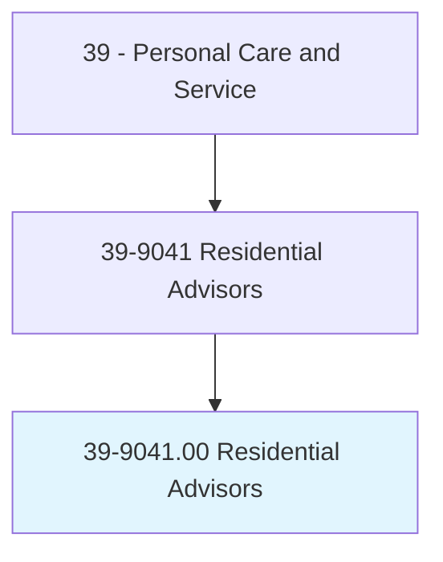
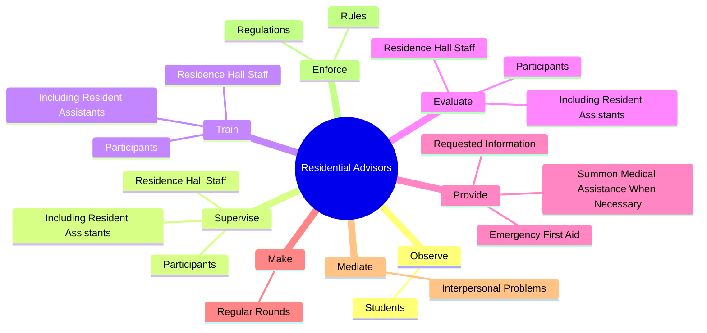
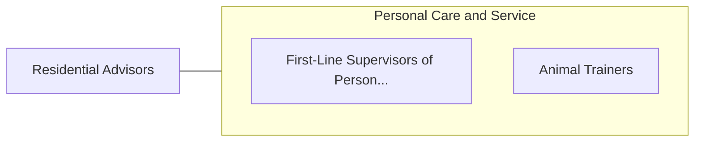

# Residential Advisors

> Coordinate activities in resident facilities in secondary school and college dormitories, group homes, or similar establishments. Order supplies and determine need for maintenance, repairs, and furnishings. May maintain household records and assign rooms. May assist residents with problem solving or refer them to counseling resources.

## Overview

Residential Advisors is an occupation within the Personal Care and Service category. Coordinate activities in resident facilities in secondary school and college dormitories, group homes, or similar establishments. Order supplies and determine need for maintenance, repairs, and furnishings.

## Classification Hierarchy

## Key Statistics

| Metric | Value |
|--------|-------|
| SOC Code | 39-9041.00 |
| Category | [Personal Care and Service](/occupations/PersonalService/index) |
| Task Count | 79 |
| Source | O*NET |

## Core Tasks

### observe.Students

Residential Advisors observe students as part of their core responsibilities.

**Actions:**
- `observe.Students.to.detect.UnusualBehavior`
- `observe.Students.to.report.UnusualBehavior`

### supervise.ResidenceHallStaff

Residential Advisors supervise residence hall staff as part of their core responsibilities.

**Actions:**
- `supervise.ResidenceHallStaff.in.WorkStudyPrograms`
- `supervise.ResidenceHallStaff.in.OtherStudentWorkers`
- `supervise.IncludingResidentAssistants.in.WorkStudyPrograms`
- `supervise.IncludingResidentAssistants.in.OtherStudentWorkers`

### train.ResidenceHallStaff

Residential Advisors train residence hall staff as part of their core responsibilities.

**Actions:**
- `train.ResidenceHallStaff.in.WorkStudyPrograms`
- `train.ResidenceHallStaff.in.OtherStudentWorkers`
- `train.IncludingResidentAssistants.in.WorkStudyPrograms`
- `train.IncludingResidentAssistants.in.OtherStudentWorkers`

## Skills & Competencies

### Technical Skills
- **Customer Service** - Advanced
- **Personal Care** - Advanced
- **Service Delivery** - Advanced

### Soft Skills
- **Communication** - Essential
- **Problem Solving** - Essential
- **Critical Thinking** - Important
- **Teamwork** - Important
- **Adaptability** - Important

## Related Occupations

## Industries

This occupation is found across multiple industries. See [Industries](/industries) for sector-specific employment data.

## Career Progression

---

*Source: O*NET 39-9041.00 - ONETOccupation*
