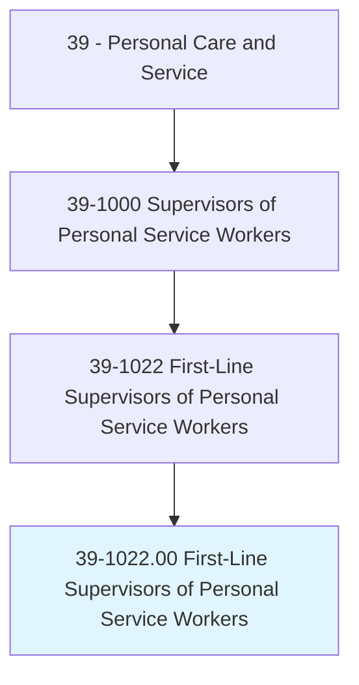
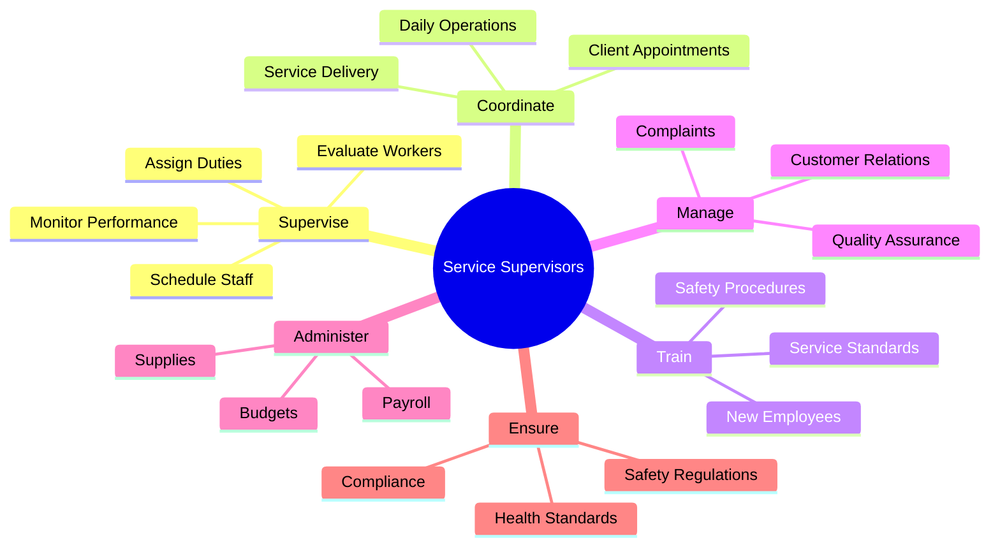
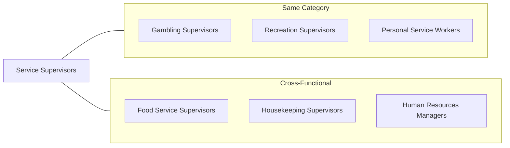
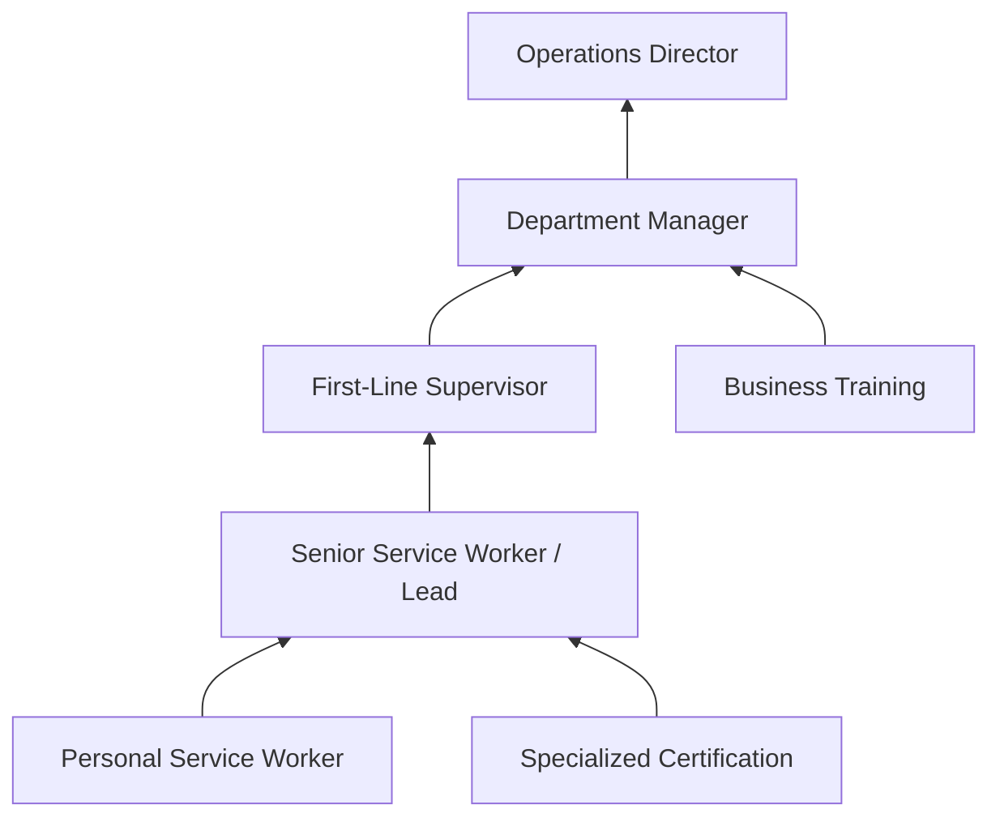

# First-Line Supervisors of Personal Service Workers

> Supervise and coordinate activities of personal service workers.

## Overview

First-Line Supervisors of Personal Service Workers oversee and coordinate the daily activities of workers who provide personal services to clients and customers. This broad supervisory role spans diverse settings including spas, salons, funeral homes, childcare facilities, fitness centers, and hospitality establishments. These supervisors ensure service quality, manage schedules, train staff, handle customer concerns, and maintain compliance with health and safety regulations. They bridge operational management with hands-on service delivery, often stepping in to assist during peak periods.

## Classification Hierarchy



## Key Statistics

| Metric | Value |
|--------|-------|
| SOC Code | 39-1022.00 |
| Job Zone | 3 (Medium Preparation) |
| Category | [Personal Care and Service](/occupations/PersonalService) |
| Core Tasks | 12+ |
| Source | O*NET |

## Core Tasks



### supervise.PersonalServiceWorkers

First-Line Supervisors direct and oversee the work of personal service staff to ensure quality service delivery.

**Actions:**
- `supervise.PersonalServiceWorkers.to.ensure.QualityServiceDelivery` - Monitor staff performance for service excellence
- `supervise.Staff.to.coordinate.DailyOperations` - Oversee day-to-day service activities
- `supervise.Workers.to.maintain.ServiceStandards` - Enforce organizational quality standards

### schedule.Staff

Supervisors create and manage work schedules to ensure adequate coverage for service demands.

**Actions:**
- `schedule.Staff.for.Shifts` - Assign workers to appropriate shifts
- `schedule.Appointments.for.Clients` - Manage customer booking systems
- `schedule.Coverage.for.PeakPeriods` - Ensure staffing during busy times

### train.Employees

Supervisors develop staff skills through training and mentorship programs.

**Actions:**
- `train.NewEmployees.on.Procedures` - Onboard new hires with company policies
- `train.Staff.on.ServiceTechniques` - Develop specialized service skills
- `train.Workers.on.SafetyProtocols` - Ensure compliance with health and safety requirements

### handle.CustomerComplaints

Supervisors resolve customer issues and maintain client satisfaction.

**Actions:**
- `handle.CustomerComplaints.to.resolve.Issues` - Address and resolve service problems
- `handle.ClientConcerns.to.ensure.Satisfaction` - Maintain positive customer relationships
- `handle.Feedback.to.improve.Services` - Use input to enhance service quality

### manage.Operations

Supervisors oversee administrative and operational aspects of service delivery.

**Actions:**
- `manage.Budgets.for.Department` - Control departmental spending
- `manage.Supplies.for.Operations` - Maintain adequate inventory
- `manage.Payroll.for.Staff` - Process employee compensation

## Skills & Competencies

### Technical Skills
- **Staff Scheduling** - Advanced
- **Customer Service Management** - Expert
- **Quality Assurance** - Advanced
- **Budget Management** - Intermediate
- **Inventory Control** - Intermediate
- **Regulatory Compliance** - Advanced

### Soft Skills
- **Leadership** - Critical
- **Communication** - Critical
- **Conflict Resolution** - Essential
- **Problem Solving** - Essential
- **Time Management** - Essential
- **Empathy** - Important

## Related Occupations



## Industries

- [Other Services (except Public Administration)](/industries/OtherServices) - High Employment
- [Accommodation and Food Services](/industries/AccommodationFood) - High Employment
- [Health Care and Social Assistance](/industries/Healthcare) - Moderate Employment
- [Arts, Entertainment, and Recreation](/industries/ArtsEntertainment) - Moderate Employment
- [Retail Trade](/industries/RetailTrade) - Moderate Employment

## Industry Variations

### Spa and Salon Industry
Focus on beauty service coordination, product inventory, and client relationship management. Requires knowledge of cosmetology licensing and health regulations.

### Childcare Services
Emphasis on child safety, staff-to-child ratios, parent communication, and educational programming compliance.

### Fitness and Wellness
Coordination of personal trainers, group fitness instructors, and wellness staff. Focus on membership services and equipment maintenance.

### Funeral Services
Supervision of funeral attendants, coordination with families, and ensuring dignified service delivery during sensitive situations.

### Hospitality
Oversight of concierge, bellhop, and guest services staff. Focus on guest satisfaction and luxury service standards.

## Career Progression



## Education & Training

| Requirement | Details |
|-------------|---------|
| Typical Education | High school diploma; some positions prefer associate's degree |
| Work Experience | 2-5 years in personal services or related field |
| On-the-Job Training | Moderate - company-specific procedures and management training |
| Common Certifications | Industry-specific certifications (cosmetology, childcare, fitness) |

## Departments

This occupation typically works in:
- [Guest Services](/departments/GuestServices)
- [Spa and Wellness](/departments/SpaWellness)
- [Client Services](/departments/ClientServices)
- [Operations](/departments/Operations)

## GraphDL Semantic Structure

```
Namespace: occupations.org.ai
Entity: FirstLineSupervisorsOfPersonalServiceWorkers

Relationships:
- supervises.PersonalServiceWorkers
- coordinatesWith.DepartmentManagers
- reportsTo.OperationsDirector
- ensures.ServiceQuality
- manages.StaffScheduling
```

---

*Source: O*NET 39-1022.00 - ONETOccupation*
