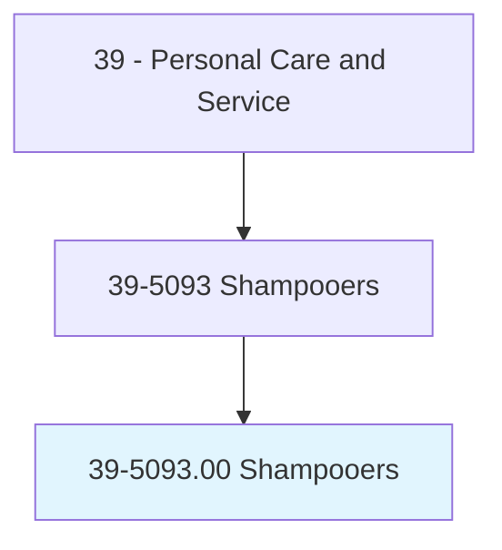
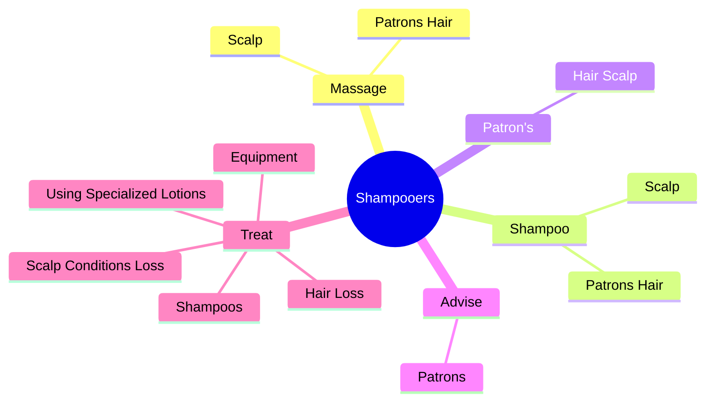
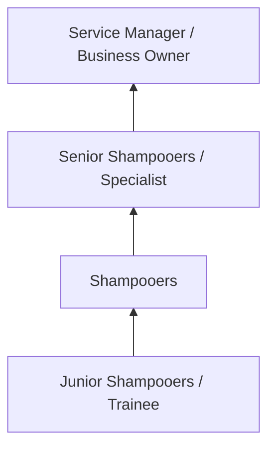
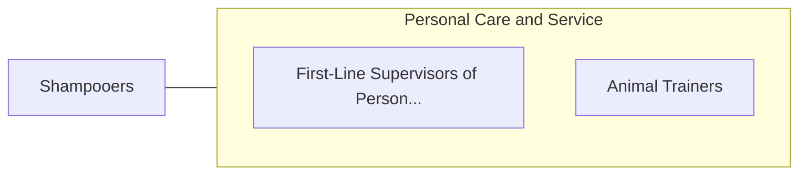

# Shampooers

> Shampoo and rinse customers' hair.

## Overview

Shampooers professionals serve a vital function within the Personal Care and Service field. They bring specialized skills and knowledge to their roles, contributing to organizational objectives and societal needs.

These practitioners work in varied environments, adapting their expertise to meet specific requirements of their industry and employer. The role requires ongoing professional development to maintain competency and respond to changing demands.

Career paths in this field offer opportunities for advancement through experience, additional education, and specialized certifications. Employment prospects are influenced by industry trends, technological change, and workforce demographics.

## Classification Hierarchy



## Key Statistics

| Metric | Value |
|--------|-------|
| SOC Code | 39-5093.00 |
| Job Zone | N/A |
| Category | [Personal Care and Service](/occupations/PersonalService/index) |
| Core Tasks | 18+ |
| Salary Range | $25,000 - $60,000 |
| Median Salary | $35,000 |
| Growth Outlook | 8% (Faster than average) |
| Source | O*NET |

## Core Tasks



### treat.ScalpConditionsLoss

Shampooers treat scalp conditions loss as part of their core responsibilities.

**Actions:**
- `treat.ScalpConditionsLoss` - Treat scalp conditions and hair loss, using specialized lotions, shampoos, or...
- `treat.HairLoss` - Treat scalp conditions and hair loss, using specialized lotions, shampoos, or...
- `treat.UsingSpecializedLotions` - Treat scalp conditions and hair loss, using specialized lotions, shampoos, or...
- `treat.Shampoos` - Treat scalp conditions and hair loss, using specialized lotions, shampoos, or...
- `treat.Equipment` - Treat scalp conditions and hair loss, using specialized lotions, shampoos, or...

### massage.PatronsHair

Shampooers massage patrons hair as part of their core responsibilities.

**Actions:**
- `massage.PatronsHair.to.clean.Them` - Massage, shampoo, and condition patron's hair and scalp to clean them and rem...
- `massage.PatronsHair.to.remove.ExcessOil` - Massage, shampoo, and condition patron's hair and scalp to clean them and rem...
- `massage.Scalp.to.clean.Them` - Massage, shampoo, and condition patron's hair and scalp to clean them and rem...
- `massage.Scalp.to.remove.ExcessOil` - Massage, shampoo, and condition patron's hair and scalp to clean them and rem...

### shampoo.PatronsHair

Shampooers shampoo patrons hair as part of their core responsibilities.

**Actions:**
- `shampoo.PatronsHair.to.clean.Them` - Massage, shampoo, and condition patron's hair and scalp to clean them and rem...
- `shampoo.PatronsHair.to.remove.ExcessOil` - Massage, shampoo, and condition patron's hair and scalp to clean them and rem...
- `shampoo.Scalp.to.clean.Them` - Massage, shampoo, and condition patron's hair and scalp to clean them and rem...
- `shampoo.Scalp.to.remove.ExcessOil` - Massage, shampoo, and condition patron's hair and scalp to clean them and rem...

### advise.Patrons

Shampooers advise patrons as part of their core responsibilities.

**Actions:**
- `advise.Patrons.with.ChronicContagiousScalpConditions.to.seek.MedicalTreatment` - Advise patrons with chronic or potentially contagious scalp conditions to see...
- `advise.Patrons.with.PotentiallyContagiousScalpConditions.to.seek.MedicalTreatment` - Advise patrons with chronic or potentially contagious scalp conditions to see...


## Skills & Competencies

### Technical Skills
- **Service Delivery** - Advanced
- **Customer Relations** - Advanced
- **Scheduling and Planning** - Proficient
- **Safety and Hygiene** - Proficient
- **Specialty Skills** - Proficient
- **Point-of-Sale Systems** - Proficient

### Soft Skills
- **Customer Service** - Critical
- **Communication** - Critical
- **Patience** - Essential
- **Adaptability** - Essential
- **Interpersonal Skills** - Essential

## Education & Certifications

| Requirement | Details |
|-------------|---------|
| Typical Education | High school diploma to post-secondary certificate |
| Work Experience | 0-2 years service experience |
| On-the-Job Training | Short to moderate - customer service and specialty skills |
| Certifications | State licensure for cosmetology, massage, etc. |

## Career Progression



## Industry Variations

### Hospitality and Leisure
Service delivery in hotels, resorts, and entertainment venues. Shampooers professionals focus on guest satisfaction and experience.

### Health and Wellness
Personal services supporting physical and mental well-being. Emphasis on client relationships and customized service.

### Retail and Consumer Services
Direct consumer-facing service delivery. Focus on customer experience and repeat business.

### Self-Employment
Independent service provision with entrepreneurial responsibilities including marketing, scheduling, and business management.

## Technology & Tools

- **Scheduling and booking software**
- **Point-of-sale systems**
- **Customer relationship management (CRM)**
- **Specialty service equipment**
- **Social media marketing tools**

## Related Occupations



## Industries

- [Personal and Laundry Services](/industries/PersonalServices) - High Employment
- [Amusement and Recreation](/industries/Recreation) - High Employment
- [Accommodation](/industries/Accommodation) - Moderate Employment
- [Fitness and Wellness](/industries/Fitness) - Growing Employment

## Departments

This occupation typically works in:
- [Guest Services](/departments/GuestServices)
- [Client Relations](/departments/ClientRelations)
- [Operations](/departments/Operations/index)

## GraphDL Semantic Structure

```
Shampooers perform:
- massage.PatronsHair.to.clean.Them
- massage.PatronsHair.to.remove.ExcessOil
- massage.Scalp.to.clean.Them
- massage.Scalp.to.remove.ExcessOil
- shampoo.PatronsHair.to.clean.Them
- shampoo.PatronsHair.to.remove.ExcessOil
```

---

*Source: O*NET 39-5093.00 - ONETOccupation*
