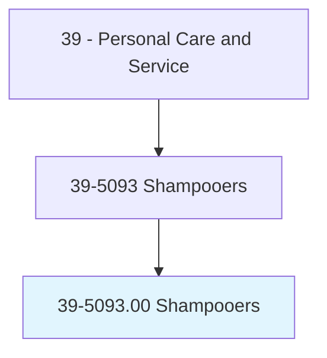
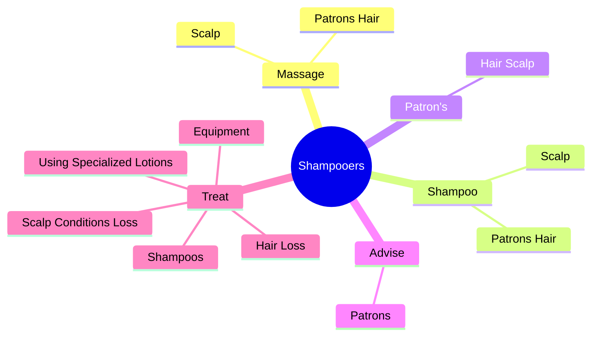
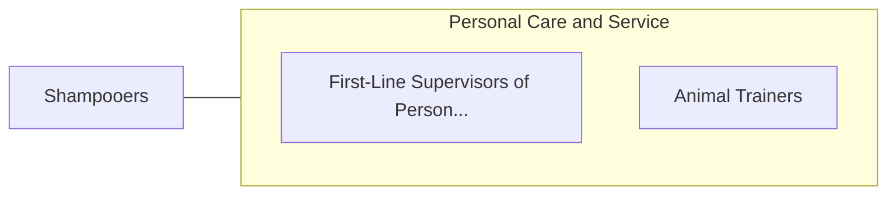

# Shampooers

> Shampoo and rinse customers' hair.

## Overview

Shampooers is classified under Personal Care and Service (SOC 39). Shampoo and rinse customers' hair.

## Classification Hierarchy

## Key Statistics

| Metric | Value |
|--------|-------|
| SOC Code | 39-5093.00 |
| Category | [Personal Care and Service](/occupations/PersonalService) |
| Task Count | 18 |
| Source | O*NET |

## Core Tasks

### massage.PatronsHair

Shampooers massage patrons hair as part of their core responsibilities.

**Actions:**
- `massage.PatronsHair.to.clean.Them`
- `massage.PatronsHair.to.remove.ExcessOil`
- `massage.Scalp.to.clean.Them`
- `massage.Scalp.to.remove.ExcessOil`

### shampoo.PatronsHair

Shampooers shampoo patrons hair as part of their core responsibilities.

**Actions:**
- `shampoo.PatronsHair.to.clean.Them`
- `shampoo.PatronsHair.to.remove.ExcessOil`
- `shampoo.Scalp.to.clean.Them`
- `shampoo.Scalp.to.remove.ExcessOil`

### patron's.HairScalp

Shampooers patron's hair scalp as part of their core responsibilities.

**Actions:**
- `patron's.HairScalp.to.clean.ThemRemoveExcessOil`

## Skills & Competencies

### Technical Skills
- **Customer Service** - Advanced
- **Personal Care** - Advanced
- **Service Delivery** - Advanced

### Soft Skills
- **Communication** - Essential
- **Problem Solving** - Essential
- **Critical Thinking** - Important
- **Teamwork** - Important
- **Adaptability** - Important

## Related Occupations

## Industries

This occupation is found across multiple industries. See [Industries](/industries) for sector-specific employment data.

## Career Progression

---

*Source: O*NET 39-5093.00 - ONETOccupation*
