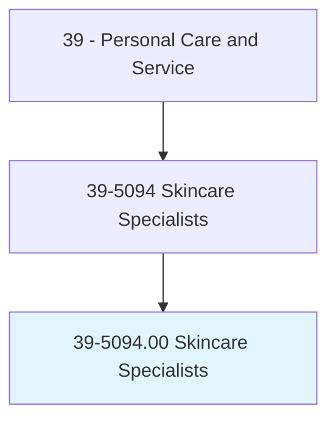
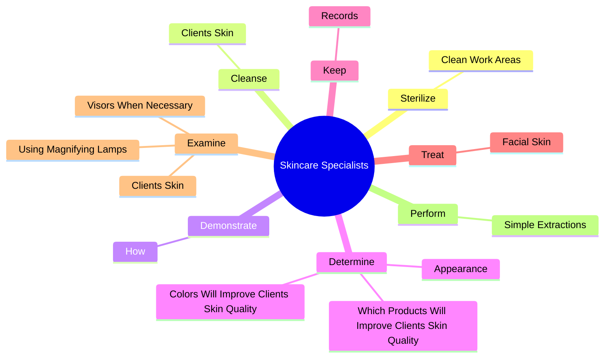
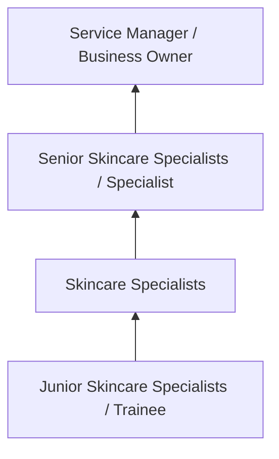
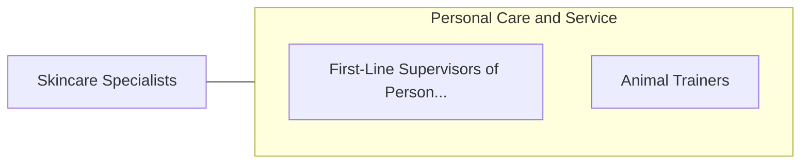

# Skincare Specialists

> Provide skincare treatments to face and body to enhance an individual's appearance. Includes electrologists and laser hair removal specialists.

## Overview

Skincare Specialists professionals provide skincare treatments to face and body to enhance an individual's appearance. This occupation falls within the Personal Care and Service category and requires a combination of specialized knowledge, technical skills, and practical experience.

These professionals work across diverse settings and organizational contexts, applying their expertise to meet the demands of their field. They must stay current with industry standards, emerging practices, and regulatory requirements that affect their work. The role demands both independent judgment and collaborative skills, as practitioners regularly interact with colleagues, stakeholders, and the public.

As the field continues to evolve, Skincare Specialists professionals increasingly leverage technology and data-driven approaches to enhance their effectiveness. Career opportunities span the public and private sectors, with demand influenced by economic conditions, demographic shifts, and technological advancement.

## Classification Hierarchy



## Key Statistics

| Metric | Value |
|--------|-------|
| SOC Code | 39-5094.00 |
| Job Zone | N/A |
| Category | [Personal Care and Service](/occupations/PersonalService/index) |
| Core Tasks | 52+ |
| Salary Range | $25,000 - $60,000 |
| Median Salary | $35,000 |
| Growth Outlook | 8% (Faster than average) |
| Source | O*NET |

## Core Tasks



### treat.FacialSkin

Skincare Specialists treat facial skin as part of their core responsibilities.

**Actions:**
- `treat.FacialSkin.to.maintain.Appearance` - Treat the facial skin to maintain and improve its appearance, using specializ...
- `treat.FacialSkin.to.improve.Appearance` - Treat the facial skin to maintain and improve its appearance, using specializ...
- `treat.FacialSkin.to.UsingSpecializedTechniques` - Treat the facial skin to maintain and improve its appearance, using specializ...
- `treat.FacialSkin.to.Products` - Treat the facial skin to maintain and improve its appearance, using specializ...
- `treat.FacialSkin.to.peels` - Treat the facial skin to maintain and improve its appearance, using specializ...

### examine.ClientsSkin

Skincare Specialists examine clients skin as part of their core responsibilities.

**Actions:**
- `examine.ClientsSkin.to.evaluate.SkinCondition` - Examine clients' skin, using magnifying lamps or visors when necessary, to ev...
- `examine.ClientsSkin.to.Appearance` - Examine clients' skin, using magnifying lamps or visors when necessary, to ev...
- `examine.UsingMagnifyingLamps.to.evaluate.SkinCondition` - Examine clients' skin, using magnifying lamps or visors when necessary, to ev...
- `examine.UsingMagnifyingLamps.to.Appearance` - Examine clients' skin, using magnifying lamps or visors when necessary, to ev...
- `examine.VisorsWhenNecessary.to.evaluate.SkinCondition` - Examine clients' skin, using magnifying lamps or visors when necessary, to ev...

### apply.CosmeticProducts

Skincare Specialists apply cosmetic products as part of their core responsibilities.

**Actions:**
- `apply.CosmeticProducts` - Select and apply cosmetic products, such as creams, lotions, and tonics.
- `apply.Creams` - Select and apply cosmetic products, such as creams, lotions, and tonics.
- `apply.Lotions` - Select and apply cosmetic products, such as creams, lotions, and tonics.
- `apply.Tonics` - Select and apply cosmetic products, such as creams, lotions, and tonics.
- `apply.ChemicalPeels.to.reduce.FineLinesSpots` - Apply chemical peels to reduce fine lines and age spots.

### select.CosmeticProducts

Skincare Specialists select cosmetic products as part of their core responsibilities.

**Actions:**
- `select.CosmeticProducts` - Select and apply cosmetic products, such as creams, lotions, and tonics.
- `select.Creams` - Select and apply cosmetic products, such as creams, lotions, and tonics.
- `select.Lotions` - Select and apply cosmetic products, such as creams, lotions, and tonics.
- `select.Tonics` - Select and apply cosmetic products, such as creams, lotions, and tonics.


## Skills & Competencies

### Technical Skills
- **Service Delivery** - Advanced
- **Customer Relations** - Advanced
- **Scheduling and Planning** - Proficient
- **Safety and Hygiene** - Proficient
- **Specialty Skills** - Proficient
- **Point-of-Sale Systems** - Proficient

### Soft Skills
- **Customer Service** - Critical
- **Communication** - Critical
- **Patience** - Essential
- **Adaptability** - Essential
- **Interpersonal Skills** - Essential

## Education & Certifications

| Requirement | Details |
|-------------|---------|
| Typical Education | High school diploma to post-secondary certificate |
| Work Experience | 0-2 years service experience |
| On-the-Job Training | Short to moderate - customer service and specialty skills |
| Certifications | State licensure for cosmetology, massage, etc. |

## Career Progression



## Industry Variations

### Hospitality and Leisure
Service delivery in hotels, resorts, and entertainment venues. Skincare Specialists professionals focus on guest satisfaction and experience.

### Health and Wellness
Personal services supporting physical and mental well-being. Emphasis on client relationships and customized service.

### Retail and Consumer Services
Direct consumer-facing service delivery. Focus on customer experience and repeat business.

### Self-Employment
Independent service provision with entrepreneurial responsibilities including marketing, scheduling, and business management.

## Technology & Tools

- **Scheduling and booking software**
- **Point-of-sale systems**
- **Customer relationship management (CRM)**
- **Specialty service equipment**
- **Social media marketing tools**

## Related Occupations



## Industries

- [Personal and Laundry Services](/industries/PersonalServices) - High Employment
- [Amusement and Recreation](/industries/Recreation) - High Employment
- [Accommodation](/industries/Accommodation) - Moderate Employment
- [Fitness and Wellness](/industries/Fitness) - Growing Employment

## Departments

This occupation typically works in:
- [Guest Services](/departments/GuestServices)
- [Client Relations](/departments/ClientRelations)
- [Operations](/departments/Operations/index)

## GraphDL Semantic Structure

```
Skincare Specialists perform:
- sterilize.CleanWorkAreas
- cleanse.ClientsSkin.with.Water
- cleanse.ClientsSkin.with.Creams
- cleanse.ClientsSkin.with.Lotions
- demonstrate.How.to.clean.ForSkinProperlyRecommendSkinCareRegimens
- demonstrate.How.to.care.ForSkinProperlyRecommendSkinCareRegimens
```

---

*Source: O*NET 39-5094.00 - ONETOccupation*
