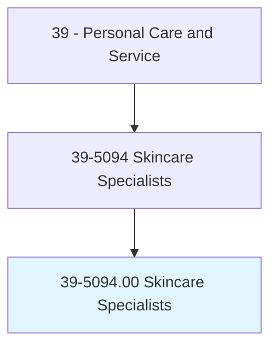
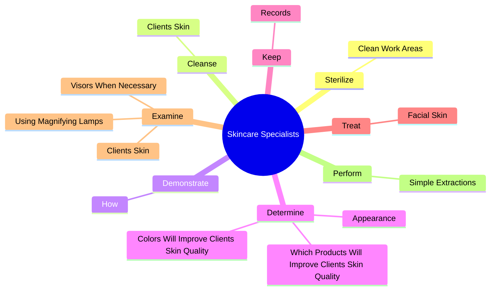
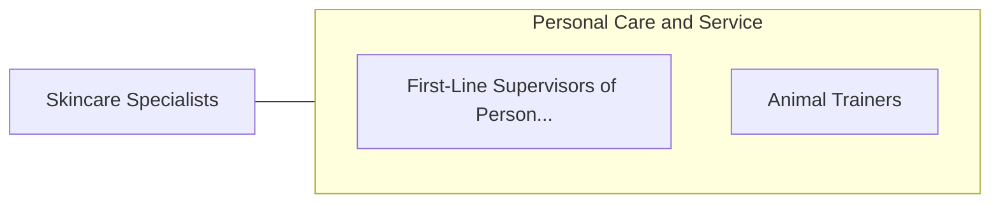

# Skincare Specialists

> Provide skincare treatments to face and body to enhance an individual's appearance. Includes electrologists and laser hair removal specialists.

## Overview

Skincare Specialists is an occupation within the Personal Care and Service category. Provide skincare treatments to face and body to enhance an individual's appearance. 

## Classification Hierarchy

## Key Statistics

| Metric | Value |
|--------|-------|
| SOC Code | 39-5094.00 |
| Category | [Personal Care and Service](/occupations/PersonalService) |
| Task Count | 52 |
| Source | O*NET |

## Core Tasks

### sterilize.CleanWorkAreas

Skincare Specialists sterilize clean work areas as part of their core responsibilities.

**Actions:**
- `sterilize.CleanWorkAreas`

### cleanse.ClientsSkin

Skincare Specialists cleanse clients skin as part of their core responsibilities.

**Actions:**
- `cleanse.ClientsSkin.with.Water`
- `cleanse.ClientsSkin.with.Creams`
- `cleanse.ClientsSkin.with.Lotions`

### demonstrate.How

Skincare Specialists demonstrate how as part of their core responsibilities.

**Actions:**
- `demonstrate.How.to.clean.ForSkinProperlyRecommendSkinCareRegimens`
- `demonstrate.How.to.care.ForSkinProperlyRecommendSkinCareRegimens`

## Skills & Competencies

### Technical Skills
- **Customer Service** - Advanced
- **Personal Care** - Advanced
- **Service Delivery** - Advanced

### Soft Skills
- **Communication** - Essential
- **Problem Solving** - Essential
- **Critical Thinking** - Important
- **Teamwork** - Important
- **Adaptability** - Important

## Related Occupations

## Industries

This occupation is found across multiple industries. See [Industries](/industries) for sector-specific employment data.

## Career Progression

---

*Source: O*NET 39-5094.00 - ONETOccupation*
