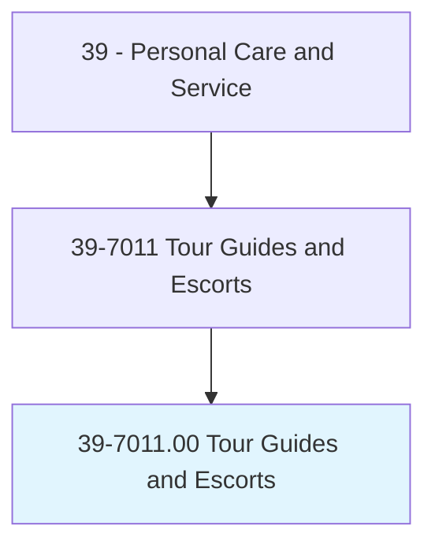
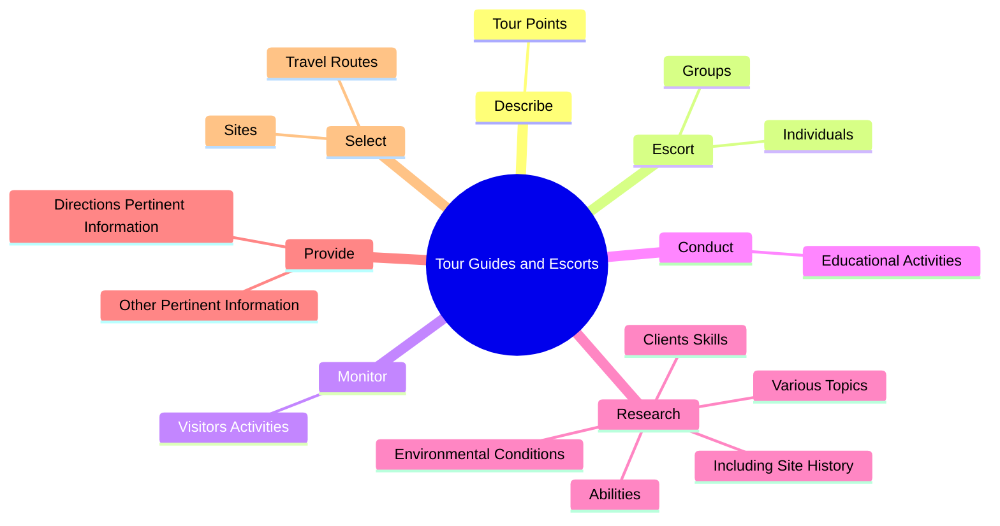
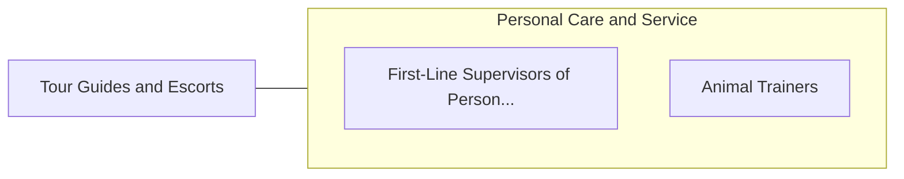

# Tour Guides and Escorts

> Escort individuals or groups on sightseeing tours or through places of interest, such as industrial establishments, public buildings, and art galleries.

## Overview

Tour Guides and Escorts is classified under Personal Care and Service (SOC 39). Escort individuals or groups on sightseeing tours or through places of interest, such as industrial establishments, public buildings, and art galleries.

## Classification Hierarchy

## Key Statistics

| Metric | Value |
|--------|-------|
| SOC Code | 39-7011.00 |
| Category | [Personal Care and Service](/occupations/PersonalService/index) |
| Task Count | 73 |
| Source | O*NET |

## Core Tasks

### describe.TourPoints

Tour Guides and Escorts describe tour points as part of their core responsibilities.

**Actions:**
- `describe.TourPoints.of.InterestToGroupMembers`
- `describe.TourPoints.of.Respond.to.Questions`

### escort.Individuals

Tour Guides and Escorts escort individuals as part of their core responsibilities.

**Actions:**
- `escort.Individuals.on.Cruises`
- `escort.Individuals.on.SightseeingTours`
- `escort.Individuals.on.ThroughPlaces.of.Interest`
- `escort.Individuals.on.IndustrialEstablishments`

### monitor.VisitorsActivities

Tour Guides and Escorts monitor visitors activities as part of their core responsibilities.

**Actions:**
- `monitor.VisitorsActivities.to.ensure.ComplianceWithEstablishment`
- `monitor.VisitorsActivities.to.tour.RegulationsPractices`
- `monitor.VisitorsActivities.to.SafetyPractices`

## Skills & Competencies

### Technical Skills
- **Customer Service** - Advanced
- **Personal Care** - Advanced
- **Service Delivery** - Advanced

### Soft Skills
- **Communication** - Essential
- **Problem Solving** - Essential
- **Critical Thinking** - Important
- **Teamwork** - Important
- **Adaptability** - Important

## Related Occupations

## Industries

This occupation is found across multiple industries. See [Industries](/industries) for sector-specific employment data.

## Career Progression

---

*Source: O*NET 39-7011.00 - ONETOccupation*
