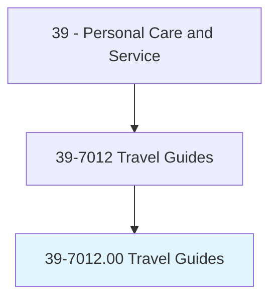
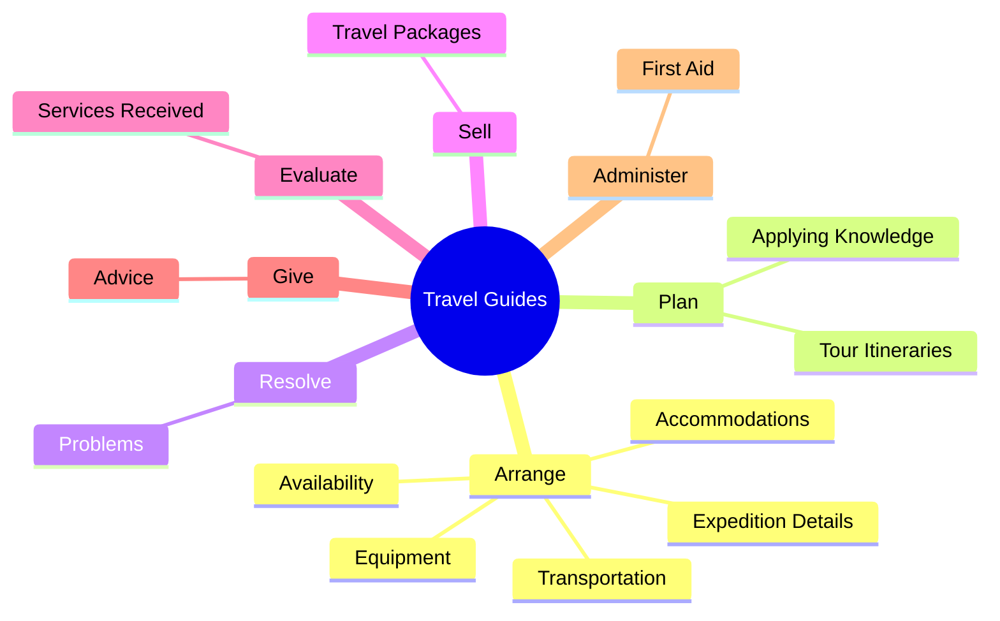
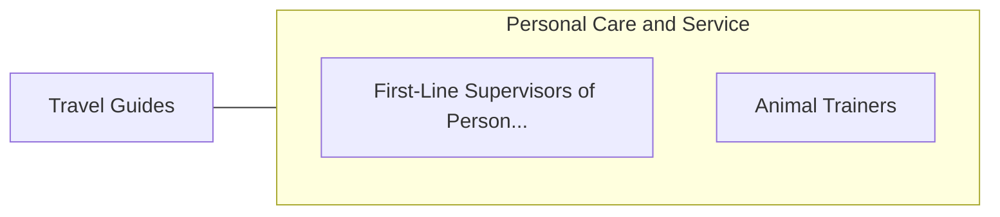

# Travel Guides

> Plan, organize, and conduct long-distance travel, tours, and expeditions for individuals and groups.

## Overview

Travel Guides is classified under Personal Care and Service (SOC 39). Plan, organize, and conduct long-distance travel, tours, and expeditions for individuals and groups.

## Classification Hierarchy

## Key Statistics

| Metric | Value |
|--------|-------|
| SOC Code | 39-7012.00 |
| Category | [Personal Care and Service](/occupations/PersonalService) |
| Task Count | 55 |
| Source | O*NET |

## Core Tasks

### arrange.ExpeditionDetails

Travel Guides arrange expedition details as part of their core responsibilities.

**Actions:**
- `arrange.ExpeditionDetails.of.MedicalPersonnel`
- `arrange.Accommodations.of.MedicalPersonnel`
- `arrange.Transportation.of.MedicalPersonnel`
- `arrange.Equipment.of.MedicalPersonnel`

### plan.TourItineraries

Travel Guides plan tour itineraries as part of their core responsibilities.

**Actions:**
- `plan.TourItineraries.of.TravelRoutesSites`
- `plan.TourItineraries.of.DestinationSites`
- `plan.ApplyingKnowledge.of.TravelRoutesSites`
- `plan.ApplyingKnowledge.of.DestinationSites`

### resolve.Problems

Travel Guides resolve problems as part of their core responsibilities.

**Actions:**
- `resolve.Problems.with.Itineraries`
- `resolve.Problems.with.Service`
- `resolve.Problems.with.Accommodations`

## Skills & Competencies

### Technical Skills
- **Customer Service** - Advanced
- **Personal Care** - Advanced
- **Service Delivery** - Advanced

### Soft Skills
- **Communication** - Essential
- **Problem Solving** - Essential
- **Critical Thinking** - Important
- **Teamwork** - Important
- **Adaptability** - Important

## Related Occupations

## Industries

This occupation is found across multiple industries. See [Industries](/industries) for sector-specific employment data.

## Career Progression

---

*Source: O*NET 39-7012.00 - ONETOccupation*
