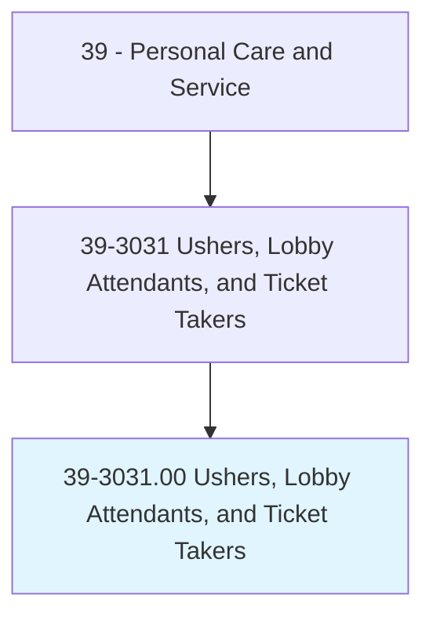
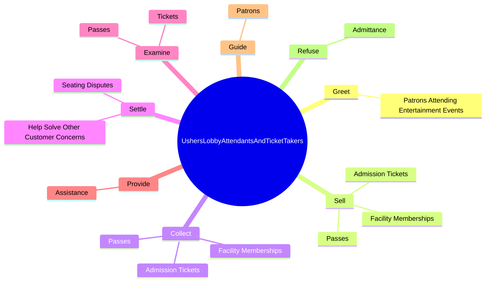
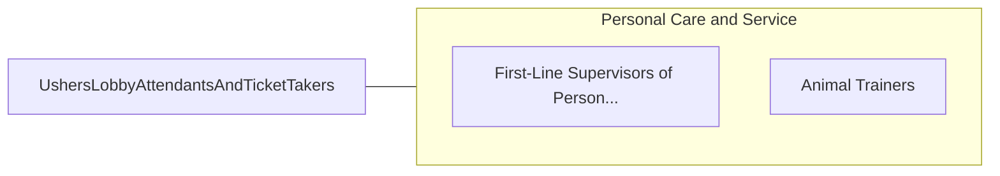

# Ushers, Lobby Attendants, and Ticket Takers

> Assist patrons at entertainment events by performing duties, such as collecting admission tickets and passes from patrons, assisting in finding seats, searching for lost articles, and helping patrons locate such facilities as restrooms and telephones.

## Overview

Ushers, Lobby Attendants, and Ticket Takers is classified under Personal Care and Service (SOC 39). Assist patrons at entertainment events by performing duties, such as collecting admission tickets and passes from patrons, assisting in finding seats, searching for lost articles, and helping patrons locate such facilities as restrooms and telephones.

## Classification Hierarchy

## Key Statistics

| Metric | Value |
|--------|-------|
| SOC Code | 39-3031.00 |
| Category | [Personal Care and Service](/occupations/PersonalService/index) |
| Task Count | 50 |
| Source | O*NET |

## Core Tasks

### greet.PatronsAttendingEntertainmentEvents

Ushers, Lobby Attendants, and Ticket Takers greet patrons attending entertainment events as part of their core responsibilities.

**Actions:**
- `greet.PatronsAttendingEntertainmentEvents`

### sell.AdmissionTickets

Ushers, Lobby Attendants, and Ticket Takers sell admission tickets as part of their core responsibilities.

**Actions:**
- `sell.AdmissionTickets.from.Patrons.at.EntertainmentEvents`
- `sell.Passes.from.Patrons.at.EntertainmentEvents`
- `sell.FacilityMemberships.from.Patrons.at.EntertainmentEvents`

### collect.AdmissionTickets

Ushers, Lobby Attendants, and Ticket Takers collect admission tickets as part of their core responsibilities.

**Actions:**
- `collect.AdmissionTickets.from.Patrons.at.EntertainmentEvents`
- `collect.Passes.from.Patrons.at.EntertainmentEvents`
- `collect.FacilityMemberships.from.Patrons.at.EntertainmentEvents`

## Skills & Competencies

### Technical Skills
- **Customer Service** - Advanced
- **Personal Care** - Advanced
- **Service Delivery** - Advanced

### Soft Skills
- **Communication** - Essential
- **Problem Solving** - Essential
- **Critical Thinking** - Important
- **Teamwork** - Important
- **Adaptability** - Important

## Related Occupations

## Industries

This occupation is found across multiple industries. See [Industries](/industries) for sector-specific employment data.

## Career Progression

---

*Source: O*NET 39-3031.00 - ONETOccupation*
