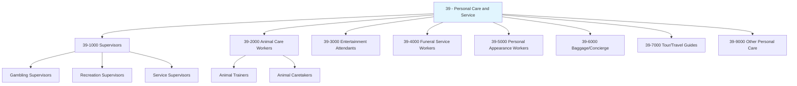
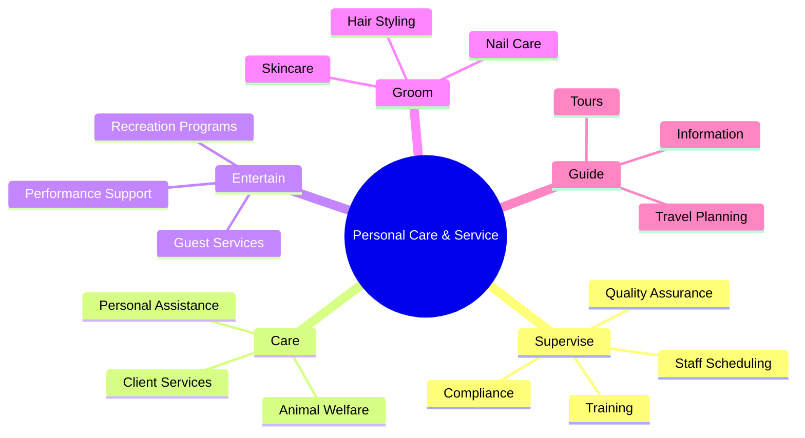
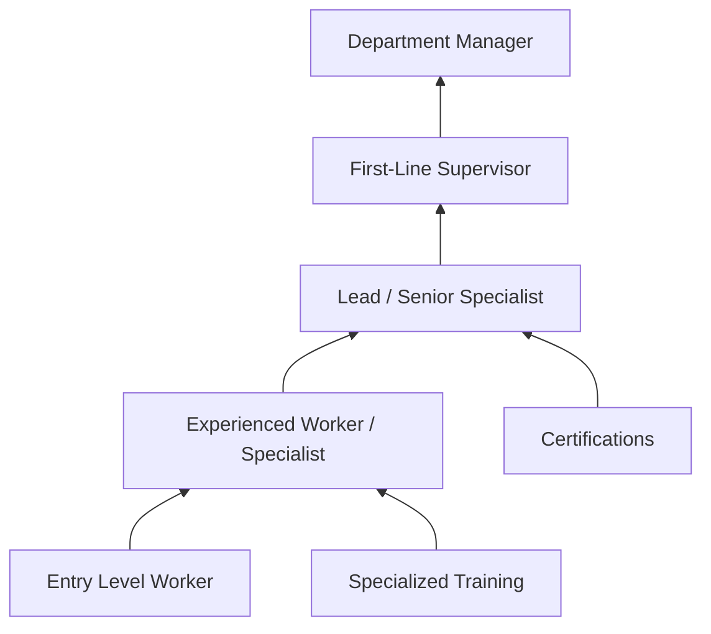

# Personal Care and Service

> Category 39 - Personal Care and Service Occupations

## Overview

Personal Care and Service occupations encompass roles focused on providing direct services to individuals, enhancing their well-being, comfort, entertainment, and quality of life. This diverse category includes workers who supervise personal service operations, care for animals, provide recreation and entertainment services, perform grooming and beauty services, assist with funeral arrangements, and support individuals in various personal care capacities.

## Classification Hierarchy

## Key Statistics

| Metric | Value |
|--------|-------|
| SOC Code | 39-0000 |
| Major Group | Personal Care and Service |
| Occupation Groups | 9 |
| Total Occupations | 35+ |
| Job Zone Range | 1-4 |

## Occupations in this Category

### Supervisors (39-1000)

- [First-Line Supervisors of Gambling Services Workers](./GamblingSupervisors.mdx) - 39-1013.00
- [First-Line Supervisors of Entertainment and Recreation Workers](./RecreationSupervisors.mdx) - 39-1014.00
- [First-Line Supervisors of Personal Service Workers](./ServiceSupervisors.mdx) - 39-1022.00

### Animal Care and Service Workers (39-2000)

- [Animal Trainers](./AnimalTrainers.mdx) - 39-2011.00
- [Animal Caretakers](./AnimalCaretakers.mdx) - 39-2021.00

### Entertainment Attendants and Related Workers (39-3000)

- Gambling Dealers - 39-3011.00
- Motion Picture Projectionists - 39-3021.00
- Ushers, Lobby Attendants, and Ticket Takers - 39-3031.00
- Amusement and Recreation Attendants - 39-3091.00
- Costume Attendants - 39-3092.00
- Locker Room, Coatroom, and Dressing Room Attendants - 39-3093.00

### Funeral Service Workers (39-4000)

- Embalmers - 39-4011.00
- Crematory Operators - 39-4012.00
- Funeral Attendants - 39-4021.00
- Morticians, Undertakers, and Funeral Arrangers - 39-4031.00

### Personal Appearance Workers (39-5000)

- Barbers - 39-5011.00
- Hairdressers, Hairstylists, and Cosmetologists - 39-5012.00
- Makeup Artists, Theatrical and Performance - 39-5091.00
- Manicurists and Pedicurists - 39-5092.00
- Shampooers - 39-5093.00
- Skincare Specialists - 39-5094.00

### Transportation, Tourism, and Lodging Attendants (39-6000/39-7000)

- Baggage Porters and Bellhops - 39-6011.00
- Concierges - 39-6012.00
- Tour Guides and Escorts - 39-7011.00
- Travel Guides - 39-7012.00

### Other Personal Care and Service Workers (39-9000)

- Childcare Workers - 39-9011.00
- Nannies - 39-9011.01
- Exercise Trainers and Group Fitness Instructors - 39-9031.00
- Recreation Workers - 39-9032.00
- Residential Advisors - 39-9041.00

## Core Task Categories

## Skills & Competencies

### Technical Skills
- **Customer Service** - Essential across all roles
- **Specialized Service Delivery** - Role-specific expertise
- **Safety Compliance** - Health and safety regulations
- **Equipment Operation** - Role-specific tools and equipment
- **Documentation** - Records and scheduling

### Soft Skills
- **Interpersonal Communication** - Critical
- **Patience and Empathy** - Essential
- **Attention to Detail** - Important
- **Physical Stamina** - Required for many roles
- **Adaptability** - Handling diverse client needs

## Industries

- Arts, Entertainment, and Recreation - High Employment
- Accommodation and Food Services - High Employment
- [Other Services](/industries/OtherServices) - High Employment
- [Healthcare and Social Assistance](/industries/Healthcare/index) - Moderate Employment
- [Retail Trade](/industries/Retail/index) - Moderate Employment

## Career Progression

## Education & Training

| Level | Typical Requirements |
|-------|---------------------|
| Entry Level | High school diploma or equivalent |
| Specialized Roles | Vocational training or certification |
| Supervisory | 2-5 years experience + leadership skills |
| Management | Bachelor's degree + extensive experience |

## Related Categories

- [Food Preparation and Serving](/occupations/FoodService/index) - Category 35
- [Building and Grounds Cleaning](/occupations/Facilities/index) - Category 37
- [Healthcare Support](/occupations/HealthcareSupport/index) - Category 31
- [Sales and Related](/occupations/Sales/index) - Category 41

---

*Source: O*NET Category 39 - Personal Care and Service Occupations*
