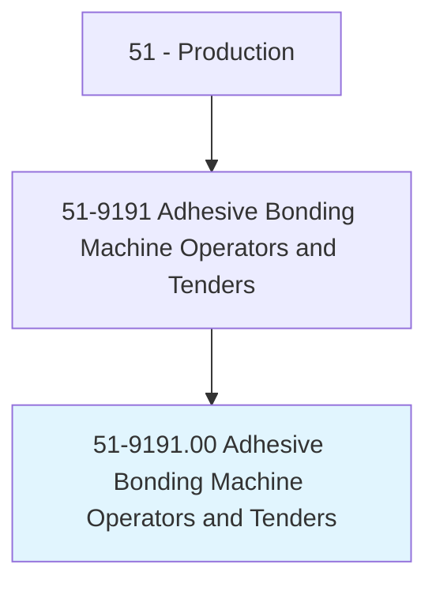
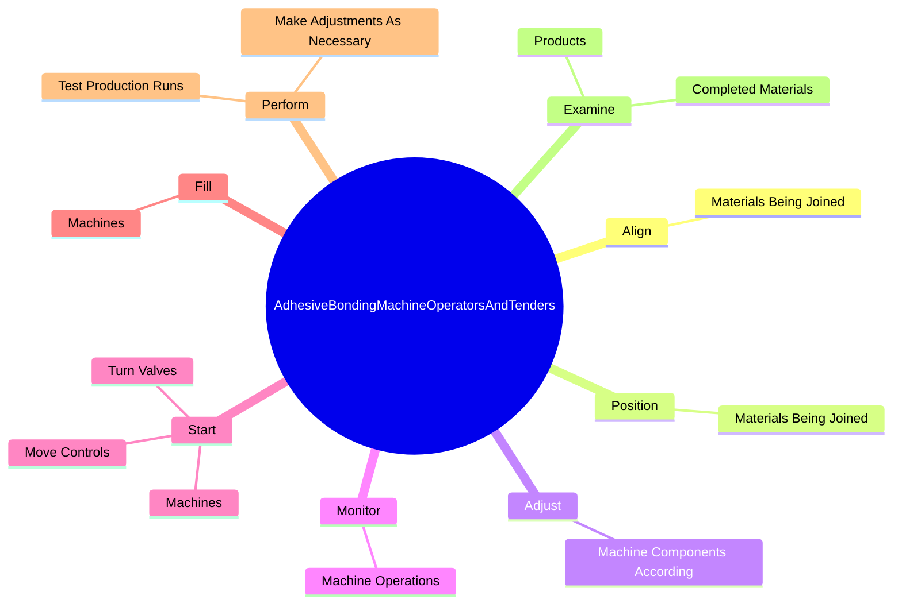

# Adhesive Bonding Machine Operators and Tenders

> Operate or tend bonding machines that use adhesives to join items for further processing or to form a completed product. Processes include joining veneer sheets into plywood; gluing paper; or joining rubber and rubberized fabric parts, plastic, simulated leather, or other materials.

## Overview

Adhesive Bonding Machine Operators and Tenders is an occupation within the Production category. Operate or tend bonding machines that use adhesives to join items for further processing or to form a completed product. 

## Classification Hierarchy

## Key Statistics

| Metric | Value |
|--------|-------|
| SOC Code | 51-9191.00 |
| Category | [Production](/occupations/Production/index) |
| Task Count | 117 |
| Source | O*NET |

## Core Tasks

### align.MaterialsBeingJoined

Adhesive Bonding Machine Operators and Tenders align materials being joined as part of their core responsibilities.

**Actions:**
- `align.MaterialsBeingJoined.to.ensure.AccurateApplicationOfAdhesive`
- `align.MaterialsBeingJoined.to.heat.Sealing`

### position.MaterialsBeingJoined

Adhesive Bonding Machine Operators and Tenders position materials being joined as part of their core responsibilities.

**Actions:**
- `position.MaterialsBeingJoined.to.ensure.AccurateApplicationOfAdhesive`
- `position.MaterialsBeingJoined.to.heat.Sealing`

### adjust.MachineComponentsAccording

Adhesive Bonding Machine Operators and Tenders adjust machine components according as part of their core responsibilities.

**Actions:**
- `adjust.MachineComponentsAccording.to.Specifications`
- `adjust.MachineComponentsAccording.to.Widths`
- `adjust.MachineComponentsAccording.to.Lengths`
- `adjust.MachineComponentsAccording.to.ThicknessOfMaterials`

## Skills & Competencies

### Technical Skills
- **Machine Operation** - Advanced
- **Quality Control** - Advanced
- **Production Processes** - Advanced

### Soft Skills
- **Communication** - Essential
- **Problem Solving** - Essential
- **Critical Thinking** - Important
- **Teamwork** - Important
- **Adaptability** - Important

## Related Occupations

## Industries

This occupation is found across multiple industries. See [Industries](/industries) for sector-specific employment data.

## Career Progression

---

*Source: O*NET 51-9191.00 - ONETOccupation*
