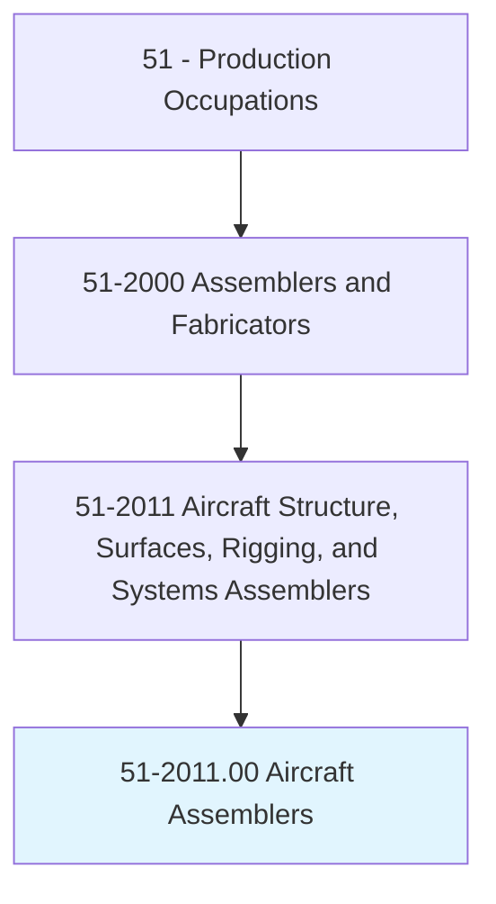
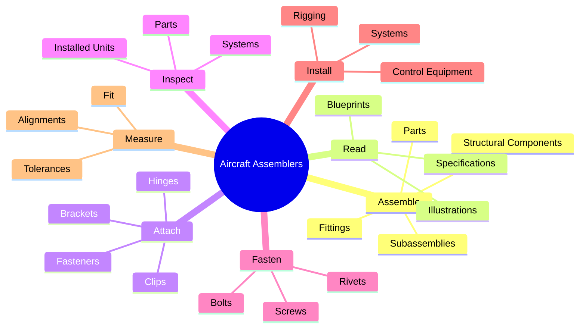
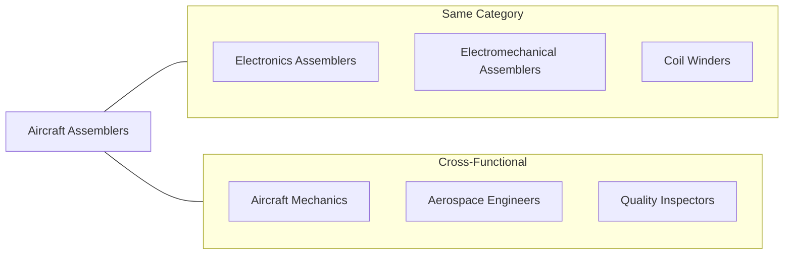
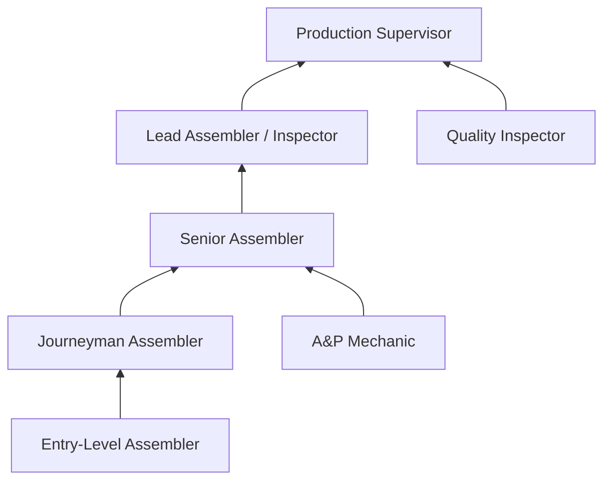
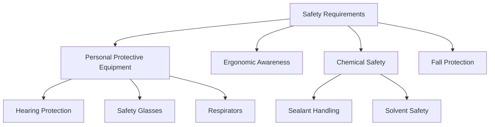

# Aircraft Structure, Surfaces, Rigging, and Systems Assemblers

> Assemble, fit, fasten, and install parts of airplanes, space vehicles, or missiles, such as tails, wings, fuselage, bulkheads, stabilizers, landing gear, rigging and control equipment, or heating and ventilating systems.

## Overview

Aircraft Structure, Surfaces, Rigging, and Systems Assemblers are highly skilled technicians who build and assemble critical components of aircraft, spacecraft, and missiles. Working from detailed blueprints and specifications, they fit, fasten, and install structural components including wings, fuselages, landing gear, and control systems. This role demands exceptional precision, as even minor errors can have catastrophic consequences in aerospace applications. Assemblers work with specialized tools, measuring instruments, and fastening techniques to ensure every component meets strict FAA and industry quality standards.

## Classification Hierarchy

## Key Statistics

| Metric | Value |
|--------|-------|
| SOC Code | 51-2011.00 |
| Job Zone | 3 (Medium Preparation) |
| Category | [Production](/occupations/Production/index) |
| Core Tasks | 15+ |
| Source | O*NET |

## Core Tasks

### assemble.Parts

Aircraft Assemblers fit and fasten parts, fittings, and subassemblies onto aircraft structures using various tools and fasteners.

**Actions:**
- `assemble.Parts.on.Aircraft` - Install structural parts onto aircraft bodies
- `assemble.Parts.on.UsingLayoutTools` - Use precision layout tools for positioning
- `assemble.Fittings.on.Aircraft` - Attach fittings to aircraft structures
- `assemble.Subassemblies.on.Aircraft` - Integrate subassemblies into main structures
- `assemble.Parts.on.PowerTools` - Use power tools for efficient assembly
- `assemble.Parts.on.Fasteners` - Secure parts with appropriate fasteners

### read.Blueprints

Aircraft Assemblers interpret technical drawings and specifications to understand assembly requirements.

**Actions:**
- `read.Blueprints.to.determine.Layouts` - Understand component positioning
- `read.Blueprints.to.sequences.OfOperations` - Follow assembly sequences
- `read.Illustrations.to.IdentitiesOfParts` - Identify correct parts from drawings
- `read.Specifications.to.RelationshipsOfParts` - Understand how parts connect
- `read.Specifications.to.determine.Layouts` - Determine precise positioning

### attach.Brackets

Aircraft Assemblers secure and support components using brackets, hinges, clips, and various fastening methods.

**Actions:**
- `attach.Brackets.to.secure.ComponentsSubassemblies` - Secure components with brackets
- `attach.Brackets.to.support.ComponentsSubassemblies` - Provide structural support
- `attach.Hinges.to.UsingBolts` - Install hinges with bolt fasteners
- `attach.Clips.to.Rivets` - Secure clips using riveting
- `attach.Brackets.to.ChemicalBonding` - Use adhesive bonding techniques
- `attach.Brackets.to.Welding` - Apply welding for permanent attachment

### inspect.InstalledUnits

Aircraft Assemblers verify that installed components meet strict aerospace quality standards.

**Actions:**
- `inspect.InstalledUnits.for.Fit` - Check proper fit of components
- `inspect.InstalledUnits.for.Alignment` - Verify component alignment
- `inspect.InstalledUnits.for.Performance` - Test operational performance
- `inspect.InstalledUnits.for.Defects` - Identify any defects or damage
- `inspect.InstalledUnits.for.Compliance.with.Standards` - Ensure regulatory compliance
- `inspect.Parts.for.UsingMeasuringInstruments` - Use precision measurement tools

### inspect.Systems

Aircraft Assemblers check entire systems for proper integration and function.

**Actions:**
- `inspect.Systems.for.Fit` - Verify system component fit
- `inspect.Systems.for.Alignment` - Check system alignment
- `inspect.Systems.for.Performance` - Test system operation
- `inspect.Systems.for.Defects` - Identify system-level issues
- `inspect.Systems.for.UsingMeasuringInstruments` - Apply measuring instruments

## Skills & Competencies

### Technical Skills
- **Blueprint Reading** - Expert
- **Precision Measurement** - Expert
- **Riveting** - Advanced
- **Fastening Systems** - Advanced
- **Hand Tools** - Expert
- **Power Tools** - Advanced
- **Quality Inspection** - Advanced

### Soft Skills
- **Attention to Detail** - Critical
- **Manual Dexterity** - Critical
- **Spatial Reasoning** - Essential
- **Problem Solving** - Essential
- **Team Coordination** - Important
- **Communication** - Important

## Related Occupations

## Industries

- [Aerospace Product Manufacturing](/industries/Aerospace) - Primary Employment
- [Defense Manufacturing](/industries/Defense) - High Employment
- [Commercial Aviation](/industries/CommercialAviation) - Significant Employment
- [Space Vehicle Manufacturing](/industries/SpaceVehicles) - Growing Sector
- [Aircraft Parts Manufacturing](/industries/AircraftParts) - Supplier Industry

## Career Progression

## Education & Training

| Requirement | Details |
|-------------|---------|
| Typical Education | High School Diploma plus technical training |
| Work Experience | Apprenticeship or 1-2 years assembly experience |
| On-the-Job Training | Long-term (1-2 years typical) |
| Common Certifications | IPC Certifications, Blueprint Reading, FAA Repairman Certificate |

## Industry Variations

### Commercial Aircraft (Boeing, Airbus)
- Large-scale assembly operations
- High production volumes
- Extensive tooling and jigs
- Union environment common

### Military/Defense (Lockheed Martin, Northrop Grumman)
- Security clearance required
- Classified documentation
- Specialized weapon systems
- Government compliance (DCMA, ITAR)

### Space Vehicles (SpaceX, Blue Origin)
- Extreme precision requirements
- Advanced composite materials
- Cleanroom assembly for some components
- Rapid prototyping environment

### General Aviation (Cessna, Piper)
- Smaller scale operations
- Greater variety of tasks
- Full aircraft assembly possible
- More hands-on craftsmanship

## Assembly Process Flow

## Tools & Equipment

### Hand Tools
- Rivet guns and bucking bars
- Drill motors (pneumatic/electric)
- Reamers and countersinks
- Cleco fasteners and pliers
- Sealant guns

### Measuring Instruments
- Micrometers
- Calipers
- Height gauges
- Bore gauges
- Go/No-go gauges

### Power Equipment
- CNC drill/rivet machines
- Automated fastening systems
- Overhead cranes
- Positioning fixtures

## Departments

This occupation typically works in:
- [Aircraft Assembly](/departments/AircraftAssembly)
- [Structures](/departments/Structures)
- [Final Assembly](/departments/FinalAssembly)
- [Wing Assembly](/departments/WingAssembly)

## Safety Considerations

---

*Source: O*NET 51-2011.00 - ONETOccupation*
