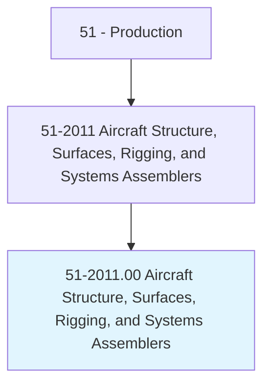
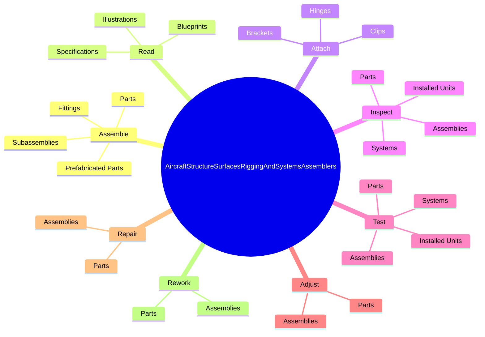
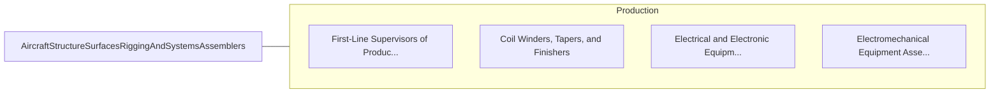

# Aircraft Structure, Surfaces, Rigging, and Systems Assemblers

> Assemble, fit, fasten, and install parts of airplanes, space vehicles, or missiles, such as tails, wings, fuselage, bulkheads, stabilizers, landing gear, rigging and control equipment, or heating and ventilating systems.

## Overview

Aircraft Structure, Surfaces, Rigging, and Systems Assemblers is classified under Production (SOC 51). Assemble, fit, fasten, and install parts of airplanes, space vehicles, or missiles, such as tails, wings, fuselage, bulkheads, stabilizers, landing gear, rigging and control equipment, or heating and ventilating systems.

## Classification Hierarchy

## Key Statistics

| Metric | Value |
|--------|-------|
| SOC Code | 51-2011.00 |
| Category | [Production](/occupations/Production/index) |
| Task Count | 338 |
| Source | O*NET |

## Core Tasks

### assemble.Parts

Aircraft Structure, Surfaces, Rigging, and Systems Assemblers assemble parts as part of their core responsibilities.

**Actions:**
- `assemble.Parts.on.Aircraft`
- `assemble.Parts.on.UsingLayoutTools`
- `assemble.Parts.on.H`
- `assemble.Parts.on.Tools`

### read.Blueprints

Aircraft Structure, Surfaces, Rigging, and Systems Assemblers read blueprints as part of their core responsibilities.

**Actions:**
- `read.Blueprints.to.determine.Layouts`
- `read.Blueprints.to.sequences.OfOperations`
- `read.Blueprints.to.IdentitiesOfParts`
- `read.Blueprints.to.RelationshipsOfParts`

### attach.Brackets

Aircraft Structure, Surfaces, Rigging, and Systems Assemblers attach brackets as part of their core responsibilities.

**Actions:**
- `attach.Brackets.to.secure.ComponentsSubassemblies`
- `attach.Brackets.to.support.ComponentsSubassemblies`
- `attach.Brackets.to.UsingBolts`
- `attach.Brackets.to.Screws`

## Skills & Competencies

### Technical Skills
- **Machine Operation** - Advanced
- **Quality Control** - Advanced
- **Production Processes** - Advanced

### Soft Skills
- **Communication** - Essential
- **Problem Solving** - Essential
- **Critical Thinking** - Important
- **Teamwork** - Important
- **Adaptability** - Important

## Related Occupations

## Industries

This occupation is found across multiple industries. See [Industries](/industries) for sector-specific employment data.

## Career Progression

---

*Source: O*NET 51-2011.00 - ONETOccupation*
