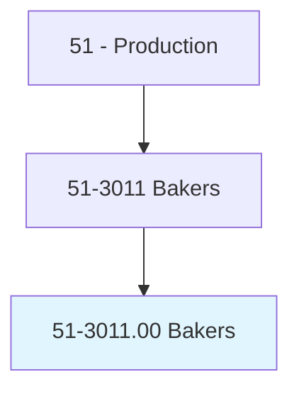
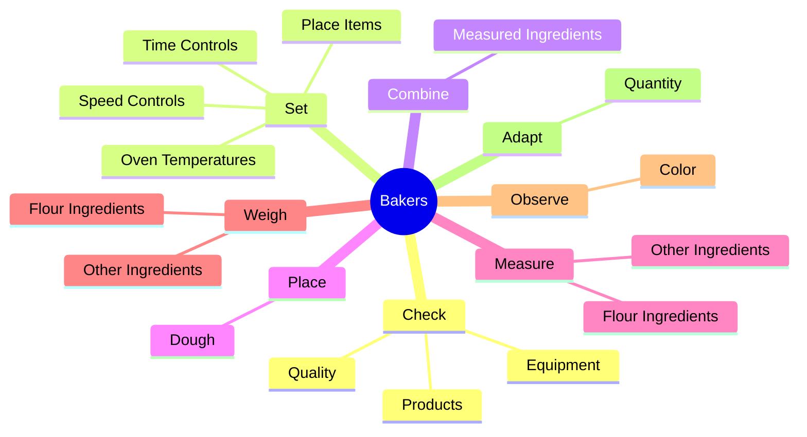
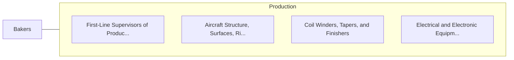

# Bakers

> Mix and bake ingredients to produce breads, rolls, cookies, cakes, pies, pastries, or other baked goods.

## Overview

Bakers is classified under Production (SOC 51). Mix and bake ingredients to produce breads, rolls, cookies, cakes, pies, pastries, or other baked goods.

## Classification Hierarchy

## Key Statistics

| Metric | Value |
|--------|-------|
| SOC Code | 51-3011.00 |
| Category | [Production](/occupations/Production/index) |
| Task Count | 93 |
| Source | O*NET |

## Core Tasks

### check.Products

Bakers check products as part of their core responsibilities.

**Actions:**
- `check.Products.for.Quality`
- `check.Products.for.IdentifyDamaged`
- `check.Products.for.ExpiredGoods`
- `check.Quality.of.RawMaterials.to.ensure.StandardsAreMet`

### set.OvenTemperatures

Bakers set oven temperatures as part of their core responsibilities.

**Actions:**
- `set.OvenTemperatures.for.Baking`
- `set.PlaceItems.into.HotOvens.for.Baking`
- `set.TimeControls.for.MixingMachines`
- `set.TimeControls.for.BlendingMachines`

### combine.MeasuredIngredients

Bakers combine measured ingredients as part of their core responsibilities.

**Actions:**
- `combine.MeasuredIngredients.in.Bowls.of.Mixing`
- `combine.MeasuredIngredients.in.Blending`
- `combine.MeasuredIngredients.in.CookingMachinery`

## Skills & Competencies

### Technical Skills
- **Machine Operation** - Advanced
- **Quality Control** - Advanced
- **Production Processes** - Advanced

### Soft Skills
- **Communication** - Essential
- **Problem Solving** - Essential
- **Critical Thinking** - Important
- **Teamwork** - Important
- **Adaptability** - Important

## Related Occupations

## Industries

This occupation is found across multiple industries. See [Industries](/industries) for sector-specific employment data.

## Career Progression

---

*Source: O*NET 51-3011.00 - ONETOccupation*
