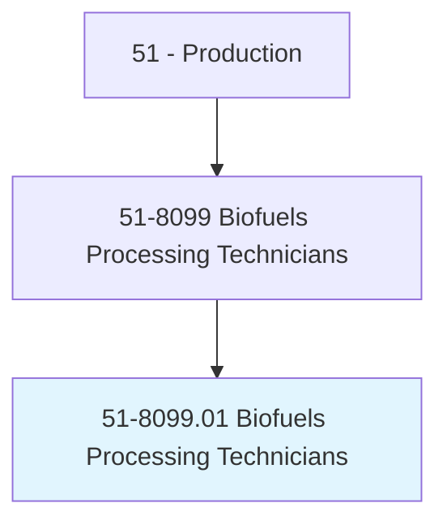
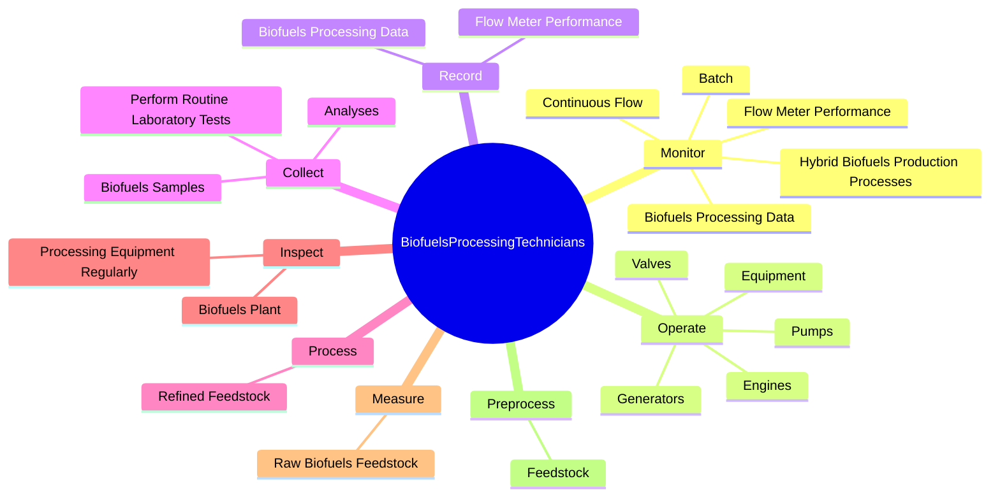
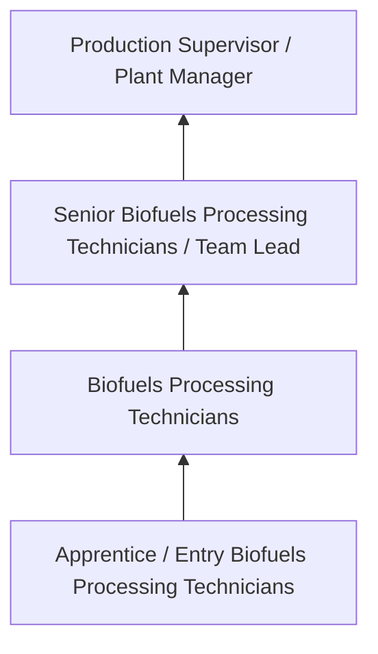

# Biofuels Processing Technicians

> Calculate, measure, load, mix, and process refined feedstock with additives in fermentation or reaction process vessels and monitor production process. Perform, and keep records of, plant maintenance, repairs, and safety inspections.

## Overview

Biofuels Processing Technicians professionals calculate, measure, load, mix, and process refined feedstock with additives in fermentation or reaction process vessels and monitor production process. This occupation falls within the Production category and requires a combination of specialized knowledge, technical skills, and practical experience.

These professionals work across diverse settings and organizational contexts, applying their expertise to meet the demands of their field. They must stay current with industry standards, emerging practices, and regulatory requirements that affect their work. The role demands both independent judgment and collaborative skills, as practitioners regularly interact with colleagues, stakeholders, and the public.

As the field continues to evolve, Biofuels Processing Technicians professionals increasingly leverage technology and data-driven approaches to enhance their effectiveness. Career opportunities span the public and private sectors, with demand influenced by economic conditions, demographic shifts, and technological advancement.

## Classification Hierarchy



## Key Statistics

| Metric | Value |
|--------|-------|
| SOC Code | 51-8099.01 |
| Job Zone | N/A |
| Category | [Production](/occupations/Production/index) |
| Core Tasks | 47+ |
| Salary Range | $28,000 - $65,000 |
| Median Salary | $40,000 |
| Growth Outlook | 1% (Little or no change) |
| Source | O*NET |

## Core Tasks



### operate.Valves

Biofuels Processing Technicians operate valves as part of their core responsibilities.

**Actions:**
- `operate.Valves.to.control.BiofuelsProduction` - Operate valves, pumps, engines, or generators to control and adjust biofuels ...
- `operate.Valves.to.adjust.BiofuelsProduction` - Operate valves, pumps, engines, or generators to control and adjust biofuels ...
- `operate.Pumps.to.control.BiofuelsProduction` - Operate valves, pumps, engines, or generators to control and adjust biofuels ...
- `operate.Pumps.to.adjust.BiofuelsProduction` - Operate valves, pumps, engines, or generators to control and adjust biofuels ...
- `operate.Engines.to.control.BiofuelsProduction` - Operate valves, pumps, engines, or generators to control and adjust biofuels ...

### monitor.Batch

Biofuels Processing Technicians monitor batch as part of their core responsibilities.

**Actions:**
- `monitor.Batch` - Monitor batch, continuous flow, or hybrid biofuels production processes.
- `monitor.ContinuousFlow` - Monitor batch, continuous flow, or hybrid biofuels production processes.
- `monitor.HybridBiofuelsProductionProcesses` - Monitor batch, continuous flow, or hybrid biofuels production processes.
- `monitor.BiofuelsProcessingData` - Monitor and record biofuels processing data.
- `monitor.FlowMeterPerformance` - Monitor and record flow meter performance.

### perform.RoutineMaintenance

Biofuels Processing Technicians perform routine maintenance as part of their core responsibilities.

**Actions:**
- `perform.RoutineMaintenance.on.Mechanical` - Perform routine maintenance on mechanical, electrical, or electronic equipmen...
- `perform.RoutineMaintenance.on.Electrical` - Perform routine maintenance on mechanical, electrical, or electronic equipmen...
- `perform.RoutineMaintenance.on.ElectronicEquipmentUsed.in.ProcessingOfBiofuels` - Perform routine maintenance on mechanical, electrical, or electronic equipmen...
- `perform.RoutineMaintenance.on.InstrumentsUsed.in.ProcessingOfBiofuels` - Perform routine maintenance on mechanical, electrical, or electronic equipmen...

### collect.BiofuelsSamples

Biofuels Processing Technicians collect biofuels samples as part of their core responsibilities.

**Actions:**
- `collect.BiofuelsSamples.to.assess.BiofuelsQuality` - Collect biofuels samples and perform routine laboratory tests or analyses to ...
- `collect.PerformRoutineLaboratoryTests.to.assess.BiofuelsQuality` - Collect biofuels samples and perform routine laboratory tests or analyses to ...
- `collect.Analyses.to.assess.BiofuelsQuality` - Collect biofuels samples and perform routine laboratory tests or analyses to ...


## Skills & Competencies

### Technical Skills
- **Machine Operation** - Advanced
- **Quality Inspection** - Advanced
- **Safety Procedures** - Advanced
- **Blueprint Reading** - Proficient
- **Measurement Tools** - Proficient
- **Process Control** - Proficient

### Soft Skills
- **Attention to Detail** - Critical
- **Reliability** - Critical
- **Physical Dexterity** - Essential
- **Teamwork** - Essential
- **Problem Solving** - Important

## Education & Certifications

| Requirement | Details |
|-------------|---------|
| Typical Education | High school diploma or equivalent; some positions require technical training |
| Work Experience | 0-2 years manufacturing experience |
| On-the-Job Training | Moderate - equipment operation and safety procedures |
| Certifications | OSHA certifications, quality management certifications |

## Career Progression



## Industry Variations

### Discrete Manufacturing
Assembly of distinct products such as automobiles, electronics, or machinery. Biofuels Processing Technicians professionals work with precision equipment and quality standards.

### Process Manufacturing
Continuous production of chemicals, food, or materials. Focus on process control and consistency.

### Custom and Job Shop
Small-batch or custom production work. Requires versatility and ability to adapt to varied specifications.

### Automated Manufacturing
Technology-driven production with robotics and advanced systems. Increasing emphasis on programming and monitoring skills.

## Technology & Tools

- **Manufacturing execution systems (MES)**
- **Computer numerical control (CNC) machines**
- **Quality management software**
- **Programmable logic controllers (PLC)**
- **Enterprise resource planning (ERP) systems**

## Related Occupations


## Industries

- [Manufacturing](/industries/Manufacturing) - High Employment
- Food Processing - High Employment
- [Automotive](/industries/Manufacturing) - Moderate Employment
- [Electronics](/industries/Electronics) - Moderate Employment

## Departments

This occupation typically works in:
- [Manufacturing](/departments/Operations)
- Quality Control
- Production Planning

## GraphDL Semantic Structure

```graphdl
Biofuels Processing Technicians perform:
- monitor.Batch
- monitor.ContinuousFlow
- monitor.HybridBiofuelsProductionProcesses
- operate.Valves.to.control.BiofuelsProduction
- operate.Valves.to.adjust.BiofuelsProduction
- operate.Pumps.to.control.BiofuelsProduction
```

---

*Source: O*NET 51-8099.01 - ONETOccupation*
