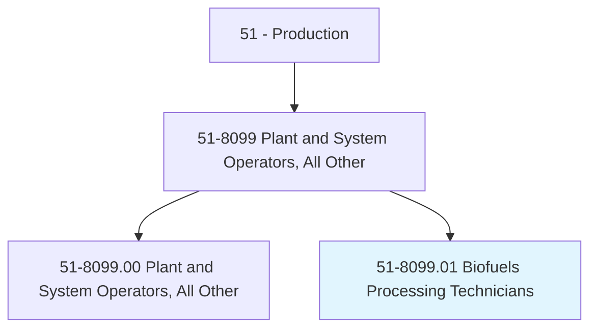
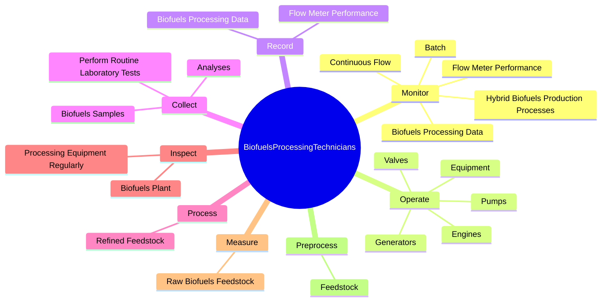

# Biofuels Processing Technicians

> Calculate, measure, load, mix, and process refined feedstock with additives in fermentation or reaction process vessels and monitor production process. Perform, and keep records of, plant maintenance, repairs, and safety inspections.

## Overview

Biofuels Processing Technicians is a specialized variant within the Production category. Calculate, measure, load, mix, and process refined feedstock with additives in fermentation or reaction process vessels and monitor production process. 

## Classification Hierarchy

## Key Statistics

| Metric | Value |
|--------|-------|
| SOC Code | 51-8099.01 |
| Category | [Production](/occupations/Production) |
| Task Count | 47 |
| Source | O*NET |

## Core Tasks

### monitor.Batch

Biofuels Processing Technicians monitor batch as part of their core responsibilities.

**Actions:**
- `monitor.Batch`
- `monitor.ContinuousFlow`
- `monitor.HybridBiofuelsProductionProcesses`
- `monitor.BiofuelsProcessingData`

### operate.Valves

Biofuels Processing Technicians operate valves as part of their core responsibilities.

**Actions:**
- `operate.Valves.to.control.BiofuelsProduction`
- `operate.Valves.to.adjust.BiofuelsProduction`
- `operate.Pumps.to.control.BiofuelsProduction`
- `operate.Pumps.to.adjust.BiofuelsProduction`

### record.BiofuelsProcessingData

Biofuels Processing Technicians record biofuels processing data as part of their core responsibilities.

**Actions:**
- `record.BiofuelsProcessingData`
- `record.FlowMeterPerformance`

## Skills & Competencies

### Technical Skills
- **Machine Operation** - Advanced
- **Quality Control** - Advanced
- **Production Processes** - Advanced

### Soft Skills
- **Communication** - Essential
- **Problem Solving** - Essential
- **Critical Thinking** - Important
- **Teamwork** - Important
- **Adaptability** - Important

## Related Occupations

## Industries

This occupation is found across multiple industries. See [Industries](/industries) for sector-specific employment data.

## Career Progression

---

*Source: O*NET 51-8099.01 - ONETOccupation*
