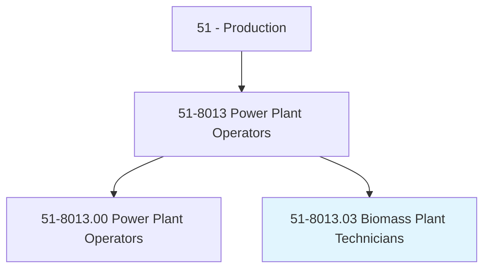
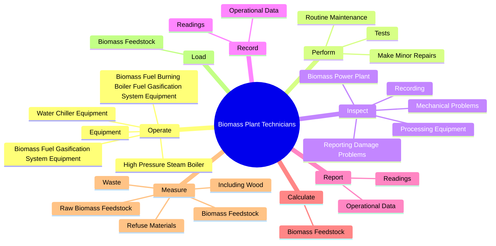

# Biomass Plant Technicians

> Control and monitor biomass plant activities and perform maintenance as needed.

## Overview

Biomass Plant Technicians is classified under Production (SOC 51). Control and monitor biomass plant activities and perform maintenance as needed.

## Classification Hierarchy

## Key Statistics

| Metric | Value |
|--------|-------|
| SOC Code | 51-8013.03 |
| Category | [Production](/occupations/Production) |
| Task Count | 80 |
| Source | O*NET |

## Core Tasks

### operate.BiomassFuelBurningBoilerFuelGasificationSystemEquipment

Biomass Plant Technicians operate biomass fuel burning boiler fuel gasification system equipment as part of their core responsibilities.

**Actions:**
- `operate.BiomassFuelBurningBoilerFuelGasificationSystemEquipment.in.Accordance.with.Specifications`
- `operate.BiomassFuelBurningBoilerFuelGasificationSystemEquipment.in.Instructions`
- `operate.BiomassFuelGasificationSystemEquipment.in.Accordance.with.Specifications`
- `operate.BiomassFuelGasificationSystemEquipment.in.Instructions`

### perform.Tests

Biomass Plant Technicians perform tests as part of their core responsibilities.

**Actions:**
- `perform.Tests.of.WaterChemistry.in.Boilers`
- `perform.RoutineMaintenance.to.Mechanical`
- `perform.RoutineMaintenance.to.Electrical`
- `perform.RoutineMaintenance.to.ElectronicEquipmentInBiomassPlants`

### inspect.BiomassPowerPlant

Biomass Plant Technicians inspect biomass power plant as part of their core responsibilities.

**Actions:**
- `inspect.BiomassPowerPlant`
- `inspect.ProcessingEquipment`
- `inspect.Recording`
- `inspect.ReportingDamageProblems`

## Skills & Competencies

### Technical Skills
- **Machine Operation** - Advanced
- **Quality Control** - Advanced
- **Production Processes** - Advanced

### Soft Skills
- **Communication** - Essential
- **Problem Solving** - Essential
- **Critical Thinking** - Important
- **Teamwork** - Important
- **Adaptability** - Important

## Related Occupations

## Industries

This occupation is found across multiple industries. See [Industries](/industries) for sector-specific employment data.

## Career Progression

---

*Source: O*NET 51-8013.03 - ONETOccupation*
