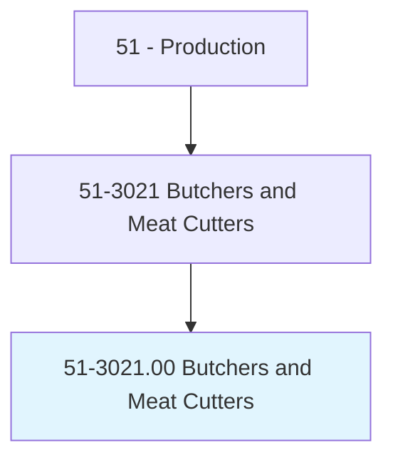
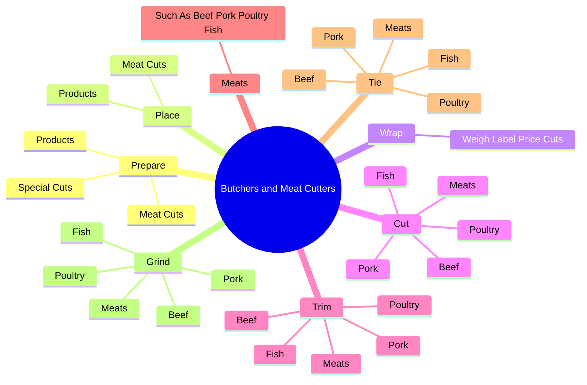
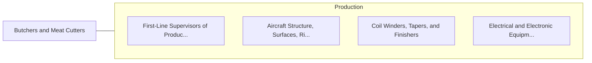

# Butchers and Meat Cutters

> Cut, trim, or prepare consumer-sized portions of meat for use or sale in retail establishments.

## Overview

Butchers and Meat Cutters is classified under Production (SOC 51). Cut, trim, or prepare consumer-sized portions of meat for use or sale in retail establishments.

## Classification Hierarchy

## Key Statistics

| Metric | Value |
|--------|-------|
| SOC Code | 51-3021.00 |
| Category | [Production](/occupations/Production) |
| Task Count | 53 |
| Source | O*NET |

## Core Tasks

### prepare.MeatCuts

Butchers and Meat Cutters prepare meat cuts as part of their core responsibilities.

**Actions:**
- `prepare.MeatCuts.in.DisplayCounter.to.appear.AttractiveShoppersEye`
- `prepare.MeatCuts.in.CatchShoppersEye`
- `prepare.Products.in.DisplayCounter.to.appear.AttractiveShoppersEye`
- `prepare.Products.in.CatchShoppersEye`

### place.MeatCuts

Butchers and Meat Cutters place meat cuts as part of their core responsibilities.

**Actions:**
- `place.MeatCuts.in.DisplayCounter.to.appear.AttractiveShoppersEye`
- `place.MeatCuts.in.CatchShoppersEye`
- `place.Products.in.DisplayCounter.to.appear.AttractiveShoppersEye`
- `place.Products.in.CatchShoppersEye`

### wrap.WeighLabelPriceCuts

Butchers and Meat Cutters wrap weigh label price cuts as part of their core responsibilities.

**Actions:**
- `wrap.WeighLabelPriceCuts.of.Meat`

## Skills & Competencies

### Technical Skills
- **Machine Operation** - Advanced
- **Quality Control** - Advanced
- **Production Processes** - Advanced

### Soft Skills
- **Communication** - Essential
- **Problem Solving** - Essential
- **Critical Thinking** - Important
- **Teamwork** - Important
- **Adaptability** - Important

## Related Occupations

## Industries

This occupation is found across multiple industries. See [Industries](/industries) for sector-specific employment data.

## Career Progression

---

*Source: O*NET 51-3021.00 - ONETOccupation*
