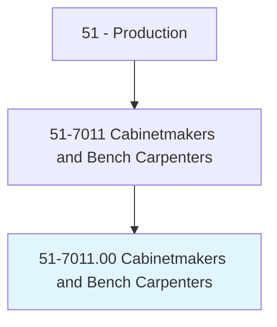
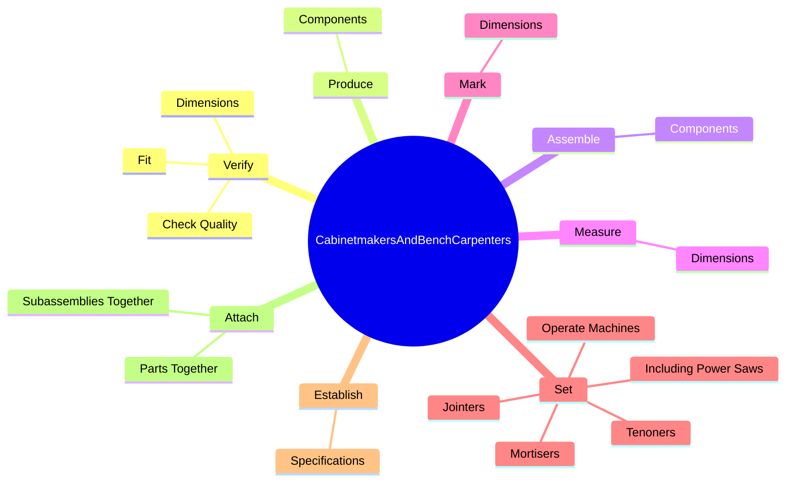

# Cabinetmakers and Bench Carpenters

> Cut, shape, and assemble wooden articles or set up and operate a variety of woodworking machines, such as power saws, jointers, and mortisers to surface, cut, or shape lumber or to fabricate parts for wood products.

## Overview

Cabinetmakers and Bench Carpenters is classified under Production (SOC 51). Cut, shape, and assemble wooden articles or set up and operate a variety of woodworking machines, such as power saws, jointers, and mortisers to surface, cut, or shape lumber or to fabricate parts for wood products.

## Classification Hierarchy

## Key Statistics

| Metric | Value |
|--------|-------|
| SOC Code | 51-7011.00 |
| Category | [Production](/occupations/Production/index) |
| Task Count | 123 |
| Source | O*NET |

## Core Tasks

### verify.Dimensions

Cabinetmakers and Bench Carpenters verify dimensions as part of their core responsibilities.

**Actions:**
- `verify.Dimensions.of.Pieces.to.ensure.AdherenceToSpecifications`
- `verify.CheckQuality.of.Pieces.to.ensure.AdherenceToSpecifications`
- `verify.Fit.of.Pieces.to.ensure.AdherenceToSpecifications`

### produce.Components

Cabinetmakers and Bench Carpenters produce components as part of their core responsibilities.

**Actions:**
- `produce.Components.of.Articles`
- `produce.Components.of.StoreFixtures`
- `produce.Components.of.OfficeEquipment`
- `produce.Components.of.Cabinets`

### assemble.Components

Cabinetmakers and Bench Carpenters assemble components as part of their core responsibilities.

**Actions:**
- `assemble.Components.of.Articles`
- `assemble.Components.of.StoreFixtures`
- `assemble.Components.of.OfficeEquipment`
- `assemble.Components.of.Cabinets`

## Skills & Competencies

### Technical Skills
- **Machine Operation** - Advanced
- **Quality Control** - Advanced
- **Production Processes** - Advanced

### Soft Skills
- **Communication** - Essential
- **Problem Solving** - Essential
- **Critical Thinking** - Important
- **Teamwork** - Important
- **Adaptability** - Important

## Related Occupations

## Industries

This occupation is found across multiple industries. See [Industries](/industries) for sector-specific employment data.

## Career Progression

---

*Source: O*NET 51-7011.00 - ONETOccupation*
