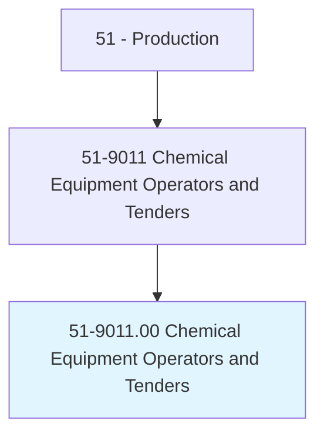
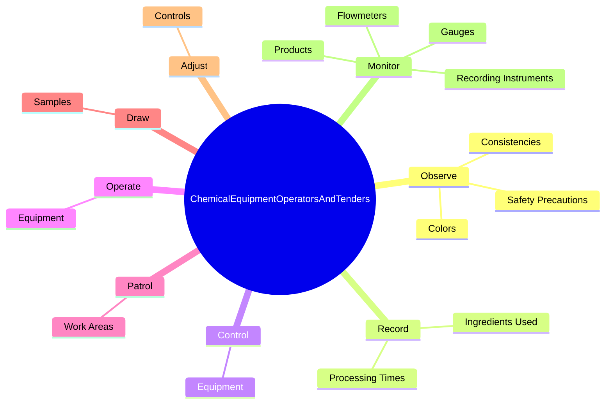
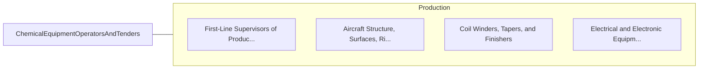

# Chemical Equipment Operators and Tenders

> Operate or tend equipment to control chemical changes or reactions in the processing of industrial or consumer products. Equipment used includes devulcanizers, steam-jacketed kettles, and reactor vessels.

## Overview

Chemical Equipment Operators and Tenders is an occupation within the Production category. Operate or tend equipment to control chemical changes or reactions in the processing of industrial or consumer products. 

## Classification Hierarchy

## Key Statistics

| Metric | Value |
|--------|-------|
| SOC Code | 51-9011.00 |
| Category | [Production](/occupations/Production) |
| Task Count | 90 |
| Source | O*NET |

## Core Tasks

### observe.SafetyPrecautions

Chemical Equipment Operators and Tenders observe safety precautions as part of their core responsibilities.

**Actions:**
- `observe.SafetyPrecautions.to.prevent.Fires`
- `observe.SafetyPrecautions.to.Explosions`
- `observe.Colors.of.ProductsToInstrumentReadingsLaboratoryStandardTestResults`
- `observe.Colors.of.ToLaboratoryStandardTestResults`

### record.IngredientsUsed

Chemical Equipment Operators and Tenders record ingredients used as part of their core responsibilities.

**Actions:**
- `record.IngredientsUsed`
- `record.ProcessingTimes`

### control.Equipment

Chemical Equipment Operators and Tenders control equipment as part of their core responsibilities.

**Actions:**
- `control.Equipment.in.WhichChemicalChangesTakePlaceDuringProcessing.of.IndustrialConsumerProducts`
- `control.Equipment.in.ReactionsTakePlaceDuringProcessing.of.IndustrialConsumerProducts`

## Skills & Competencies

### Technical Skills
- **Machine Operation** - Advanced
- **Quality Control** - Advanced
- **Production Processes** - Advanced

### Soft Skills
- **Communication** - Essential
- **Problem Solving** - Essential
- **Critical Thinking** - Important
- **Teamwork** - Important
- **Adaptability** - Important

## Related Occupations

## Industries

This occupation is found across multiple industries. See [Industries](/industries) for sector-specific employment data.

## Career Progression

---

*Source: O*NET 51-9011.00 - ONETOccupation*
