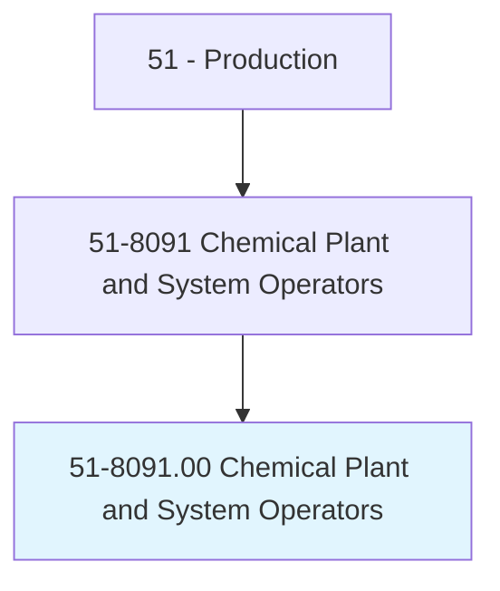
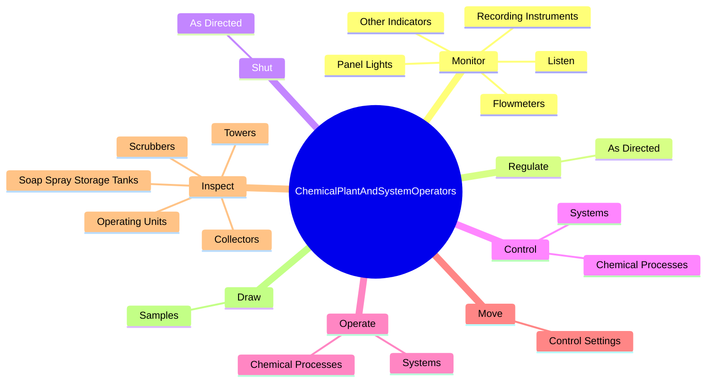
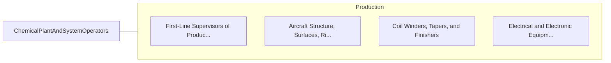

# Chemical Plant and System Operators

> Control or operate entire chemical processes or system of machines.

## Overview

Chemical Plant and System Operators is classified under Production (SOC 51). Control or operate entire chemical processes or system of machines.

## Classification Hierarchy

## Key Statistics

| Metric | Value |
|--------|-------|
| SOC Code | 51-8091.00 |
| Category | [Production](/occupations/Production/index) |
| Task Count | 93 |
| Source | O*NET |

## Core Tasks

### monitor.RecordingInstruments

Chemical Plant and System Operators monitor recording instruments as part of their core responsibilities.

**Actions:**
- `monitor.RecordingInstruments.for.WarningSignals.to.verify.ConformityOfProcessConditions`
- `monitor.Flowmeters.for.WarningSignals.to.verify.ConformityOfProcessConditions`
- `monitor.PanelLights.for.WarningSignals.to.verify.ConformityOfProcessConditions`
- `monitor.OtherIndicators.for.WarningSignals.to.verify.ConformityOfProcessConditions`

### regulate.AsDirected

Chemical Plant and System Operators regulate as directed as part of their core responsibilities.

**Actions:**
- `regulate.AsDirected.by.SupervisoryPersonnel`

### shut.AsDirected

Chemical Plant and System Operators shut as directed as part of their core responsibilities.

**Actions:**
- `shut.AsDirected.by.SupervisoryPersonnel`

## Skills & Competencies

### Technical Skills
- **Machine Operation** - Advanced
- **Quality Control** - Advanced
- **Production Processes** - Advanced

### Soft Skills
- **Communication** - Essential
- **Problem Solving** - Essential
- **Critical Thinking** - Important
- **Teamwork** - Important
- **Adaptability** - Important

## Related Occupations

## Industries

This occupation is found across multiple industries. See [Industries](/industries) for sector-specific employment data.

## Career Progression

---

*Source: O*NET 51-8091.00 - ONETOccupation*
