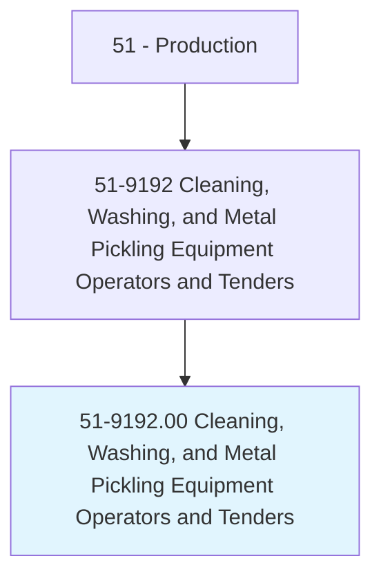
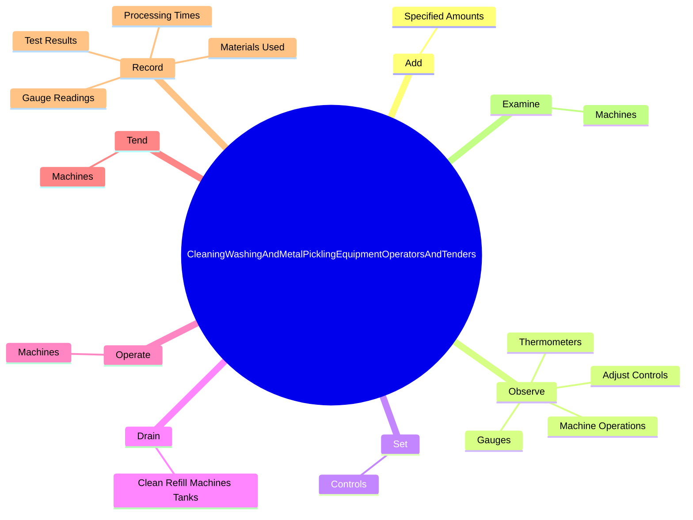
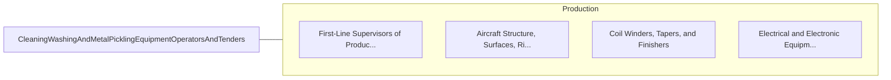

# Cleaning, Washing, and Metal Pickling Equipment Operators and Tenders

> Operate or tend machines to wash or clean products, such as barrels or kegs, glass items, tin plate, food, pulp, coal, plastic, or rubber, to remove impurities.

## Overview

Cleaning, Washing, and Metal Pickling Equipment Operators and Tenders is classified under Production (SOC 51). Operate or tend machines to wash or clean products, such as barrels or kegs, glass items, tin plate, food, pulp, coal, plastic, or rubber, to remove impurities.

## Classification Hierarchy

## Key Statistics

| Metric | Value |
|--------|-------|
| SOC Code | 51-9192.00 |
| Category | [Production](/occupations/Production) |
| Task Count | 67 |
| Source | O*NET |

## Core Tasks

### add.SpecifiedAmounts

Cleaning, Washing, and Metal Pickling Equipment Operators and Tenders add specified amounts as part of their core responsibilities.

**Actions:**
- `add.SpecifiedAmounts.of.ChemicalsToEquipmentAtRequiredTimesToMaintainSolutionLevels`
- `add.SpecifiedAmounts.of.Concentrations`

### observe.MachineOperations

Cleaning, Washing, and Metal Pickling Equipment Operators and Tenders observe machine operations as part of their core responsibilities.

**Actions:**
- `observe.MachineOperations.to.maintain.SpecifiedConditions`
- `observe.Gauges.to.maintain.SpecifiedConditions`
- `observe.Thermometers.to.maintain.SpecifiedConditions`
- `observe.AdjustControls.to.maintain.SpecifiedConditions`

### set.Controls

Cleaning, Washing, and Metal Pickling Equipment Operators and Tenders set controls as part of their core responsibilities.

**Actions:**
- `set.Controls.to.regulate.TemperatureOfCycles`
- `set.Controls.to.LengthOfCycles`
- `set.Controls.to.StartConveyors`
- `set.Controls.to.pumps`

## Skills & Competencies

### Technical Skills
- **Machine Operation** - Advanced
- **Quality Control** - Advanced
- **Production Processes** - Advanced

### Soft Skills
- **Communication** - Essential
- **Problem Solving** - Essential
- **Critical Thinking** - Important
- **Teamwork** - Important
- **Adaptability** - Important

## Related Occupations

## Industries

This occupation is found across multiple industries. See [Industries](/industries) for sector-specific employment data.

## Career Progression

---

*Source: O*NET 51-9192.00 - ONETOccupation*
