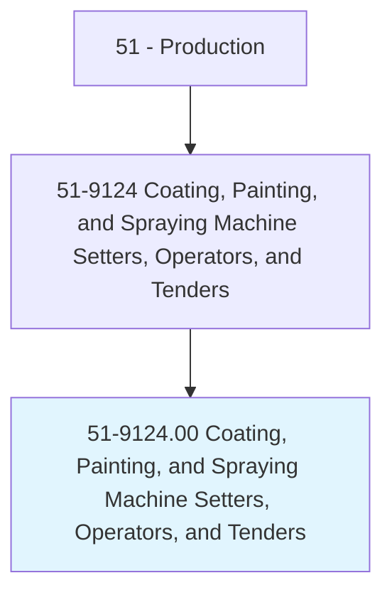
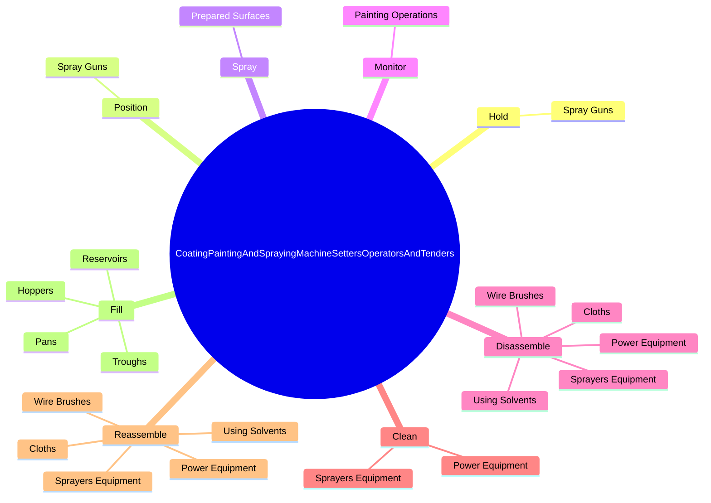

# Coating, Painting, and Spraying Machine Setters, Operators, and Tenders

> Set up, operate, or tend spraying or rolling machines to coat or paint any of a wide variety of products, including glassware, cloth, ceramics, metal, plastic, paper, or wood, with lacquer, silver, copper, rubber, varnish, glaze, enamel, oil, or rust-proofing materials. Includes painters of transportation vehicles such as painters in auto body repair facilities.

## Overview

Coating, Painting, and Spraying Machine Setters, Operators, and Tenders is an occupation within the Production category. Set up, operate, or tend spraying or rolling machines to coat or paint any of a wide variety of products, including glassware, cloth, ceramics, metal, plastic, paper, or wood, with lacquer, silver, copper, rubber, varnish, glaze, enamel, oil, or rust-proofing materials. 

## Classification Hierarchy

## Key Statistics

| Metric | Value |
|--------|-------|
| SOC Code | 51-9124.00 |
| Category | [Production](/occupations/Production) |
| Task Count | 180 |
| Source | O*NET |

## Core Tasks

### hold.SprayGuns

Coating, Painting, and Spraying Machine Setters, Operators, and Tenders hold spray guns as part of their core responsibilities.

**Actions:**
- `hold.SprayGuns.to.direct.SprayOntoArticles`

### position.SprayGuns

Coating, Painting, and Spraying Machine Setters, Operators, and Tenders position spray guns as part of their core responsibilities.

**Actions:**
- `position.SprayGuns.to.direct.SprayOntoArticles`

### spray.PreparedSurfaces

Coating, Painting, and Spraying Machine Setters, Operators, and Tenders spray prepared surfaces as part of their core responsibilities.

**Actions:**
- `spray.PreparedSurfaces.with.SpecifiedAmounts.of.PrimersFinishCoatings`
- `spray.PreparedSurfaces.with.DecorativeFinishCoatings`

## Skills & Competencies

### Technical Skills
- **Machine Operation** - Advanced
- **Quality Control** - Advanced
- **Production Processes** - Advanced

### Soft Skills
- **Communication** - Essential
- **Problem Solving** - Essential
- **Critical Thinking** - Important
- **Teamwork** - Important
- **Adaptability** - Important

## Related Occupations

## Industries

This occupation is found across multiple industries. See [Industries](/industries) for sector-specific employment data.

## Career Progression

---

*Source: O*NET 51-9124.00 - ONETOccupation*
