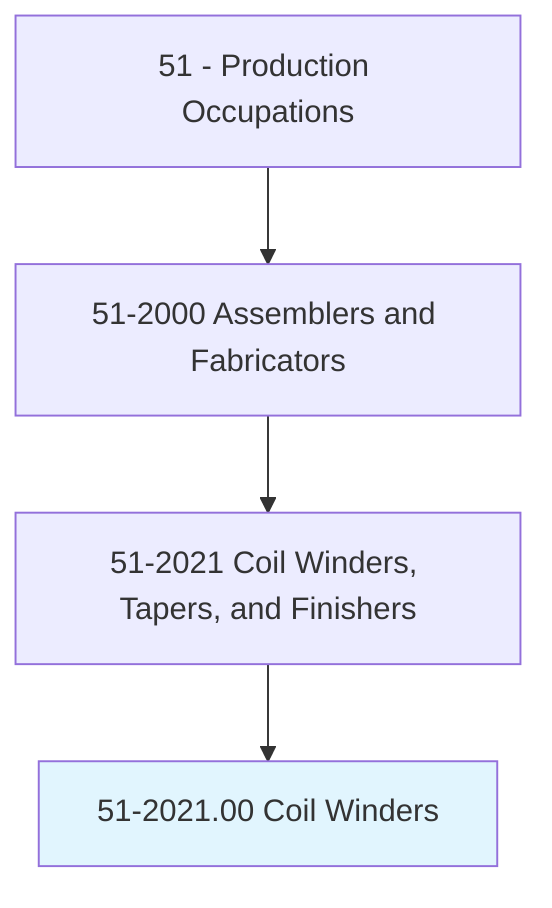
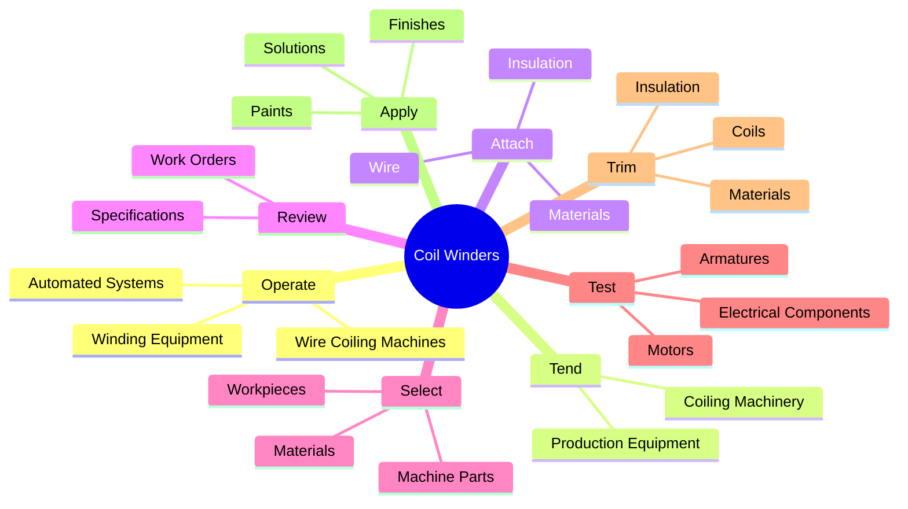
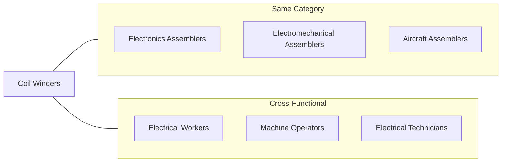
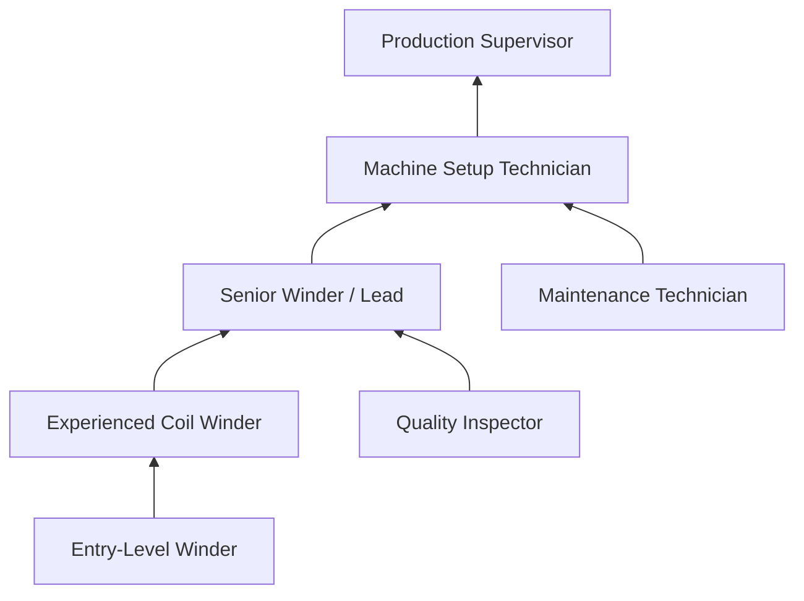
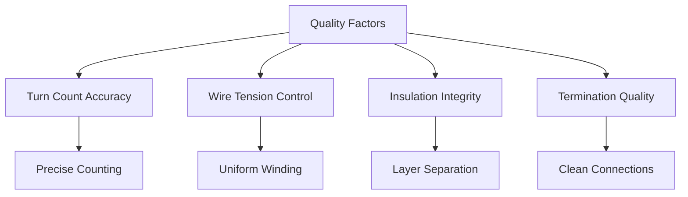

# Coil Winders, Tapers, and Finishers

> Wind wire coils used in electrical components, such as resistors and transformers, and in electrical equipment and instruments, such as field cores, bobbins, armature cores, electrical motors, generators, and control equipment.

## Overview

Coil Winders, Tapers, and Finishers are specialized production workers who create the wire coils essential to electrical components and equipment. They operate and tend wire coiling machines to wind precise coils for resistors, transformers, motors, and generators. This occupation requires careful attention to specifications, as coil characteristics directly affect electrical performance. Workers handle wire, insulation materials, and completed coils using hand tools, applying finishing touches like taping, trimming, and testing to ensure quality standards are met.

## Classification Hierarchy

## Key Statistics

| Metric | Value |
|--------|-------|
| SOC Code | 51-2021.00 |
| Job Zone | 2 (Some Preparation) |
| Category | [Production](/occupations/Production/index) |
| Core Tasks | 12+ |
| Source | O*NET |

## Core Tasks

### operate.WireCoilingMachines

Coil Winders operate and monitor wire coiling machinery to wind coils for various electrical applications.

**Actions:**
- `operate.WireCoilingMachines.to.wind.WireCoilsUsedInElectricalComponents` - Wind coils for electrical components
- `operate.WireCoilingMachines.to.Resistors` - Create coils for resistor applications
- `operate.WireCoilingMachines.to.Transformers` - Wind transformer coils
- `operate.WireCoilingMachines.to.InElectricalEquipment` - Produce coils for equipment
- `operate.WireCoilingMachines.to.Generators` - Wind generator coils
- `tend.WireCoilingMachines.to.Bobbins` - Tend machines for bobbin winding

### attach.Materials

Coil Winders handle and attach wire, insulation, and coil materials using hand tools.

**Actions:**
- `attach.Materials` - Secure materials for coiling process
- `attach.Wire` - Connect and feed wire into machines
- `attach.Insulation` - Apply insulation between coil layers
- `attach.Coils` - Attach completed coils to components
- `attach.UsingHandTools` - Use hand tools for attachment work
- `alter.Materials` - Modify materials as needed

### review.WorkOrders

Coil Winders review specifications and work orders to understand material and processing requirements.

**Actions:**
- `review.WorkOrders.to.determine.MaterialsNeeded` - Identify required materials
- `review.WorkOrders.to.types.OfPartsToBeProcessed` - Understand part types
- `review.Specifications.to.determine.MaterialsNeeded` - Check material specifications
- `review.Specifications.to.types.OfPartsToBeProcessed` - Review processing requirements

### select.Materials

Coil Winders select and load appropriate materials and machine parts for coiling processes.

**Actions:**
- `select.Materials.in.CoilingProcesses` - Choose correct materials
- `select.Workpieces.in.CoilingProcesses` - Select appropriate workpieces
- `select.MachineParts.onto.EquipmentUsed.in.CoilingProcesses` - Install machine components
- `load.Materials.in.CoilingProcesses` - Load materials into machines
- `load.Workpieces.in.CoilingProcesses` - Position workpieces for processing

### test.WiredElectricalComponents

Coil Winders examine and test completed electrical components to verify quality.

**Actions:**
- `examine.WiredElectricalComponents` - Visually inspect completed coils
- `examine.Motors` - Check motor coil assemblies
- `examine.Armatures` - Inspect armature windings
- `test.WiredElectricalComponents` - Perform electrical testing
- `test.UsingMeasuringDevices` - Use test equipment
- `test.RecordTestResults` - Document test outcomes

### trim.Materials

Coil Winders trim and finish coils and materials to specifications.

**Actions:**
- `trim.Materials` - Cut excess materials
- `trim.Insulation` - Remove excess insulation
- `trim.Coils` - Finish coil edges
- `trim.UsingHandTools` - Use cutting tools
- `cut.StripBendWireLeads.at.Ends.of.CoilsUsingPliersWireScrapers` - Prepare wire leads

### apply.Solutions

Coil Winders apply protective solutions, paints, and finishes to completed components.

**Actions:**
- `apply.Solutions.to.wired.ElectricalComponents` - Apply protective coatings
- `apply.Solutions.to.bake.Components` - Prepare for heat treatment
- `apply.Paints.to.wired.ElectricalComponents` - Apply paint finishes
- `apply.Paints.to.UsingH` - Use hand application methods

## Skills & Competencies

### Technical Skills
- **Machine Operation** - Proficient
- **Wire Handling** - Advanced
- **Electrical Testing** - Proficient
- **Blueprint Reading** - Basic to Proficient
- **Quality Inspection** - Proficient
- **Hand Tools** - Advanced

### Soft Skills
- **Attention to Detail** - Critical
- **Manual Dexterity** - Critical
- **Concentration** - Essential
- **Quality Awareness** - Essential
- **Following Instructions** - Important
- **Time Management** - Important

## Related Occupations

## Industries

- [Electrical Equipment Manufacturing](/industries/Manufacturing/ElectricalEquipment/index) - Primary Employment
- [Motor and Generator Manufacturing](/industries/MotorManufacturing) - High Employment
- Transformer Manufacturing - High Employment
- [Electronics Manufacturing](/industries/Electronics) - Moderate Employment
- Automotive Parts Manufacturing - Moderate Employment

## Career Progression

## Education & Training

| Requirement | Details |
|-------------|---------|
| Typical Education | High School Diploma or equivalent |
| Work Experience | No prior experience required for entry-level |
| On-the-Job Training | Short to moderate (1-6 months) |
| Common Certifications | IPC Certifications, Soldering Certification |

## Industry Variations

### Motor Manufacturing
- Large-scale coil production
- Automated winding common
- High volume, repetitive work
- Armature and stator focus

### Transformer Manufacturing
- Precision high-voltage coils
- Insulation critical
- Larger gauge wire handling
- Impregnation processes

### Electronics/Small Components
- Fine wire handling (magnet wire)
- Microscope work possible
- Precision counting
- Clean environment

### Repair/Rewind Shops
- Variable product types
- Manual winding more common
- Diagnostic skills needed
- Customer interaction

## Coil Winding Process Flow

## Tools & Equipment

### Winding Machines
- Manual coil winders
- Semi-automatic winders
- CNC winding machines
- Toroidal winders
- Layer winders

### Hand Tools
- Wire cutters/strippers
- Pliers (needle-nose, flat)
- Soldering equipment
- Taping tools
- Tension devices

### Test Equipment
- Multimeters
- Ohm meters
- Hi-pot testers
- Turn counters
- Surge testers

## Departments

This occupation typically works in:
- Coil Winding Department
- Motor Assembly
- Transformer Production
- Electrical Manufacturing

## Quality Considerations

## Physical Demands

- Seated work common
- Fine motor skills essential
- Repetitive hand motions
- Visual acuity required
- May require magnification

---

*Source: O*NET 51-2021.00 - ONETOccupation*
