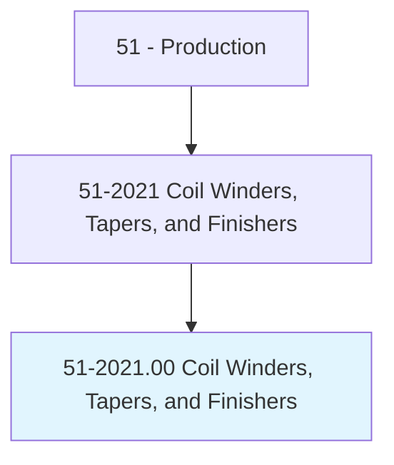
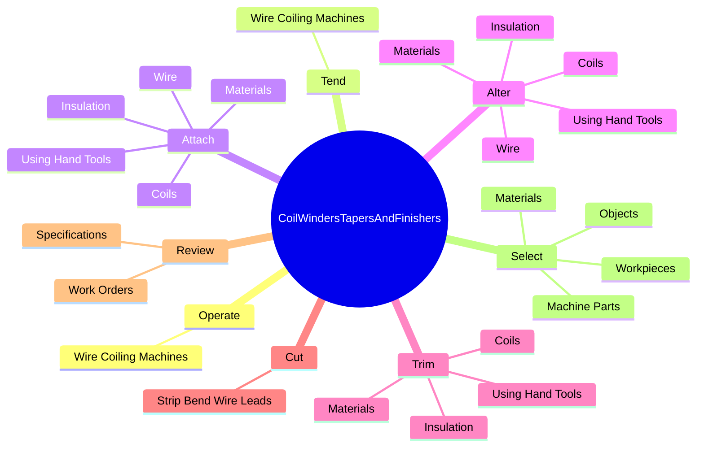
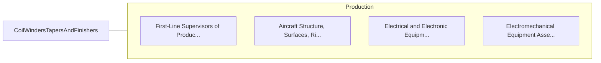

# Coil Winders, Tapers, and Finishers

> Wind wire coils used in electrical components, such as resistors and transformers, and in electrical equipment and instruments, such as field cores, bobbins, armature cores, electrical motors, generators, and control equipment.

## Overview

Coil Winders, Tapers, and Finishers is classified under Production (SOC 51). Wind wire coils used in electrical components, such as resistors and transformers, and in electrical equipment and instruments, such as field cores, bobbins, armature cores, electrical motors, generators, and control equipment.

## Classification Hierarchy

## Key Statistics

| Metric | Value |
|--------|-------|
| SOC Code | 51-2021.00 |
| Category | [Production](/occupations/Production/index) |
| Task Count | 72 |
| Source | O*NET |

## Core Tasks

### operate.WireCoilingMachines

Coil Winders, Tapers, and Finishers operate wire coiling machines as part of their core responsibilities.

**Actions:**
- `operate.WireCoilingMachines.to.wind.WireCoilsUsedInElectricalComponents`
- `operate.WireCoilingMachines.to.Resistors`
- `operate.WireCoilingMachines.to.Transformers`
- `operate.WireCoilingMachines.to.InElectricalEquipment`

### tend.WireCoilingMachines

Coil Winders, Tapers, and Finishers tend wire coiling machines as part of their core responsibilities.

**Actions:**
- `tend.WireCoilingMachines.to.wind.WireCoilsUsedInElectricalComponents`
- `tend.WireCoilingMachines.to.Resistors`
- `tend.WireCoilingMachines.to.Transformers`
- `tend.WireCoilingMachines.to.InElectricalEquipment`

### attach.Materials

Coil Winders, Tapers, and Finishers attach materials as part of their core responsibilities.

**Actions:**
- `attach.Materials`
- `attach.Wire`
- `attach.Insulation`
- `attach.Coils`

## Skills & Competencies

### Technical Skills
- **Machine Operation** - Advanced
- **Quality Control** - Advanced
- **Production Processes** - Advanced

### Soft Skills
- **Communication** - Essential
- **Problem Solving** - Essential
- **Critical Thinking** - Important
- **Teamwork** - Important
- **Adaptability** - Important

## Related Occupations

## Industries

This occupation is found across multiple industries. See [Industries](/industries) for sector-specific employment data.

## Career Progression

---

*Source: O*NET 51-2021.00 - ONETOccupation*
