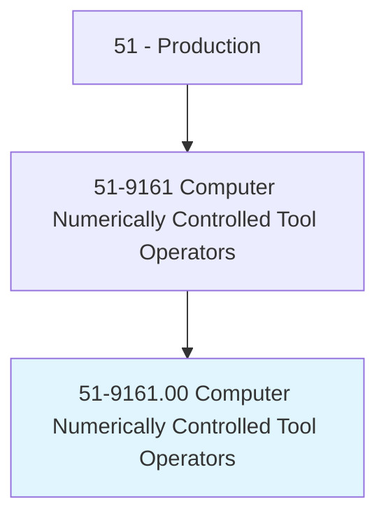
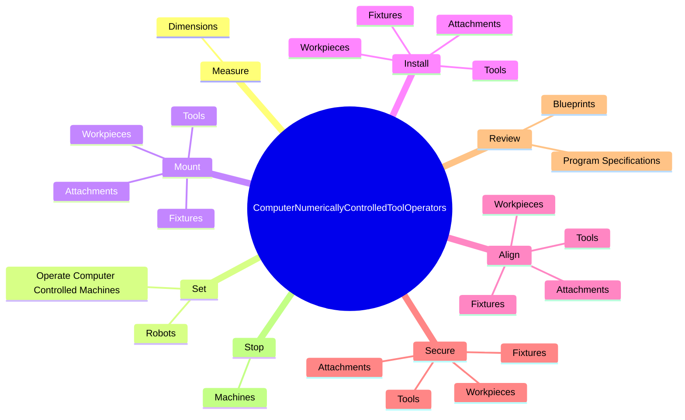
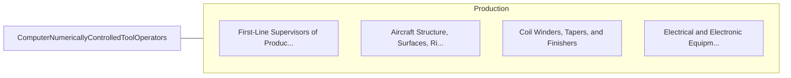

# Computer Numerically Controlled Tool Operators

> Operate computer-controlled tools, machines, or robots to machine or process parts, tools, or other work pieces made of metal, plastic, wood, stone, or other materials. May also set up and maintain equipment.

## Overview

Computer Numerically Controlled Tool Operators is an occupation within the Production category. Operate computer-controlled tools, machines, or robots to machine or process parts, tools, or other work pieces made of metal, plastic, wood, stone, or other materials. 

## Classification Hierarchy

## Key Statistics

| Metric | Value |
|--------|-------|
| SOC Code | 51-9161.00 |
| Category | [Production](/occupations/Production/index) |
| Task Count | 134 |
| Source | O*NET |

## Core Tasks

### measure.Dimensions

Computer Numerically Controlled Tool Operators measure dimensions as part of their core responsibilities.

**Actions:**
- `measure.Dimensions.of.FinishedWorkpieces.to.ensure.ConformanceToSpecifications`
- `measure.Dimensions.of.UsingPrecisionMeasuringInstruments`
- `measure.Dimensions.of.Templates`
- `measure.Dimensions.of.Fixtures`

### set.OperateComputerControlledMachines

Computer Numerically Controlled Tool Operators set operate computer controlled machines as part of their core responsibilities.

**Actions:**
- `set.OperateComputerControlledMachines.to.perform.OneMachineFunctionsOnMetalPlasticWorkpieces`
- `set.OperateComputerControlledMachines.to.machine.FunctionsOnMetalPlasticWorkpieces`
- `set.Robots.to.perform.OneMachineFunctionsOnMetalPlasticWorkpieces`
- `set.Robots.to.machine.FunctionsOnMetalPlasticWorkpieces`

### mount.Tools

Computer Numerically Controlled Tool Operators mount tools as part of their core responsibilities.

**Actions:**
- `mount.Tools.on.Machines`
- `mount.Tools.on.UsingH`
- `mount.Tools.on.ToolsMeasuringInstruments`
- `mount.Tools.on.PrecisionMeasuringInstruments`

## Skills & Competencies

### Technical Skills
- **Machine Operation** - Advanced
- **Quality Control** - Advanced
- **Production Processes** - Advanced

### Soft Skills
- **Communication** - Essential
- **Problem Solving** - Essential
- **Critical Thinking** - Important
- **Teamwork** - Important
- **Adaptability** - Important

## Related Occupations

## Industries

This occupation is found across multiple industries. See [Industries](/industries) for sector-specific employment data.

## Career Progression

---

*Source: O*NET 51-9161.00 - ONETOccupation*
