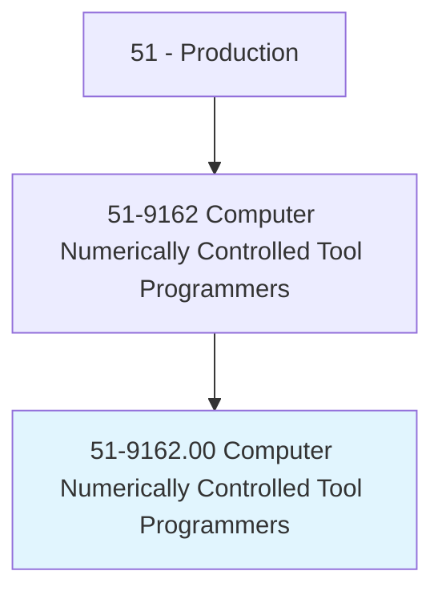
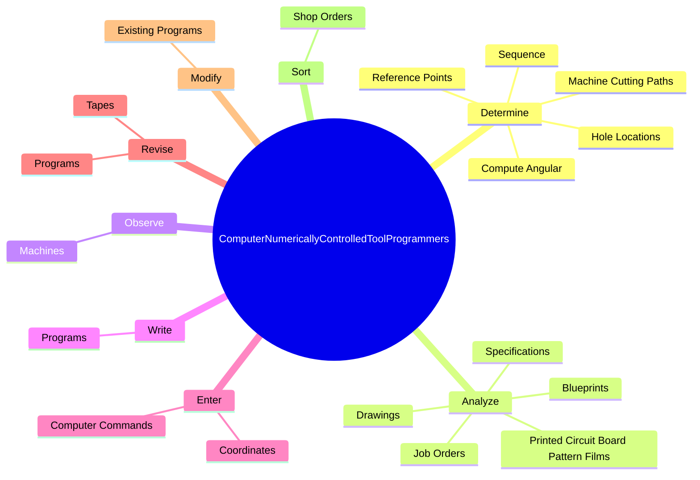
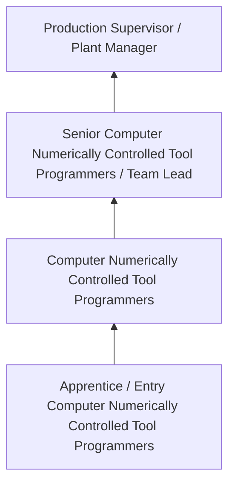
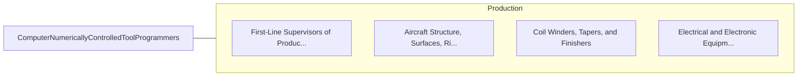

# Computer Numerically Controlled Tool Programmers

> Develop programs to control machining or processing of materials by automatic machine tools, equipment, or systems. May also set up, operate, or maintain equipment.

## Overview

Computer Numerically Controlled Tool Programmers professionals develop programs to control machining or processing of materials by automatic machine tools, equipment, or systems. This occupation falls within the Production category and requires a combination of specialized knowledge, technical skills, and practical experience.

These professionals work across diverse settings and organizational contexts, applying their expertise to meet the demands of their field. They must stay current with industry standards, emerging practices, and regulatory requirements that affect their work. The role demands both independent judgment and collaborative skills, as practitioners regularly interact with colleagues, stakeholders, and the public.

As the field continues to evolve, Computer Numerically Controlled Tool Programmers professionals increasingly leverage technology and data-driven approaches to enhance their effectiveness. Career opportunities span the public and private sectors, with demand influenced by economic conditions, demographic shifts, and technological advancement.

## Classification Hierarchy



## Key Statistics

| Metric | Value |
|--------|-------|
| SOC Code | 51-9162.00 |
| Job Zone | N/A |
| Category | [Production](/occupations/Production/index) |
| Core Tasks | 73+ |
| Salary Range | $28,000 - $65,000 |
| Median Salary | $40,000 |
| Growth Outlook | 1% (Little or no change) |
| Source | O*NET |

## Core Tasks



### analyze.JobOrders

Computer Numerically Controlled Tool Programmers analyze job orders as part of their core responsibilities.

**Actions:**
- `analyze.JobOrders.to.calculate.Dimensions` - Analyze job orders, drawings, blueprints, specifications, printed circuit boa...
- `analyze.JobOrders.to.ToolSelection` - Analyze job orders, drawings, blueprints, specifications, printed circuit boa...
- `analyze.JobOrders.to.machine.Speeds` - Analyze job orders, drawings, blueprints, specifications, printed circuit boa...
- `analyze.JobOrders.to.feed.Rates` - Analyze job orders, drawings, blueprints, specifications, printed circuit boa...
- `analyze.Drawings.to.calculate.Dimensions` - Analyze job orders, drawings, blueprints, specifications, printed circuit boa...

### determine.Sequence

Computer Numerically Controlled Tool Programmers determine sequence as part of their core responsibilities.

**Actions:**
- `determine.Sequence.of.MachineOperations` - Determine the sequence of machine operations, and select the proper cutting t...
- `determine.Sequence.of.SelectProperCuttingToolsNeeded.to.machine.WorkpiecesIntoDesiredShapes` - Determine the sequence of machine operations, and select the proper cutting t...
- `determine.ReferencePoints` - Determine reference points, machine cutting paths, or hole locations, and com...
- `determine.MachineCuttingPaths` - Determine reference points, machine cutting paths, or hole locations, and com...
- `determine.HoleLocations` - Determine reference points, machine cutting paths, or hole locations, and com...

### write.Programs

Computer Numerically Controlled Tool Programmers write programs as part of their core responsibilities.

**Actions:**
- `write.Programs.in.Language.of.MachinesController` - Write programs in the language of a machine's controller and store programs o...
- `write.Programs.in.StorePrograms.on.Media` - Write programs in the language of a machine's controller and store programs o...
- `write.Programs.in.PunchTapes` - Write programs in the language of a machine's controller and store programs o...
- `write.Programs.in.MagneticTapes` - Write programs in the language of a machine's controller and store programs o...
- `write.Programs.in.Disks` - Write programs in the language of a machine's controller and store programs o...

### enter.ComputerCommands

Computer Numerically Controlled Tool Programmers enter computer commands as part of their core responsibilities.

**Actions:**
- `enter.ComputerCommands.to.store.PartsPatterns` - Enter computer commands to store or retrieve parts patterns, graphic displays...
- `enter.ComputerCommands.to.retrieve.PartsPatterns` - Enter computer commands to store or retrieve parts patterns, graphic displays...
- `enter.ComputerCommands.to.GraphicDisplays` - Enter computer commands to store or retrieve parts patterns, graphic displays...
- `enter.ComputerCommands.to.programs.TransferDataToOtherMedia` - Enter computer commands to store or retrieve parts patterns, graphic displays...
- `enter.Coordinates.of.HoleLocationsIntoProgramMemories.by.DepressingPedalsOfProgrammers` - Enter coordinates of hole locations into program memories by depressing pedal...


## Skills & Competencies

### Technical Skills
- **Machine Operation** - Advanced
- **Quality Inspection** - Advanced
- **Safety Procedures** - Advanced
- **Blueprint Reading** - Proficient
- **Measurement Tools** - Proficient
- **Process Control** - Proficient

### Soft Skills
- **Attention to Detail** - Critical
- **Reliability** - Critical
- **Physical Dexterity** - Essential
- **Teamwork** - Essential
- **Problem Solving** - Important

## Education & Certifications

| Requirement | Details |
|-------------|---------|
| Typical Education | High school diploma or equivalent; some positions require technical training |
| Work Experience | 0-2 years manufacturing experience |
| On-the-Job Training | Moderate - equipment operation and safety procedures |
| Certifications | OSHA certifications, quality management certifications |

## Career Progression



## Industry Variations

### Discrete Manufacturing
Assembly of distinct products such as automobiles, electronics, or machinery. Computer Numerically Controlled Tool Programmers professionals work with precision equipment and quality standards.

### Process Manufacturing
Continuous production of chemicals, food, or materials. Focus on process control and consistency.

### Custom and Job Shop
Small-batch or custom production work. Requires versatility and ability to adapt to varied specifications.

### Automated Manufacturing
Technology-driven production with robotics and advanced systems. Increasing emphasis on programming and monitoring skills.

## Technology & Tools

- **Manufacturing execution systems (MES)**
- **Computer numerical control (CNC) machines**
- **Quality management software**
- **Programmable logic controllers (PLC)**
- **Enterprise resource planning (ERP) systems**

## Related Occupations



## Industries

- [Manufacturing](/industries/Manufacturing) - High Employment
- Food Processing - High Employment
- [Automotive](/industries/Manufacturing) - Moderate Employment
- [Electronics](/industries/Electronics) - Moderate Employment

## Departments

This occupation typically works in:
- [Manufacturing](/departments/Operations)
- Quality Control
- Production Planning

## GraphDL Semantic Structure

```graphdl
Computer Numerically Controlled Tool Programmers perform:
- determine.Sequence.of.MachineOperations
- determine.Sequence.of.SelectProperCuttingToolsNeeded.to.machine.WorkpiecesIntoDesiredShapes
- analyze.JobOrders.to.calculate.Dimensions
- analyze.JobOrders.to.ToolSelection
- analyze.JobOrders.to.machine.Speeds
- analyze.JobOrders.to.feed.Rates
```

---

*Source: O*NET 51-9162.00 - ONETOccupation*
