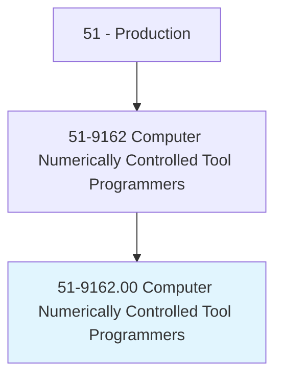
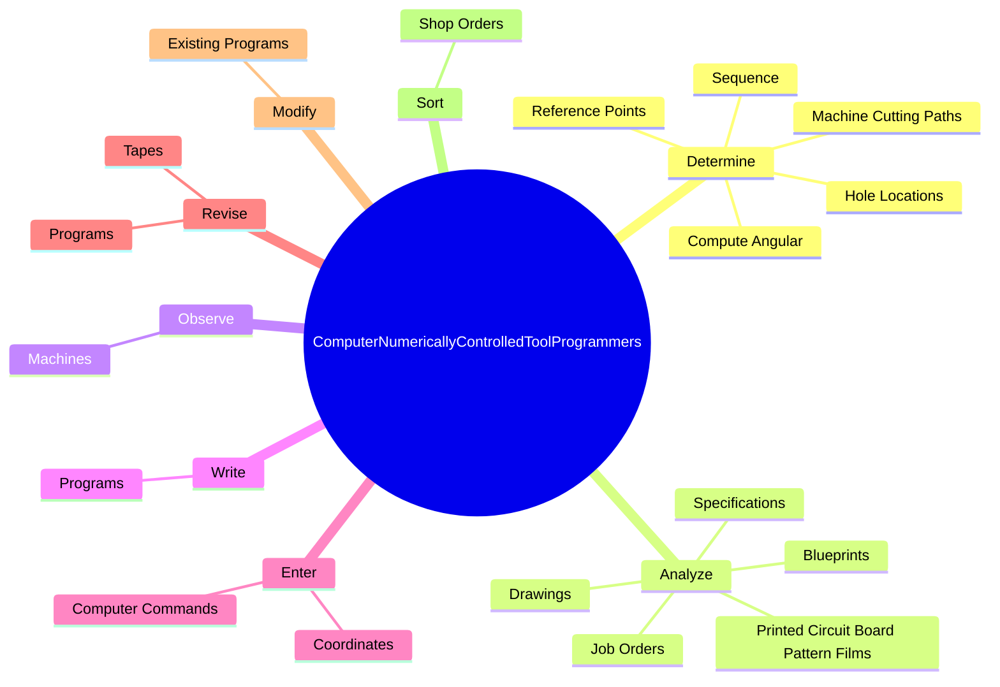
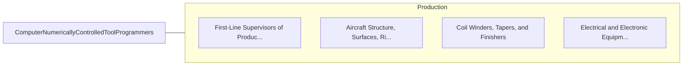

# Computer Numerically Controlled Tool Programmers

> Develop programs to control machining or processing of materials by automatic machine tools, equipment, or systems. May also set up, operate, or maintain equipment.

## Overview

Computer Numerically Controlled Tool Programmers is an occupation within the Production category. Develop programs to control machining or processing of materials by automatic machine tools, equipment, or systems. 

## Classification Hierarchy

## Key Statistics

| Metric | Value |
|--------|-------|
| SOC Code | 51-9162.00 |
| Category | [Production](/occupations/Production) |
| Task Count | 73 |
| Source | O*NET |

## Core Tasks

### determine.Sequence

Computer Numerically Controlled Tool Programmers determine sequence as part of their core responsibilities.

**Actions:**
- `determine.Sequence.of.MachineOperations`
- `determine.Sequence.of.SelectProperCuttingToolsNeeded.to.machine.WorkpiecesIntoDesiredShapes`
- `determine.ReferencePoints`
- `determine.MachineCuttingPaths`

### analyze.JobOrders

Computer Numerically Controlled Tool Programmers analyze job orders as part of their core responsibilities.

**Actions:**
- `analyze.JobOrders.to.calculate.Dimensions`
- `analyze.JobOrders.to.ToolSelection`
- `analyze.JobOrders.to.machine.Speeds`
- `analyze.JobOrders.to.feed.Rates`

### observe.Machines

Computer Numerically Controlled Tool Programmers observe machines as part of their core responsibilities.

**Actions:**
- `observe.Machines.on.TrialRuns`
- `observe.Machines.on.ConductComputerSimulations.to.ensure.ProgramsWillFunctionProperlyProduceItemsMeetSpecifications`
- `observe.Machines.on.MachineryWillFunctionProperlyProduceItemsMeetSpecifications`

## Skills & Competencies

### Technical Skills
- **Machine Operation** - Advanced
- **Quality Control** - Advanced
- **Production Processes** - Advanced

### Soft Skills
- **Communication** - Essential
- **Problem Solving** - Essential
- **Critical Thinking** - Important
- **Teamwork** - Important
- **Adaptability** - Important

## Related Occupations

## Industries

This occupation is found across multiple industries. See [Industries](/industries) for sector-specific employment data.

## Career Progression

---

*Source: O*NET 51-9162.00 - ONETOccupation*
