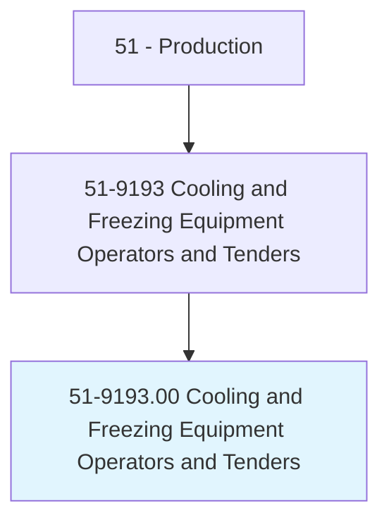
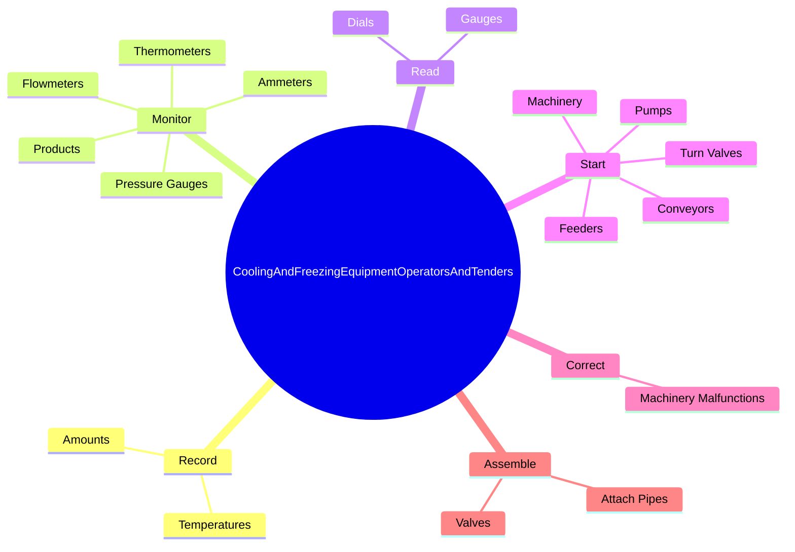
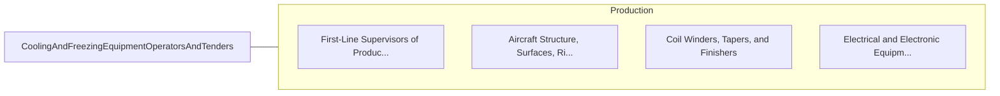

# Cooling and Freezing Equipment Operators and Tenders

> Operate or tend equipment such as cooling and freezing units, refrigerators, batch freezers, and freezing tunnels, to cool or freeze products, food, blood plasma, and chemicals.

## Overview

Cooling and Freezing Equipment Operators and Tenders is classified under Production (SOC 51). Operate or tend equipment such as cooling and freezing units, refrigerators, batch freezers, and freezing tunnels, to cool or freeze products, food, blood plasma, and chemicals.

## Classification Hierarchy

## Key Statistics

| Metric | Value |
|--------|-------|
| SOC Code | 51-9193.00 |
| Category | [Production](/occupations/Production) |
| Task Count | 168 |
| Source | O*NET |

## Core Tasks

### record.Temperatures

Cooling and Freezing Equipment Operators and Tenders record temperatures as part of their core responsibilities.

**Actions:**
- `record.Temperatures.of.MaterialsProcessed`
- `record.Temperatures.of.TestResults.on.ReportForms`
- `record.Amounts.of.MaterialsProcessed`
- `record.Amounts.of.TestResults.on.ReportForms`

### monitor.PressureGauges

Cooling and Freezing Equipment Operators and Tenders monitor pressure gauges as part of their core responsibilities.

**Actions:**
- `monitor.PressureGauges.to.maintain.SpecifiedConditions`
- `monitor.PressureGauges.to.feed.Rate`
- `monitor.PressureGauges.to.ProductConsistency`
- `monitor.PressureGauges.to.Temperature`

### read.Dials

Cooling and Freezing Equipment Operators and Tenders read dials as part of their core responsibilities.

**Actions:**
- `read.Dials.on.PanelControlBoards.to.ascertain.Temperatures`
- `read.Dials.on.Alkalinities`
- `read.Dials.on.Densities.of.Mixtures`
- `read.Dials.on.TurnValves.to.obtain.SpecifiedMixtures`

## Skills & Competencies

### Technical Skills
- **Machine Operation** - Advanced
- **Quality Control** - Advanced
- **Production Processes** - Advanced

### Soft Skills
- **Communication** - Essential
- **Problem Solving** - Essential
- **Critical Thinking** - Important
- **Teamwork** - Important
- **Adaptability** - Important

## Related Occupations

## Industries

This occupation is found across multiple industries. See [Industries](/industries) for sector-specific employment data.

## Career Progression

---

*Source: O*NET 51-9193.00 - ONETOccupation*
