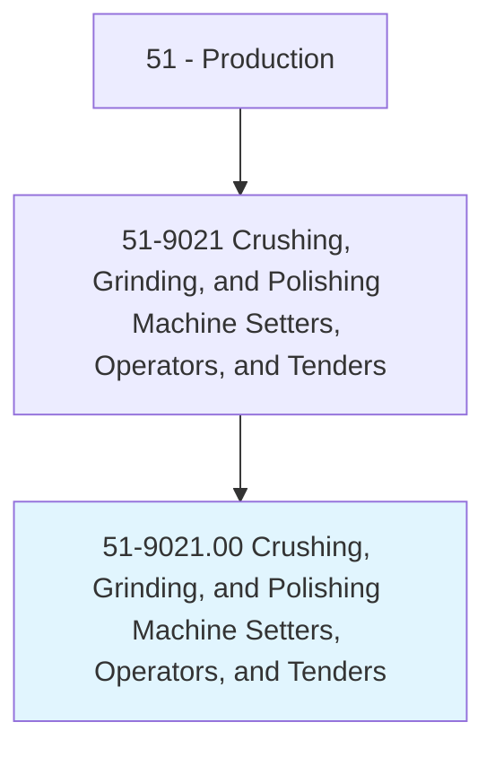
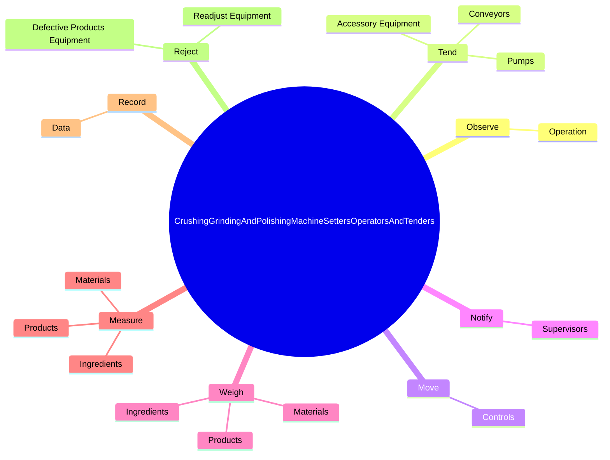

# Crushing, Grinding, and Polishing Machine Setters, Operators, and Tenders

> Set up, operate, or tend machines to crush, grind, or polish materials, such as coal, glass, grain, stone, food, or rubber.

## Overview

Crushing, Grinding, and Polishing Machine Setters, Operators, and Tenders is classified under Production (SOC 51). Set up, operate, or tend machines to crush, grind, or polish materials, such as coal, glass, grain, stone, food, or rubber.

## Classification Hierarchy

## Key Statistics

| Metric | Value |
|--------|-------|
| SOC Code | 51-9021.00 |
| Category | [Production](/occupations/Production) |
| Task Count | 84 |
| Source | O*NET |

## Core Tasks

### observe.Operation

Crushing, Grinding, and Polishing Machine Setters, Operators, and Tenders observe operation as part of their core responsibilities.

**Actions:**
- `observe.Operation.of.Equipment.to.ensure.ContinuityOfFlow`
- `observe.Operation.of.Safety`
- `observe.Operation.of.EfficientOperation`
- `observe.Operation.of.detect.Malfunctions`

### tend.AccessoryEquipment

Crushing, Grinding, and Polishing Machine Setters, Operators, and Tenders tend accessory equipment as part of their core responsibilities.

**Actions:**
- `tend.AccessoryEquipment.to.move.MaterialsThroughProductionProcesses`
- `tend.AccessoryEquipment.to.IngredientsThroughProductionProcesses`
- `tend.Pumps.to.move.MaterialsThroughProductionProcesses`
- `tend.Pumps.to.IngredientsThroughProductionProcesses`

### move.Controls

Crushing, Grinding, and Polishing Machine Setters, Operators, and Tenders move controls as part of their core responsibilities.

**Actions:**
- `move.Controls.to.start`
- `move.Controls.to.stop`
- `move.Controls.to.adjust.MachineryCrushes`
- `move.Controls.to.EquipmentCrushes`

## Skills & Competencies

### Technical Skills
- **Machine Operation** - Advanced
- **Quality Control** - Advanced
- **Production Processes** - Advanced

### Soft Skills
- **Communication** - Essential
- **Problem Solving** - Essential
- **Critical Thinking** - Important
- **Teamwork** - Important
- **Adaptability** - Important

## Related Occupations

## Industries

This occupation is found across multiple industries. See [Industries](/industries) for sector-specific employment data.

## Career Progression

---

*Source: O*NET 51-9021.00 - ONETOccupation*
