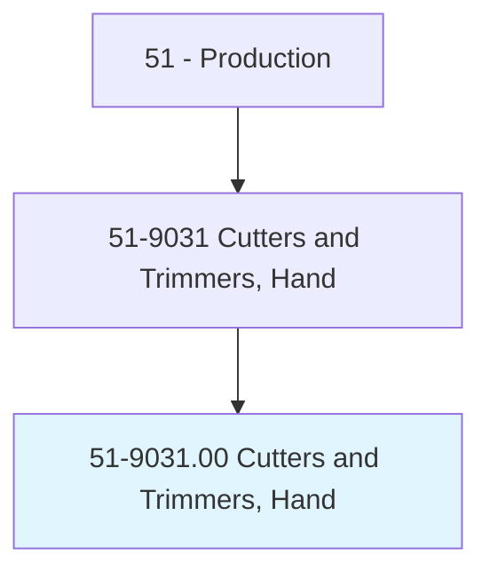
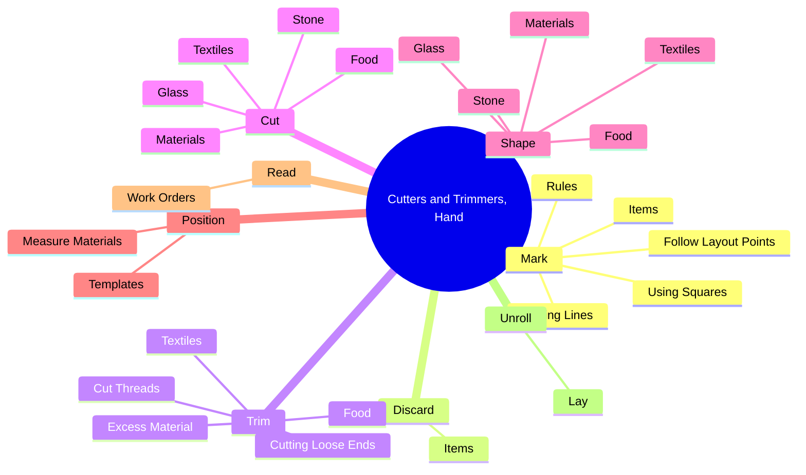
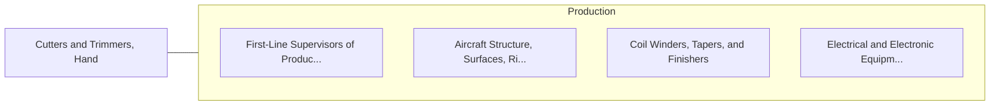

# Cutters and Trimmers, Hand

> Use hand tools or hand-held power tools to cut and trim a variety of manufactured items, such as carpet, fabric, stone, glass, or rubber.

## Overview

Cutters and Trimmers, Hand is classified under Production (SOC 51). Use hand tools or hand-held power tools to cut and trim a variety of manufactured items, such as carpet, fabric, stone, glass, or rubber.

## Classification Hierarchy

## Key Statistics

| Metric | Value |
|--------|-------|
| SOC Code | 51-9031.00 |
| Category | [Production](/occupations/Production/index) |
| Task Count | 117 |
| Source | O*NET |

## Core Tasks

### mark.Items

Cutters and Trimmers, Hand mark items as part of their core responsibilities.

**Actions:**
- `mark.Items.with.Defects`
- `mark.Items.with.Spots`
- `mark.Items.with.Stains`
- `mark.Items.with.Scars`

### discard.Items

Cutters and Trimmers, Hand discard items as part of their core responsibilities.

**Actions:**
- `discard.Items.with.Defects`
- `discard.Items.with.Spots`
- `discard.Items.with.Stains`
- `discard.Items.with.Scars`

### trim.ExcessMaterial

Cutters and Trimmers, Hand trim excess material as part of their core responsibilities.

**Actions:**
- `trim.ExcessMaterial.of.PlasticOffManufacturedToy.for.SmootherFinish`
- `trim.CutThreads.off.FinishedProducts.of.PlasticOffManufacturedToyForSmootherFinish`
- `trim.CuttingLooseEnds.of.PlasticOffManufacturedToy.for.SmootherFinish`
- `trim.Textiles`

## Skills & Competencies

### Technical Skills
- **Machine Operation** - Advanced
- **Quality Control** - Advanced
- **Production Processes** - Advanced

### Soft Skills
- **Communication** - Essential
- **Problem Solving** - Essential
- **Critical Thinking** - Important
- **Teamwork** - Important
- **Adaptability** - Important

## Related Occupations

## Industries

This occupation is found across multiple industries. See [Industries](/industries) for sector-specific employment data.

## Career Progression

---

*Source: O*NET 51-9031.00 - ONETOccupation*
