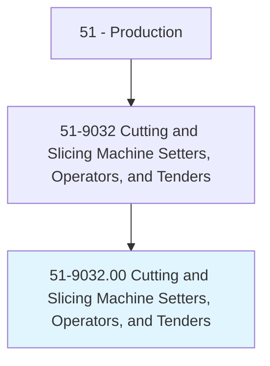
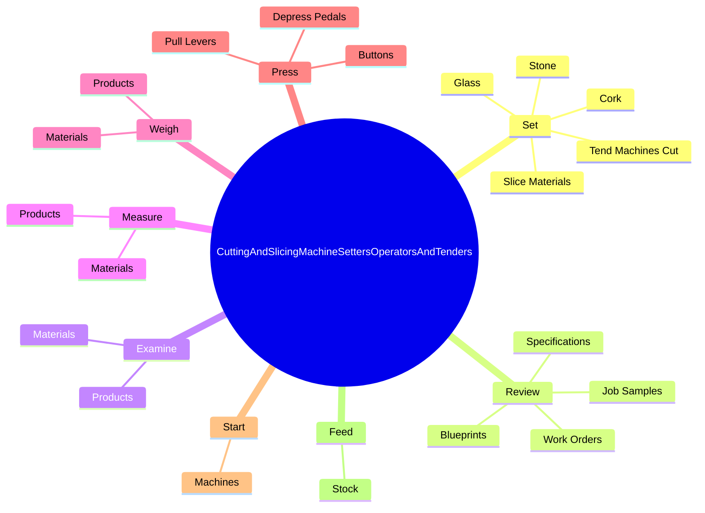

# Cutting and Slicing Machine Setters, Operators, and Tenders

> Set up, operate, or tend machines that cut or slice materials, such as glass, stone, cork, rubber, tobacco, food, paper, or insulating material.

## Overview

Cutting and Slicing Machine Setters, Operators, and Tenders is classified under Production (SOC 51). Set up, operate, or tend machines that cut or slice materials, such as glass, stone, cork, rubber, tobacco, food, paper, or insulating material.

## Classification Hierarchy

## Key Statistics

| Metric | Value |
|--------|-------|
| SOC Code | 51-9032.00 |
| Category | [Production](/occupations/Production/index) |
| Task Count | 193 |
| Source | O*NET |

## Core Tasks

### set.TendMachinesCut

Cutting and Slicing Machine Setters, Operators, and Tenders set tend machines cut as part of their core responsibilities.

**Actions:**
- `set.TendMachinesCut`
- `set.SliceMaterials`
- `set.Glass`
- `set.Stone`

### review.WorkOrders

Cutting and Slicing Machine Setters, Operators, and Tenders review work orders as part of their core responsibilities.

**Actions:**
- `review.WorkOrders.to.determine.Components`
- `review.WorkOrders.to.Settings`
- `review.WorkOrders.to.AdjustmentsForCutting`
- `review.WorkOrders.to.SlicingMachines`

### examine.Materials

Cutting and Slicing Machine Setters, Operators, and Tenders examine materials as part of their core responsibilities.

**Actions:**
- `examine.Materials.to.verify.ConformanceToSpecifications`
- `examine.Materials.to.UsingMeasuringDevices`
- `examine.Materials.to.Rulers`
- `examine.Materials.to.Micrometers`

## Skills & Competencies

### Technical Skills
- **Machine Operation** - Advanced
- **Quality Control** - Advanced
- **Production Processes** - Advanced

### Soft Skills
- **Communication** - Essential
- **Problem Solving** - Essential
- **Critical Thinking** - Important
- **Teamwork** - Important
- **Adaptability** - Important

## Related Occupations

## Industries

This occupation is found across multiple industries. See [Industries](/industries) for sector-specific employment data.

## Career Progression

---

*Source: O*NET 51-9032.00 - ONETOccupation*
