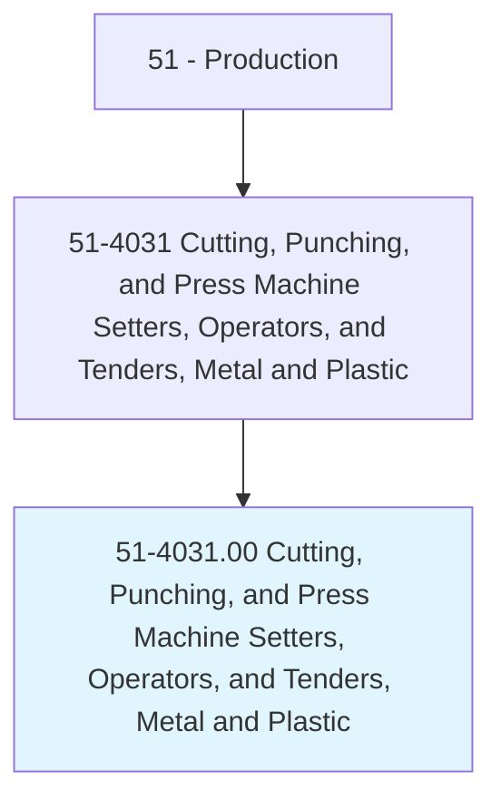
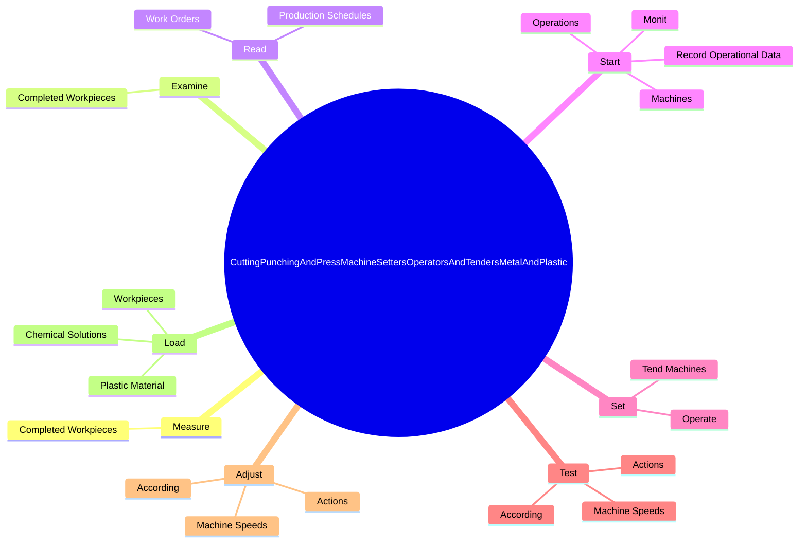

# Cutting, Punching, and Press Machine Setters, Operators, and Tenders, Metal and Plastic

> Set up, operate, or tend machines to saw, cut, shear, slit, punch, crimp, notch, bend, or straighten metal or plastic material.

## Overview

Cutting, Punching, and Press Machine Setters, Operators, and Tenders, Metal and Plastic is classified under Production (SOC 51). Set up, operate, or tend machines to saw, cut, shear, slit, punch, crimp, notch, bend, or straighten metal or plastic material.

## Classification Hierarchy

## Key Statistics

| Metric | Value |
|--------|-------|
| SOC Code | 51-4031.00 |
| Category | [Production](/occupations/Production/index) |
| Task Count | 175 |
| Source | O*NET |

## Core Tasks

### measure.CompletedWorkpieces

Cutting, Punching, and Press Machine Setters, Operators, and Tenders, Metal and Plastic measure completed workpieces as part of their core responsibilities.

**Actions:**
- `measure.CompletedWorkpieces.to.verify.ConformanceToSpecifications`
- `measure.CompletedWorkpieces.to.UsingMicrometers`
- `measure.CompletedWorkpieces.to.gauges`
- `measure.CompletedWorkpieces.to.Calipers`

### examine.CompletedWorkpieces

Cutting, Punching, and Press Machine Setters, Operators, and Tenders, Metal and Plastic examine completed workpieces as part of their core responsibilities.

**Actions:**
- `examine.CompletedWorkpieces.for.Defects`
- `examine.CompletedWorkpieces.for.ChippedEdges`
- `examine.CompletedWorkpieces.for.MarredSurfaces`
- `examine.CompletedWorkpieces.for.SortDefectivePiecesAccording.to.types.OfFlaws`

### read.WorkOrders

Cutting, Punching, and Press Machine Setters, Operators, and Tenders, Metal and Plastic read work orders as part of their core responsibilities.

**Actions:**
- `read.WorkOrders.to.determine.Specifications`
- `read.WorkOrders.to.MaterialsToBeUsed`
- `read.WorkOrders.to.LocationsOfCuttingLines`
- `read.WorkOrders.to.Dimensions`

## Skills & Competencies

### Technical Skills
- **Machine Operation** - Advanced
- **Quality Control** - Advanced
- **Production Processes** - Advanced

### Soft Skills
- **Communication** - Essential
- **Problem Solving** - Essential
- **Critical Thinking** - Important
- **Teamwork** - Important
- **Adaptability** - Important

## Related Occupations

## Industries

This occupation is found across multiple industries. See [Industries](/industries) for sector-specific employment data.

## Career Progression

---

*Source: O*NET 51-4031.00 - ONETOccupation*
