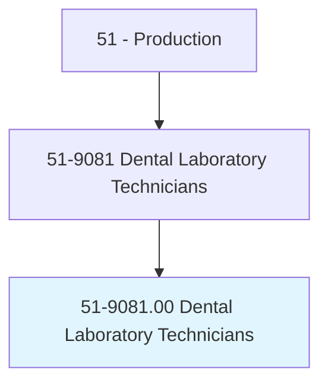
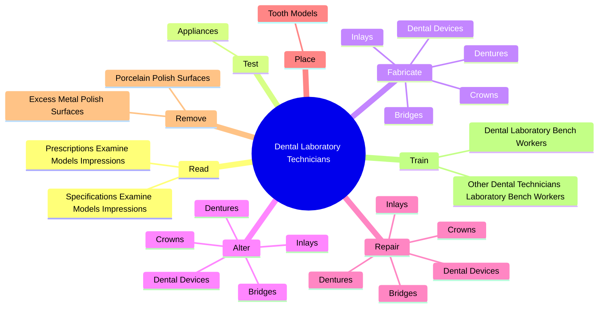
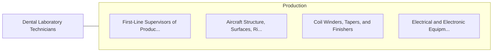

# Dental Laboratory Technicians

> Construct and repair full or partial dentures or dental appliances.

## Overview

Dental Laboratory Technicians is classified under Production (SOC 51). Construct and repair full or partial dentures or dental appliances.

## Classification Hierarchy

## Key Statistics

| Metric | Value |
|--------|-------|
| SOC Code | 51-9081.00 |
| Category | [Production](/occupations/Production) |
| Task Count | 95 |
| Source | O*NET |

## Core Tasks

### read.PrescriptionsExamineModelsImpressions

Dental Laboratory Technicians read prescriptions examine models impressions as part of their core responsibilities.

**Actions:**
- `read.PrescriptionsExamineModelsImpressions.to.determine.DesignOfDentalProductsToBeConstructed`
- `read.SpecificationsExamineModelsImpressions.to.determine.DesignOfDentalProductsToBeConstructed`

### test.Appliances

Dental Laboratory Technicians test appliances as part of their core responsibilities.

**Actions:**
- `test.Appliances.for.ConformanceToSpecificationsOfOcclusion`
- `test.Appliances.for.Accuracy.of.Occlusion`
- `test.Appliances.for.UsingArticulators`
- `test.Appliances.for.Micrometers`

### fabricate.DentalDevices

Dental Laboratory Technicians fabricate dental devices as part of their core responsibilities.

**Actions:**
- `fabricate.DentalDevices.for.StraighteningTeeth`
- `fabricate.Dentures.for.StraighteningTeeth`
- `fabricate.Crowns.for.StraighteningTeeth`
- `fabricate.Bridges.for.StraighteningTeeth`

## Skills & Competencies

### Technical Skills
- **Machine Operation** - Advanced
- **Quality Control** - Advanced
- **Production Processes** - Advanced

### Soft Skills
- **Communication** - Essential
- **Problem Solving** - Essential
- **Critical Thinking** - Important
- **Teamwork** - Important
- **Adaptability** - Important

## Related Occupations

## Industries

This occupation is found across multiple industries. See [Industries](/industries) for sector-specific employment data.

## Career Progression

---

*Source: O*NET 51-9081.00 - ONETOccupation*
