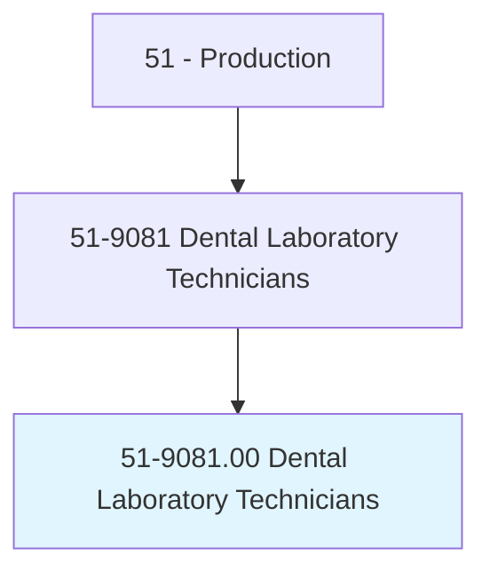
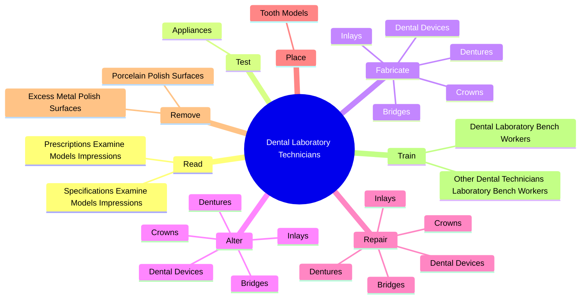
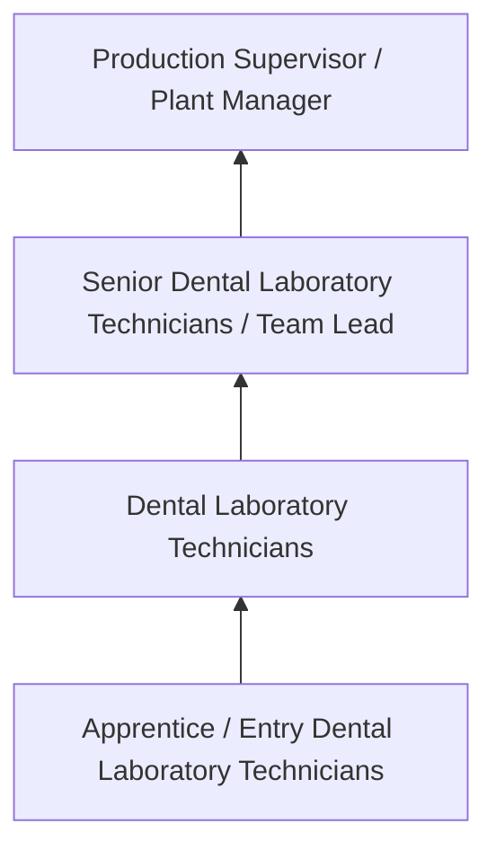
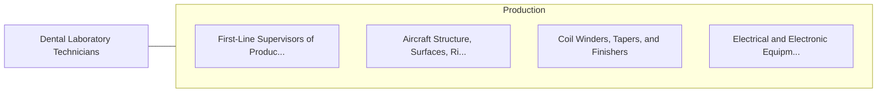

# Dental Laboratory Technicians

> Construct and repair full or partial dentures or dental appliances.

## Overview

Dental Laboratory Technicians professionals construct and repair full or partial dentures or dental appliances.. This occupation falls within the Production category and requires a combination of specialized knowledge, technical skills, and practical experience.

These professionals work across diverse settings and organizational contexts, applying their expertise to meet the demands of their field. They must stay current with industry standards, emerging practices, and regulatory requirements that affect their work. The role demands both independent judgment and collaborative skills, as practitioners regularly interact with colleagues, stakeholders, and the public.

As the field continues to evolve, Dental Laboratory Technicians professionals increasingly leverage technology and data-driven approaches to enhance their effectiveness. Career opportunities span the public and private sectors, with demand influenced by economic conditions, demographic shifts, and technological advancement.

## Classification Hierarchy



## Key Statistics

| Metric | Value |
|--------|-------|
| SOC Code | 51-9081.00 |
| Job Zone | N/A |
| Category | [Production](/occupations/Production/index) |
| Core Tasks | 95+ |
| Salary Range | $28,000 - $65,000 |
| Median Salary | $40,000 |
| Growth Outlook | 1% (Little or no change) |
| Source | O*NET |

## Core Tasks



### shape.WaxTeeth

Dental Laboratory Technicians shape wax teeth as part of their core responsibilities.

**Actions:**
- `shape.WaxTeeth.from.ObservationsSpecifications` - Build and shape wax teeth, using small hand instruments and information from ...
- `shape.WaxTeeth.from.DentistsSpecifications` - Build and shape wax teeth, using small hand instruments and information from ...
- `shape.UsingSmallH.from.ObservationsSpecifications` - Build and shape wax teeth, using small hand instruments and information from ...
- `shape.UsingSmallH.from.DentistsSpecifications` - Build and shape wax teeth, using small hand instruments and information from ...
- `shape.Instruments.from.ObservationsSpecifications` - Build and shape wax teeth, using small hand instruments and information from ...

### melt.Metals

Dental Laboratory Technicians melt metals as part of their core responsibilities.

**Actions:**
- `melt.Metals.to.form.DentalProstheses` - Melt metals or mix plaster, porcelain, or acrylic pastes and pour materials i...
- `melt.Metals.to.Apparatuses` - Melt metals or mix plaster, porcelain, or acrylic pastes and pour materials i...
- `melt.MixPlaster.to.form.DentalProstheses` - Melt metals or mix plaster, porcelain, or acrylic pastes and pour materials i...
- `melt.MixPlaster.to.Apparatuses` - Melt metals or mix plaster, porcelain, or acrylic pastes and pour materials i...
- `melt.Porcelain.to.form.DentalProstheses` - Melt metals or mix plaster, porcelain, or acrylic pastes and pour materials i...

### build.WaxTeeth

Dental Laboratory Technicians build wax teeth as part of their core responsibilities.

**Actions:**
- `build.WaxTeeth.from.ObservationsSpecifications` - Build and shape wax teeth, using small hand instruments and information from ...
- `build.WaxTeeth.from.DentistsSpecifications` - Build and shape wax teeth, using small hand instruments and information from ...
- `build.UsingSmallH.from.ObservationsSpecifications` - Build and shape wax teeth, using small hand instruments and information from ...
- `build.UsingSmallH.from.DentistsSpecifications` - Build and shape wax teeth, using small hand instruments and information from ...
- `build.Instruments.from.ObservationsSpecifications` - Build and shape wax teeth, using small hand instruments and information from ...

### fabricate.DentalDevices

Dental Laboratory Technicians fabricate dental devices as part of their core responsibilities.

**Actions:**
- `fabricate.DentalDevices.for.StraighteningTeeth` - Fabricate, alter, or repair dental devices, such as dentures, crowns, bridges...
- `fabricate.Dentures.for.StraighteningTeeth` - Fabricate, alter, or repair dental devices, such as dentures, crowns, bridges...
- `fabricate.Crowns.for.StraighteningTeeth` - Fabricate, alter, or repair dental devices, such as dentures, crowns, bridges...
- `fabricate.Bridges.for.StraighteningTeeth` - Fabricate, alter, or repair dental devices, such as dentures, crowns, bridges...
- `fabricate.Inlays.for.StraighteningTeeth` - Fabricate, alter, or repair dental devices, such as dentures, crowns, bridges...


## Skills & Competencies

### Technical Skills
- **Machine Operation** - Advanced
- **Quality Inspection** - Advanced
- **Safety Procedures** - Advanced
- **Blueprint Reading** - Proficient
- **Measurement Tools** - Proficient
- **Process Control** - Proficient

### Soft Skills
- **Attention to Detail** - Critical
- **Reliability** - Critical
- **Physical Dexterity** - Essential
- **Teamwork** - Essential
- **Problem Solving** - Important

## Education & Certifications

| Requirement | Details |
|-------------|---------|
| Typical Education | High school diploma or equivalent; some positions require technical training |
| Work Experience | 0-2 years manufacturing experience |
| On-the-Job Training | Moderate - equipment operation and safety procedures |
| Certifications | OSHA certifications, quality management certifications |

## Career Progression



## Industry Variations

### Discrete Manufacturing
Assembly of distinct products such as automobiles, electronics, or machinery. Dental Laboratory Technicians professionals work with precision equipment and quality standards.

### Process Manufacturing
Continuous production of chemicals, food, or materials. Focus on process control and consistency.

### Custom and Job Shop
Small-batch or custom production work. Requires versatility and ability to adapt to varied specifications.

### Automated Manufacturing
Technology-driven production with robotics and advanced systems. Increasing emphasis on programming and monitoring skills.

## Technology & Tools

- **Manufacturing execution systems (MES)**
- **Computer numerical control (CNC) machines**
- **Quality management software**
- **Programmable logic controllers (PLC)**
- **Enterprise resource planning (ERP) systems**

## Related Occupations



## Industries

- [Manufacturing](/industries/Manufacturing) - High Employment
- Food Processing - High Employment
- [Automotive](/industries/Manufacturing) - Moderate Employment
- [Electronics](/industries/Electronics) - Moderate Employment

## Departments

This occupation typically works in:
- [Manufacturing](/departments/Operations)
- Quality Control
- Production Planning

## GraphDL Semantic Structure

```graphdl
Dental Laboratory Technicians perform:
- read.PrescriptionsExamineModelsImpressions.to.determine.DesignOfDentalProductsToBeConstructed
- read.SpecificationsExamineModelsImpressions.to.determine.DesignOfDentalProductsToBeConstructed
- test.Appliances.for.ConformanceToSpecificationsOfOcclusion
- test.Appliances.for.Accuracy.of.Occlusion
- test.Appliances.for.UsingArticulators
- test.Appliances.for.Micrometers
```

---

*Source: O*NET 51-9081.00 - ONETOccupation*
