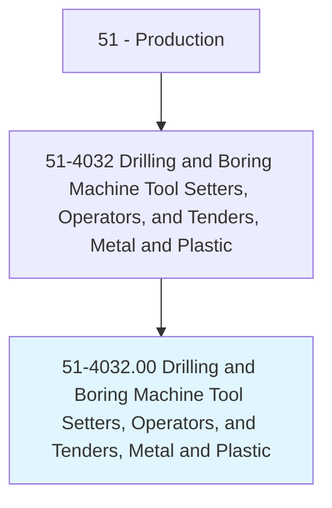
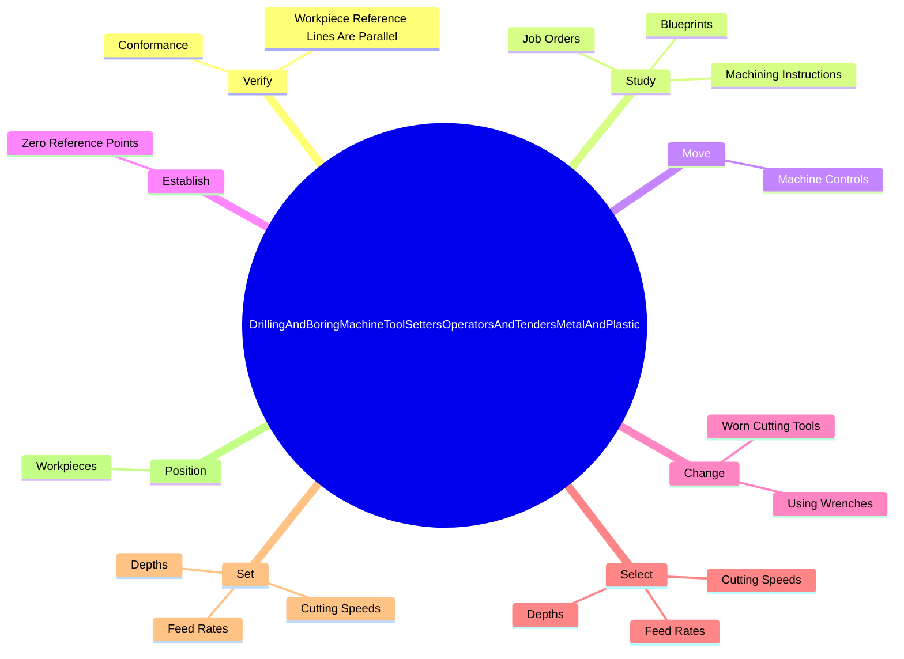
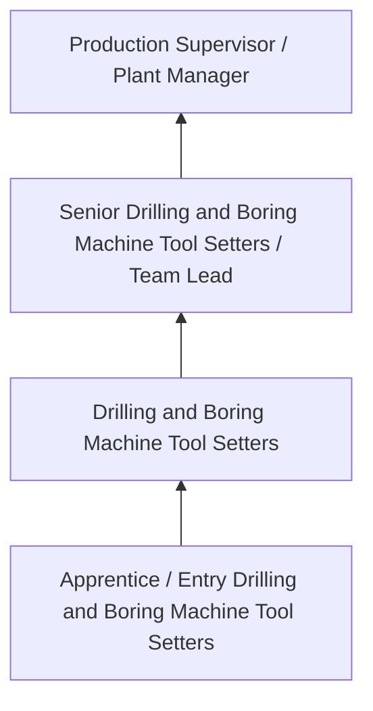
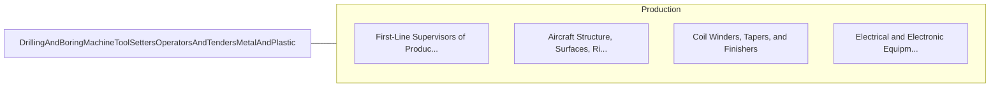

# Drilling and Boring Machine Tool Setters, Operators, and Tenders, Metal and Plastic

> Set up, operate, or tend drilling machines to drill, bore, ream, mill, or countersink metal or plastic work pieces.

## Overview

Drilling and Boring Machine Tool Setters, Operators, and Tenders, Metal and Plastic professionals set up, operate, or tend drilling machines to drill, bore, ream, mill, or countersink metal or plastic work pieces.. This occupation falls within the Production category and requires a combination of specialized knowledge, technical skills, and practical experience.

These professionals work across diverse settings and organizational contexts, applying their expertise to meet the demands of their field. They must stay current with industry standards, emerging practices, and regulatory requirements that affect their work. The role demands both independent judgment and collaborative skills, as practitioners regularly interact with colleagues, stakeholders, and the public.

As the field continues to evolve, Drilling and Boring Machine Tool Setters professionals increasingly leverage technology and data-driven approaches to enhance their effectiveness. Career opportunities span the public and private sectors, with demand influenced by economic conditions, demographic shifts, and technological advancement.

## Classification Hierarchy



## Key Statistics

| Metric | Value |
|--------|-------|
| SOC Code | 51-4032.00 |
| Job Zone | N/A |
| Category | [Production](/occupations/Production/index) |
| Core Tasks | N/A+ |
| Salary Range | $28,000 - $65,000 |
| Median Salary | $40,000 |
| Growth Outlook | 1% (Little or no change) |
| Source | O*NET |

## Core Tasks



### verify.Conformance

Drilling and Boring Machine Tool Setters, Operators, and Tenders, Metal and Plastic verify conformance as part of their core responsibilities.

**Actions:**
- `verify.Conformance.of.MachinedWork.to.Specifications`
- `verify.Conformance.of.UsingMeasuringInstruments`
- `verify.Conformance.of.Fixed`
- `verify.Conformance.of.TelescopingGauges`

### study.MachiningInstructions

Drilling and Boring Machine Tool Setters, Operators, and Tenders, Metal and Plastic study machining instructions as part of their core responsibilities.

**Actions:**
- `study.MachiningInstructions.to.determine.Dimensional`
- `study.MachiningInstructions.to.finish.Specifications`
- `study.MachiningInstructions.to.sequences.OfOperations`
- `study.MachiningInstructions.to.setups`

### move.MachineControls

Drilling and Boring Machine Tool Setters, Operators, and Tenders, Metal and Plastic move machine controls as part of their core responsibilities.

**Actions:**
- `move.MachineControls.to.lower.ToolsToWorkpiecesEngageAutomaticFeeds`
- `move.MachineControls.to.ToEngageAutomaticFeeds`

### Technical Skills
- **Machine Operation** - Advanced
- **Quality Control** - Advanced
- **Production Processes** - Advanced

### Soft Skills
- **Communication** - Essential
- **Problem Solving** - Essential
- **Critical Thinking** - Important
- **Teamwork** - Important
- **Adaptability** - Important


## Skills & Competencies

### Technical Skills
- **Machine Operation** - Advanced
- **Quality Inspection** - Advanced
- **Safety Procedures** - Advanced
- **Blueprint Reading** - Proficient
- **Measurement Tools** - Proficient
- **Process Control** - Proficient

### Soft Skills
- **Attention to Detail** - Critical
- **Reliability** - Critical
- **Physical Dexterity** - Essential
- **Teamwork** - Essential
- **Problem Solving** - Important

## Education & Certifications

| Requirement | Details |
|-------------|---------|
| Typical Education | High school diploma or equivalent; some positions require technical training |
| Work Experience | 0-2 years manufacturing experience |
| On-the-Job Training | Moderate - equipment operation and safety procedures |
| Certifications | OSHA certifications, quality management certifications |

## Career Progression



## Industry Variations

### Discrete Manufacturing
Assembly of distinct products such as automobiles, electronics, or machinery. Drilling and Boring Machine Tool Setters professionals work with precision equipment and quality standards.

### Process Manufacturing
Continuous production of chemicals, food, or materials. Focus on process control and consistency.

### Custom and Job Shop
Small-batch or custom production work. Requires versatility and ability to adapt to varied specifications.

### Automated Manufacturing
Technology-driven production with robotics and advanced systems. Increasing emphasis on programming and monitoring skills.

## Technology & Tools

- **Manufacturing execution systems (MES)**
- **Computer numerical control (CNC) machines**
- **Quality management software**
- **Programmable logic controllers (PLC)**
- **Enterprise resource planning (ERP) systems**

## Related Occupations



## Industries

- [Manufacturing](/industries/Manufacturing) - High Employment
- Food Processing - High Employment
- [Automotive](/industries/Manufacturing) - Moderate Employment
- [Electronics](/industries/Electronics) - Moderate Employment

## Departments

This occupation typically works in:
- [Manufacturing](/departments/Operations)
- Quality Control
- Production Planning

## GraphDL Semantic Structure

```graphdl
Drilling and Boring Machine Tool Setters, Operators, and Tenders, Metal and Plastic perform:
- operate.Equipment.for.ManufacturingProcesses
- inspect.Products.for.QualityStandards
- maintain.Equipment.for.OptimalPerformance
- follow.Procedures.for.SafetyCompliance
- record.Data.on.ProductionOutput
```

---

*Source: O*NET 51-4032.00 - ONETOccupation*
