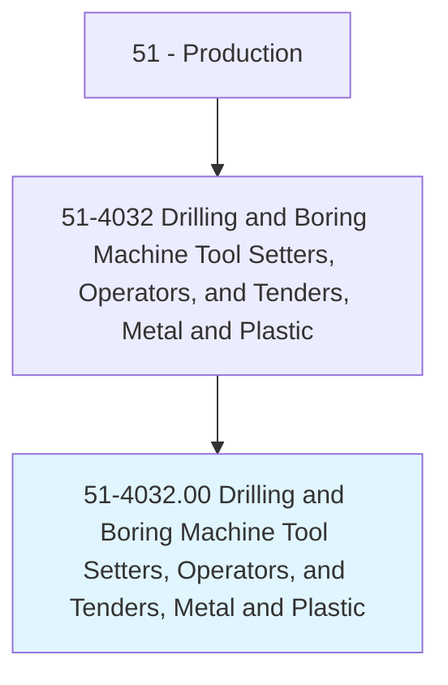
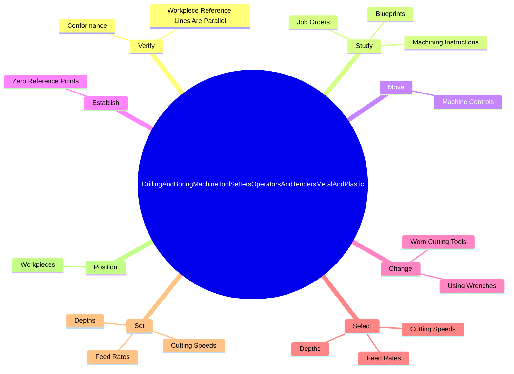

# Drilling and Boring Machine Tool Setters, Operators, and Tenders, Metal and Plastic

> Set up, operate, or tend drilling machines to drill, bore, ream, mill, or countersink metal or plastic work pieces.

## Overview

Drilling and Boring Machine Tool Setters, Operators, and Tenders, Metal and Plastic is classified under Production (SOC 51). Set up, operate, or tend drilling machines to drill, bore, ream, mill, or countersink metal or plastic work pieces.

## Classification Hierarchy

## Key Statistics

| Metric | Value |
|--------|-------|
| SOC Code | 51-4032.00 |
| Category | [Production](/occupations/Production/index) |
| Task Count | 93 |
| Source | O*NET |

## Core Tasks

### verify.Conformance

Drilling and Boring Machine Tool Setters, Operators, and Tenders, Metal and Plastic verify conformance as part of their core responsibilities.

**Actions:**
- `verify.Conformance.of.MachinedWork.to.Specifications`
- `verify.Conformance.of.UsingMeasuringInstruments`
- `verify.Conformance.of.Fixed`
- `verify.Conformance.of.TelescopingGauges`

### study.MachiningInstructions

Drilling and Boring Machine Tool Setters, Operators, and Tenders, Metal and Plastic study machining instructions as part of their core responsibilities.

**Actions:**
- `study.MachiningInstructions.to.determine.Dimensional`
- `study.MachiningInstructions.to.finish.Specifications`
- `study.MachiningInstructions.to.sequences.OfOperations`
- `study.MachiningInstructions.to.setups`

### move.MachineControls

Drilling and Boring Machine Tool Setters, Operators, and Tenders, Metal and Plastic move machine controls as part of their core responsibilities.

**Actions:**
- `move.MachineControls.to.lower.ToolsToWorkpiecesEngageAutomaticFeeds`
- `move.MachineControls.to.ToEngageAutomaticFeeds`

## Skills & Competencies

### Technical Skills
- **Machine Operation** - Advanced
- **Quality Control** - Advanced
- **Production Processes** - Advanced

### Soft Skills
- **Communication** - Essential
- **Problem Solving** - Essential
- **Critical Thinking** - Important
- **Teamwork** - Important
- **Adaptability** - Important

## Related Occupations

## Industries

This occupation is found across multiple industries. See [Industries](/industries) for sector-specific employment data.

## Career Progression

---

*Source: O*NET 51-4032.00 - ONETOccupation*
