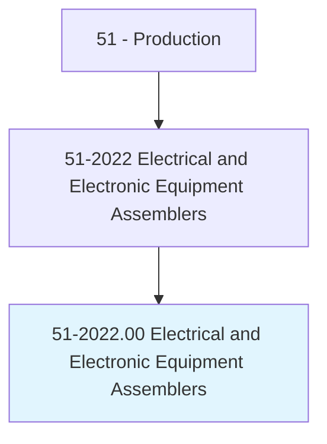
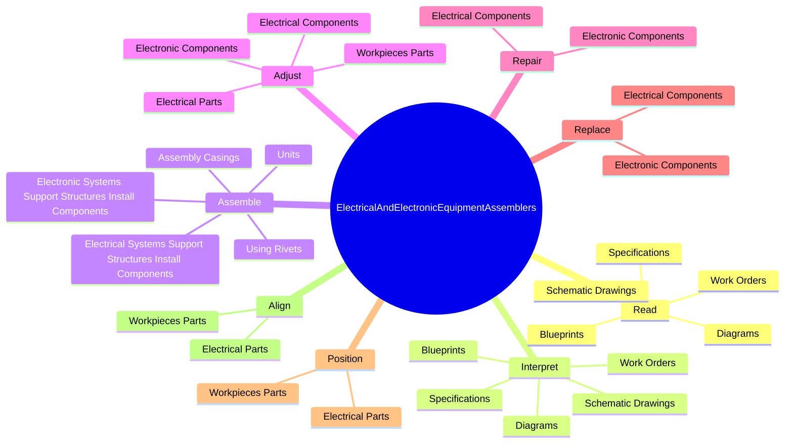
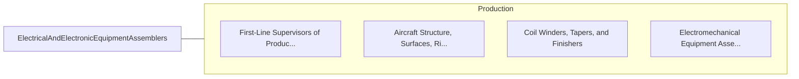

# Electrical and Electronic Equipment Assemblers

> Assemble or modify electrical or electronic equipment, such as computers, test equipment telemetering systems, electric motors, and batteries.

## Overview

Electrical and Electronic Equipment Assemblers is classified under Production (SOC 51). Assemble or modify electrical or electronic equipment, such as computers, test equipment telemetering systems, electric motors, and batteries.

## Classification Hierarchy

## Key Statistics

| Metric | Value |
|--------|-------|
| SOC Code | 51-2022.00 |
| Category | [Production](/occupations/Production) |
| Task Count | 139 |
| Source | O*NET |

## Core Tasks

### read.SchematicDrawings

Electrical and Electronic Equipment Assemblers read schematic drawings as part of their core responsibilities.

**Actions:**
- `read.SchematicDrawings.to.determine.MaterialsRequirementsInstructions`
- `read.SchematicDrawings.to.AssemblyInstructions`
- `read.Diagrams.to.determine.MaterialsRequirementsInstructions`
- `read.Diagrams.to.AssemblyInstructions`

### interpret.SchematicDrawings

Electrical and Electronic Equipment Assemblers interpret schematic drawings as part of their core responsibilities.

**Actions:**
- `interpret.SchematicDrawings.to.determine.MaterialsRequirementsInstructions`
- `interpret.SchematicDrawings.to.AssemblyInstructions`
- `interpret.Diagrams.to.determine.MaterialsRequirementsInstructions`
- `interpret.Diagrams.to.AssemblyInstructions`

### assemble.ElectricalSystemsSupportStructuresInstallComponents

Electrical and Electronic Equipment Assemblers assemble electrical systems support structures install components as part of their core responsibilities.

**Actions:**
- `assemble.ElectricalSystemsSupportStructuresInstallComponents`
- `assemble.ElectronicSystemsSupportStructuresInstallComponents`
- `assemble.Units`
- `assemble.AssemblyCasings`

## Skills & Competencies

### Technical Skills
- **Machine Operation** - Advanced
- **Quality Control** - Advanced
- **Production Processes** - Advanced

### Soft Skills
- **Communication** - Essential
- **Problem Solving** - Essential
- **Critical Thinking** - Important
- **Teamwork** - Important
- **Adaptability** - Important

## Related Occupations

## Industries

This occupation is found across multiple industries. See [Industries](/industries) for sector-specific employment data.

## Career Progression

---

*Source: O*NET 51-2022.00 - ONETOccupation*
