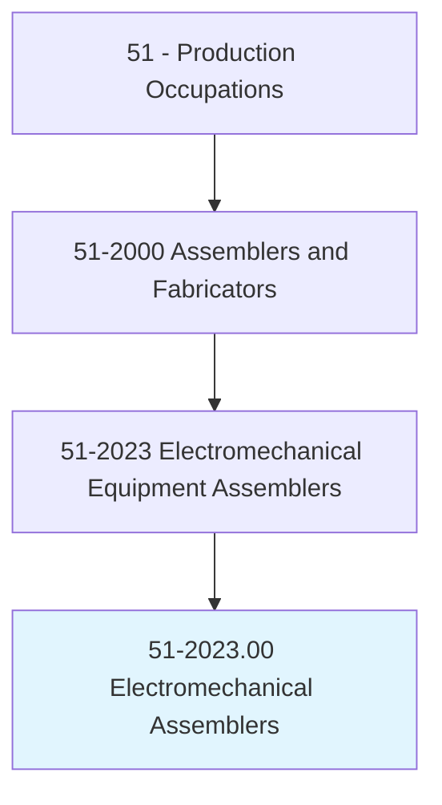
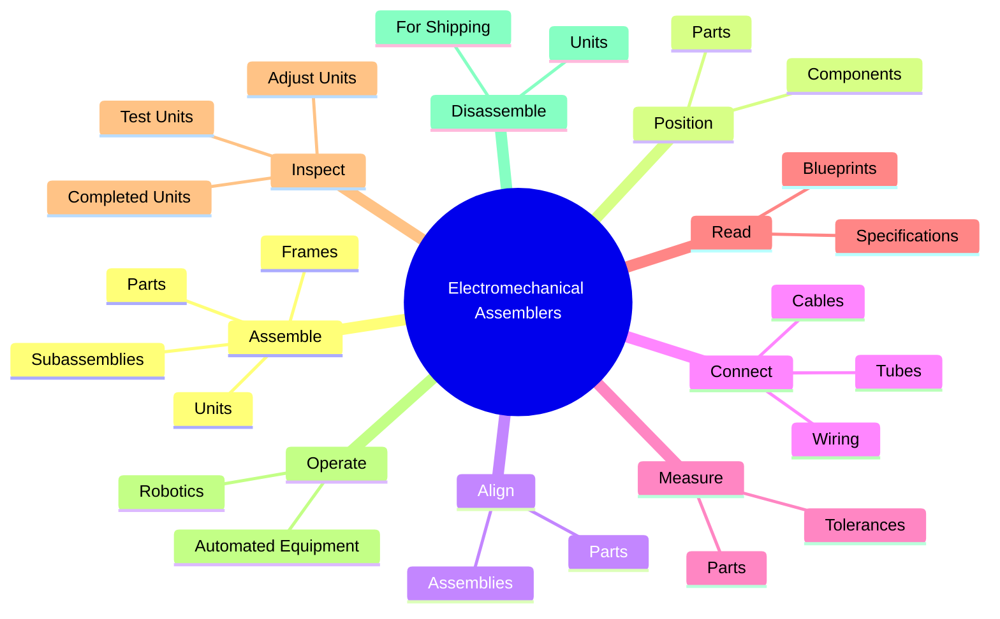
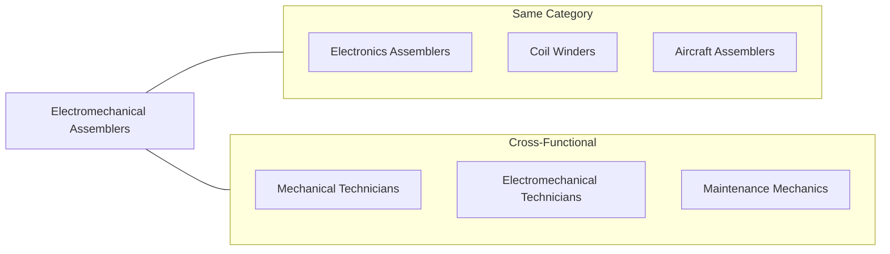
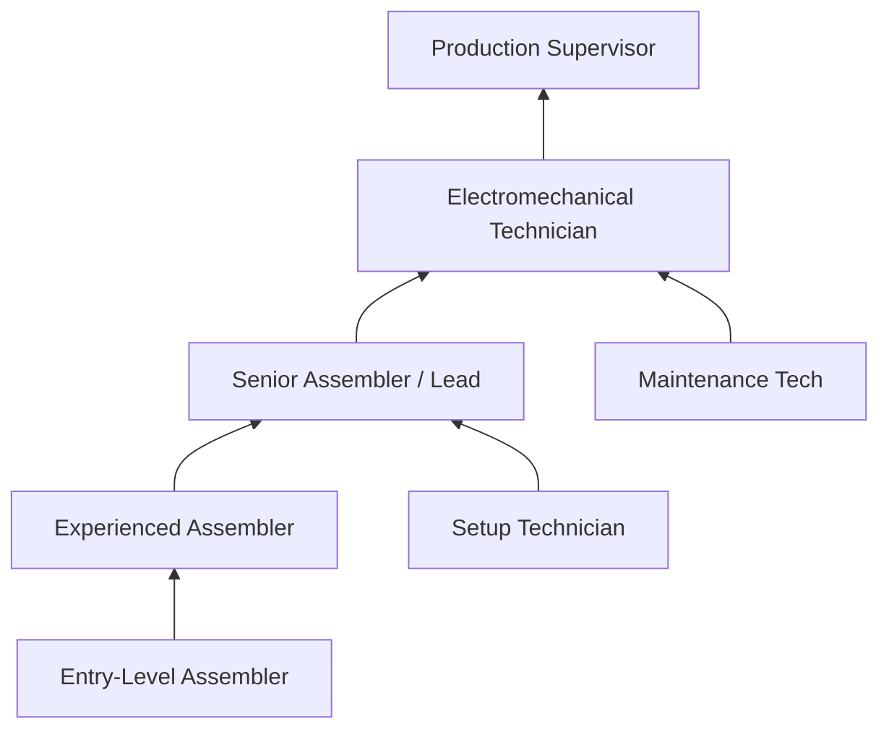
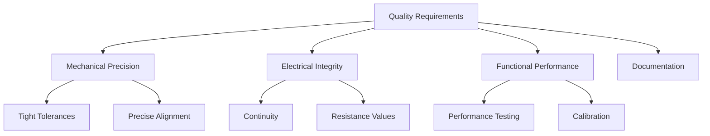

# Electromechanical Equipment Assemblers

> Assemble or modify electromechanical equipment or devices, such as servomechanisms, gyros, dynamometers, magnetic drums, tape drives, brakes, control linkage, actuators, and appliances.

## Overview

Electromechanical Equipment Assemblers combine electrical and mechanical assembly skills to build complex devices that integrate both systems. They work on precision equipment including servomechanisms, gyroscopes, actuators, dynamometers, and various control systems. This occupation requires understanding of both mechanical assembly and electrical wiring, as workers must read blueprints, connect cables and wiring, measure parts for tolerances, and ensure completed units meet strict specifications. The work demands attention to detail, precision measurement skills, and the ability to operate both hand and power tools effectively.

## Classification Hierarchy

## Key Statistics

| Metric | Value |
|--------|-------|
| SOC Code | 51-2023.00 |
| Job Zone | 2 (Some Preparation) |
| Category | [Production](/occupations/Production/index) |
| Core Tasks | 15+ |
| Source | O*NET |

## Core Tasks

### assemble.Parts

Electromechanical Assemblers fit parts and units together into assemblies and subassemblies using hand and power tools.

**Actions:**
- `assemble.Parts.to.Assemblies` - Build complete assemblies
- `assemble.Parts.to.Subassemblies` - Create subassembly units
- `assemble.Parts.to.frames` - Mount parts onto frames
- `assemble.Units.to.Assemblies` - Integrate units into larger assemblies
- `assemble.Parts.to.UsingH` - Use hand tools for assembly
- `assemble.Parts.to.PowerTools` - Use power tools for assembly
- `assemble.FastenUnits.to.Assemblies` - Secure fastened units

### position.Parts

Electromechanical Assemblers position, align, and adjust parts for proper fit and assembly.

**Actions:**
- `position.Parts.for.ProperFit` - Position parts correctly
- `position.Parts.for.Assembly` - Prepare parts for assembly
- `align.Parts.for.ProperFit` - Align components precisely
- `align.Parts.for.Assembly` - Ensure alignment for assembly
- `adjust.Parts.for.ProperFit` - Fine-tune part positioning
- `adjust.Parts.for.Assembly` - Adjust for assembly requirements

### connect.Cables

Electromechanical Assemblers connect cables, tubes, and wiring according to specifications.

**Actions:**
- `connect.Cables.to.Specifications` - Connect cables per spec
- `connect.Tubes.to.Specifications` - Connect tubing systems
- `connect.Wiring.to.Specifications` - Wire electrical connections
- `connect.According.to.Specifications` - Follow specification requirements

### measure.Parts

Electromechanical Assemblers measure parts to determine if tolerances are met using precision instruments.

**Actions:**
- `measure.Parts.to.determine.Tolerances` - Check dimensional tolerances
- `measure.Parts.to.UsingPrecisionMeasuringInstruments` - Use precision tools
- `measure.Parts.to.Micrometers` - Measure with micrometers
- `measure.Parts.to.Calipers` - Use caliper measurements
- `measure.Parts.to.Verniers` - Apply vernier scale readings

### read.Blueprints

Electromechanical Assemblers read blueprints and specifications to understand component assembly requirements.

**Actions:**
- `read.Blueprints.to.determine.ComponentPartsSequencesOfElectromechanicalUnits` - Identify component sequences
- `read.Blueprints.to.AssemblySequencesOfElectromechanicalUnits` - Follow assembly order
- `read.Specifications.to.determine.ComponentPartsSequencesOfElectromechanicalUnits` - Understand component requirements
- `read.Specifications.to.AssemblySequencesOfElectromechanicalUnits` - Determine assembly steps

### inspect.CompletedUnits

Electromechanical Assemblers inspect, test, and adjust completed units to ensure quality standards.

**Actions:**
- `inspect.TestAdjustCompletedUnits.to.ensure.UnitsMeetSpecificationsTolerancesCustomerOrderRequirements` - Verify quality compliance
- `attach.NamePlates.on.Parts` - Apply identification plates
- `attach.MarkIdentifyingInformation.on.Parts` - Mark parts for identification

### operate.AutomatedEquipment

Electromechanical Assemblers operate and tend automated assembly equipment and robotics.

**Actions:**
- `operate.AutomatedAssemblingEquipment` - Run automated systems
- `operate.Robotics` - Operate robotic equipment
- `operate.FixedAutomationEquipment` - Use fixed automation
- `tend.AutomatedAssemblingEquipment` - Monitor automated machines
- `tend.Robotics` - Attend to robotic systems

### disassemble.Units

Electromechanical Assemblers disassemble units for replacement parts or shipping preparation.

**Actions:**
- `disassemble.Units.to.replace.PartsCrateThemForShipping` - Disassemble for parts replacement
- `disassemble.Units.to.ToCrateThemForShipping` - Prepare units for shipping
- `operate.SmallCranes.to.transport.LargeParts` - Move large components
- `operate.SmallCranes.to.position.LargeParts` - Position heavy parts

## Skills & Competencies

### Technical Skills
- **Blueprint Reading** - Advanced
- **Precision Measurement** - Advanced
- **Mechanical Assembly** - Advanced
- **Electrical Wiring** - Proficient
- **Hand Tools** - Advanced
- **Power Tools** - Advanced
- **Quality Inspection** - Proficient

### Soft Skills
- **Attention to Detail** - Critical
- **Manual Dexterity** - Critical
- **Spatial Reasoning** - Essential
- **Problem Solving** - Essential
- **Following Instructions** - Important
- **Teamwork** - Important

## Related Occupations

## Industries

- [Industrial Machinery Manufacturing](/industries/Wholesale/MerchantWholesalersDurableGoods/Machinery/IndustrialMachinery) - Primary Employment
- [Electrical Equipment Manufacturing](/industries/Manufacturing/ElectricalEquipment/index) - High Employment
- Aerospace Product Manufacturing - High Employment
- [Appliance Manufacturing](/industries/Manufacturing/Appliance/index) - Moderate Employment
- Automotive Parts Manufacturing - Moderate Employment

## Career Progression

## Education & Training

| Requirement | Details |
|-------------|---------|
| Typical Education | High School Diploma; technical training preferred |
| Work Experience | Entry-level available; 1-2 years helpful |
| On-the-Job Training | Moderate (3-12 months) |
| Common Certifications | IPC Certifications, Blueprint Reading, Mechanical Assembly |

## Industry Variations

### Aerospace/Defense
- Highest precision requirements
- Security clearance needed
- Extensive documentation
- Specialized equipment (gyros, actuators)

### Industrial Machinery
- Large-scale assembly
- Heavy equipment handling
- Hydraulic/pneumatic systems
- Field service possible

### Appliance Manufacturing
- High-volume production
- Consumer product focus
- Reliability testing emphasis
- Cost-conscious assembly

### Automation/Robotics
- Cutting-edge technology
- Complex servo systems
- Programming interface
- Continuous learning required

## Assembly Process Flow

```mermaid
graph LR
    subgraph Prep["Preparation"]
        P1["Review Drawings"]
        P2["Gather Components"]
        P3["Setup Workstation"]
    end

    subgraph Mechanical["Mechanical Assembly"]
        M1["Assemble Frame"]
        M2["Install Mechanisms"]
        M3["Adjust/Align"]
    end

    subgraph Electrical["Electrical Integration"]
        E1["Route Wiring"]
        E2["Connect Components"]
        E3["Test Circuits"]
    end

    subgraph Final["Final Assembly"]
        F1["Integrate Systems"]
        F2["Functional Test"]
        F3["Adjust/Calibrate"]
        F4["Document/Label"]
    end

    Prep --> Mechanical --> Electrical --> Final
```

## Tools & Equipment

### Mechanical Tools
- Wrenches and socket sets
- Screwdrivers (various)
- Allen keys
- Torque wrenches
- Presses and arbors

### Precision Instruments
- Micrometers
- Dial calipers
- Vernier scales
- Height gauges
- Surface plates

### Power Equipment
- Drill presses
- Grinders
- Small cranes/hoists
- Pneumatic tools
- Electric drivers

### Electrical Tools
- Wire strippers
- Crimping tools
- Soldering equipment
- Multimeters
- Continuity testers

## Departments

This occupation typically works in:
- Electromechanical Assembly
- Servo/Actuator Assembly
- Final Assembly
- Test and Calibration

## Quality and Precision Requirements

## Physical Demands

- Standing and sitting alternately
- Fine motor skills required
- Lifting up to 50 lbs (with assistance for heavier)
- Repetitive hand movements
- Visual acuity for small components
- Reaching and bending

## Work Environment

- Manufacturing floor setting
- May require ESD protection
- Climate-controlled facilities common
- Safety equipment required
- Team-oriented atmosphere

---

*Source: O*NET 51-2023.00 - ONETOccupation*
