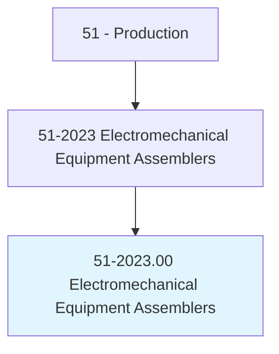
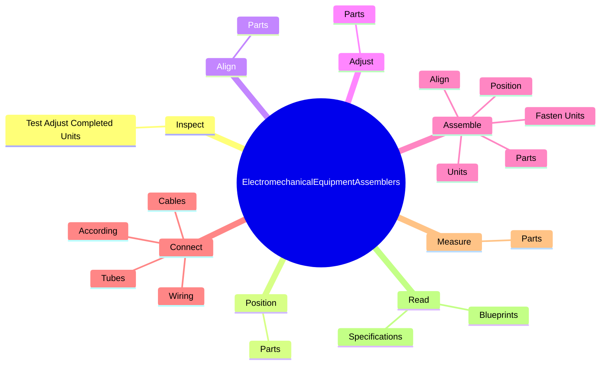
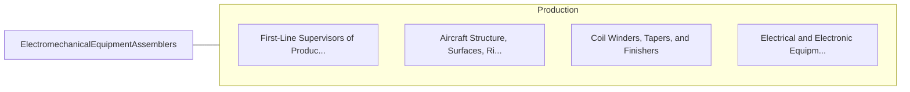

# Electromechanical Equipment Assemblers

> Assemble or modify electromechanical equipment or devices, such as servomechanisms, gyros, dynamometers, magnetic drums, tape drives, brakes, control linkage, actuators, and appliances.

## Overview

Electromechanical Equipment Assemblers is classified under Production (SOC 51). Assemble or modify electromechanical equipment or devices, such as servomechanisms, gyros, dynamometers, magnetic drums, tape drives, brakes, control linkage, actuators, and appliances.

## Classification Hierarchy

## Key Statistics

| Metric | Value |
|--------|-------|
| SOC Code | 51-2023.00 |
| Category | [Production](/occupations/Production) |
| Task Count | 77 |
| Source | O*NET |

## Core Tasks

### inspect.TestAdjustCompletedUnits

Electromechanical Equipment Assemblers inspect test adjust completed units as part of their core responsibilities.

**Actions:**
- `inspect.TestAdjustCompletedUnits.to.ensure.UnitsMeetSpecificationsTolerancesCustomerOrderRequirements`

### position.Parts

Electromechanical Equipment Assemblers position parts as part of their core responsibilities.

**Actions:**
- `position.Parts.for.ProperFit`
- `position.Parts.for.Assembly`

### align.Parts

Electromechanical Equipment Assemblers align parts as part of their core responsibilities.

**Actions:**
- `align.Parts.for.ProperFit`
- `align.Parts.for.Assembly`

## Skills & Competencies

### Technical Skills
- **Machine Operation** - Advanced
- **Quality Control** - Advanced
- **Production Processes** - Advanced

### Soft Skills
- **Communication** - Essential
- **Problem Solving** - Essential
- **Critical Thinking** - Important
- **Teamwork** - Important
- **Adaptability** - Important

## Related Occupations

## Industries

This occupation is found across multiple industries. See [Industries](/industries) for sector-specific employment data.

## Career Progression

---

*Source: O*NET 51-2023.00 - ONETOccupation*
