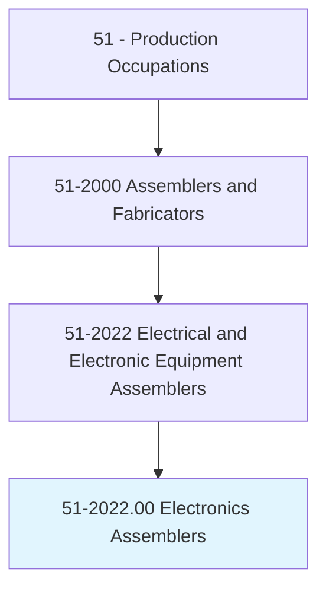
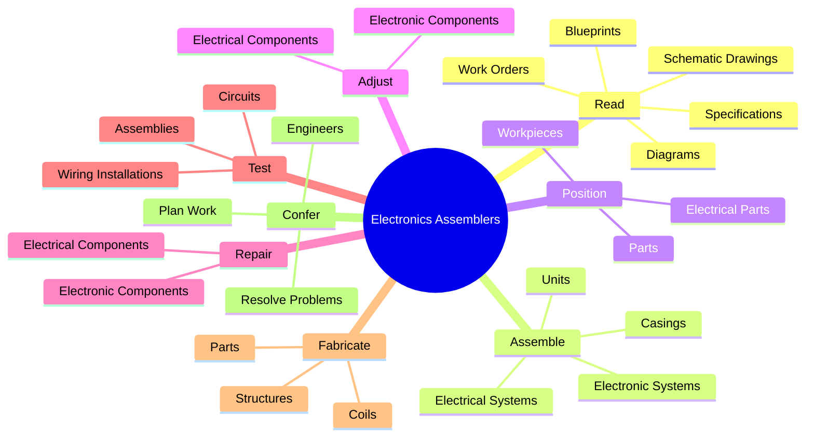
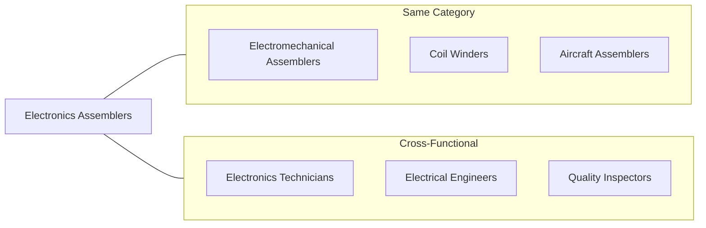
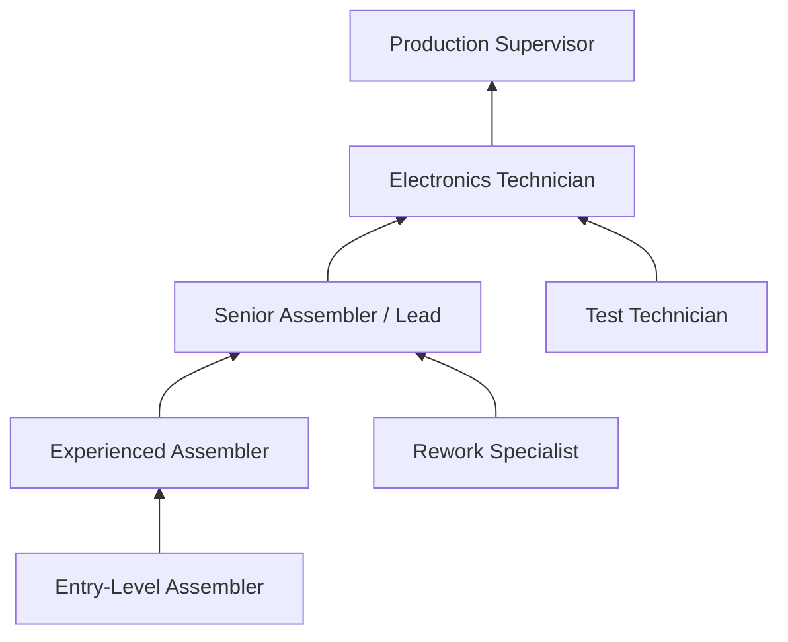
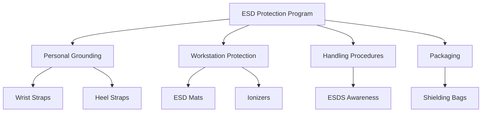

# Electrical and Electronic Equipment Assemblers

> Assemble or modify electrical or electronic equipment, such as computers, test equipment telemetering systems, electric motors, and batteries.

## Overview

Electrical and Electronic Equipment Assemblers build, modify, and repair electrical and electronic devices ranging from computers and test equipment to electric motors and batteries. They read and interpret schematic drawings, blueprints, and specifications to determine assembly requirements, then position, align, and fasten components using specialized tools. This occupation demands precision work with small components, wiring, and circuitry, often in environments requiring electrostatic discharge (ESD) protection. Assemblers ensure products meet specifications through testing and quality inspection, making adjustments or repairs as needed.

## Classification Hierarchy

## Key Statistics

| Metric | Value |
|--------|-------|
| SOC Code | 51-2022.00 |
| Job Zone | 2 (Some Preparation) |
| Category | [Production](/occupations/Production/index) |
| Core Tasks | 18+ |
| Source | O*NET |

## Core Tasks

### read.SchematicDrawings

Electronics Assemblers interpret technical documentation to understand assembly requirements and instructions.

**Actions:**
- `read.SchematicDrawings.to.determine.MaterialsRequirementsInstructions` - Determine material needs from schematics
- `read.SchematicDrawings.to.AssemblyInstructions` - Follow schematic assembly instructions
- `read.Diagrams.to.determine.MaterialsRequirementsInstructions` - Interpret diagrams for requirements
- `read.Blueprints.to.AssemblyInstructions` - Follow blueprint instructions
- `interpret.Specifications.to.determine.MaterialsRequirementsInstructions` - Understand specifications
- `interpret.WorkOrders.to.AssemblyInstructions` - Follow work order instructions

### assemble.ElectricalSystems

Electronics Assemblers build electrical and electronic systems, units, and casings.

**Actions:**
- `assemble.ElectricalSystemsSupportStructuresInstallComponents` - Build electrical systems
- `assemble.ElectronicSystemsSupportStructuresInstallComponents` - Assemble electronic systems
- `assemble.Units` - Complete unit assemblies
- `assemble.AssemblyCasings` - Build protective casings
- `assemble.UsingRivets` - Use riveting for assembly
- `assemble.MicroWeldingEquipment` - Apply micro-welding techniques

### position.WorkpiecesParts

Electronics Assemblers position and align parts to facilitate proper wiring and assembly.

**Actions:**
- `position.WorkpiecesParts.to.facilitate.Wiring` - Position parts for wiring access
- `position.WorkpiecesParts.to.Assembly` - Align parts for assembly
- `position.ElectricalParts.to.facilitate.Wiring` - Position electrical components
- `align.WorkpiecesParts.to.Assembly` - Ensure proper alignment
- `align.ElectricalParts.to.Assembly` - Align electrical components
- `adjust.WorkpiecesParts.to.Assembly` - Fine-tune positioning

### adjust.ElectricalComponents

Electronics Assemblers adjust, repair, and replace components to correct defects and ensure specifications are met.

**Actions:**
- `adjust.ElectricalComponents.to.correct.DefectsEnsureConformanceToSpecifications` - Adjust to correct defects
- `adjust.ElectronicComponents.to.ToEnsureConformanceToSpecifications` - Ensure specification conformance
- `repair.ElectricalComponents.to.correct.DefectsEnsureConformanceToSpecifications` - Repair defective components
- `replace.ElectricalComponents.to.correct.DefectsEnsureConformanceToSpecifications` - Replace faulty parts
- `replace.ElectronicComponents.to.ToEnsureConformanceToSpecifications` - Swap out non-conforming parts

### fabricate.Parts

Electronics Assemblers fabricate and form parts, coils, and structures according to specifications.

**Actions:**
- `fabricate.Parts.to.UsingDrills` - Drill parts to specification
- `fabricate.Parts.to.Calipers` - Measure fabricated parts
- `fabricate.Parts.to.Cutters` - Cut parts to size
- `fabricate.Coils.to.Specifications` - Create coils per spec
- `fabricate.StructuresAccording.to.Specifications` - Build support structures
- `form.Parts.to.Specifications` - Shape parts as required

### test.WiringInstallations

Electronics Assemblers inspect and test completed assemblies for proper operation and quality.

**Actions:**
- `inspect.WiringInstallations.for.ResistanceFactorsOperation` - Check wiring resistance
- `inspect.Assemblies.for.ForOperation` - Verify assembly operation
- `test.WiringInstallations.for.RecordResults` - Document wiring tests
- `test.Assemblies.for.ResistanceFactorsOperation` - Test assembly function
- `test.Circuits.for.ForOperation` - Verify circuit operation
- `inspect.Circuits.for.RecordResults` - Record circuit test results

### confer.Engineers

Electronics Assemblers collaborate with engineers to plan work and resolve production issues.

**Actions:**
- `confer.Engineers.to.plan.WorkActivitiesToResolveProductionProblems` - Plan with engineering
- `confer.Engineers.to.review.WorkActivitiesToResolveProductionProblems` - Review work with engineers
- `explain.AssemblyProcedures.to.OtherWorkers` - Train other workers
- `explain.Techniques.to.OtherWorkers` - Share technical knowledge

## Skills & Competencies

### Technical Skills
- **Schematic Reading** - Advanced
- **Soldering** - Advanced
- **Wiring** - Advanced
- **Electronic Testing** - Proficient
- **Hand Tools** - Advanced
- **ESD Procedures** - Proficient
- **Quality Inspection** - Proficient

### Soft Skills
- **Attention to Detail** - Critical
- **Manual Dexterity** - Critical
- **Color Vision** - Essential (for wire coding)
- **Problem Solving** - Essential
- **Communication** - Important
- **Teamwork** - Important

## Related Occupations

## Industries

- [Computer and Electronic Product Manufacturing](/industries/ComputerManufacturing) - Primary Employment
- [Electrical Equipment Manufacturing](/industries/Manufacturing/ElectricalEquipment/index) - High Employment
- [Communications Equipment Manufacturing](/industries/Communications) - High Employment
- [Aerospace Product Manufacturing](/industries/Aerospace) - Significant Employment
- [Medical Device Manufacturing](/industries/MedicalDevices) - Growing Sector

## Career Progression

## Education & Training

| Requirement | Details |
|-------------|---------|
| Typical Education | High School Diploma; vocational training helpful |
| Work Experience | Entry-level positions available; 1-2 years preferred |
| On-the-Job Training | Moderate (3-12 months) |
| Common Certifications | IPC-A-610, IPC J-STD-001, ESD Certification |

## Industry Variations

### Computer/Server Assembly
- Clean room environments
- Complex circuit board handling
- Rapid product cycles
- High component density

### Medical Electronics
- FDA compliance required
- Cleanroom assembly
- Extensive documentation
- Biocompatibility awareness

### Telecommunications Equipment
- RF/wireless expertise helpful
- Shielding requirements
- Environmental testing
- Outdoor equipment assembly

### Consumer Electronics
- High-volume production
- Automated assistance common
- Cost-driven environment
- Quick turnaround times

## Assembly Process Flow

## Tools & Equipment

### Assembly Tools
- Soldering irons/stations
- Wire strippers/crimpers
- Screwdrivers (precision)
- Torque drivers
- Heat guns

### Test Equipment
- Multimeters
- Oscilloscopes
- Logic analyzers
- Spectrum analyzers
- Hi-pot testers

### Workstation Equipment
- ESD mats and wrist straps
- Magnification lamps
- Fume extraction
- Component bins
- Work holders/jigs

## Departments

This occupation typically works in:
- [Electronics Assembly](/departments/ElectronicsAssembly)
- [PCB Assembly](/departments/PCBAssembly)
- [Final Assembly](/departments/FinalAssembly)
- [Test and Inspection](/departments/TestInspection)

## ESD Protection Requirements

## Physical Demands

- Seated work predominant
- Fine motor control essential
- Close visual work
- Repetitive hand movements
- May require microscope use
- Standing for some operations

---

*Source: O*NET 51-2022.00 - ONETOccupation*
