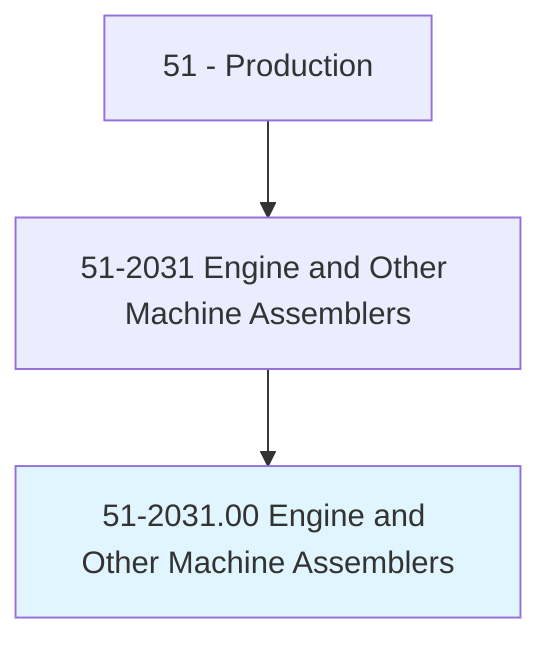
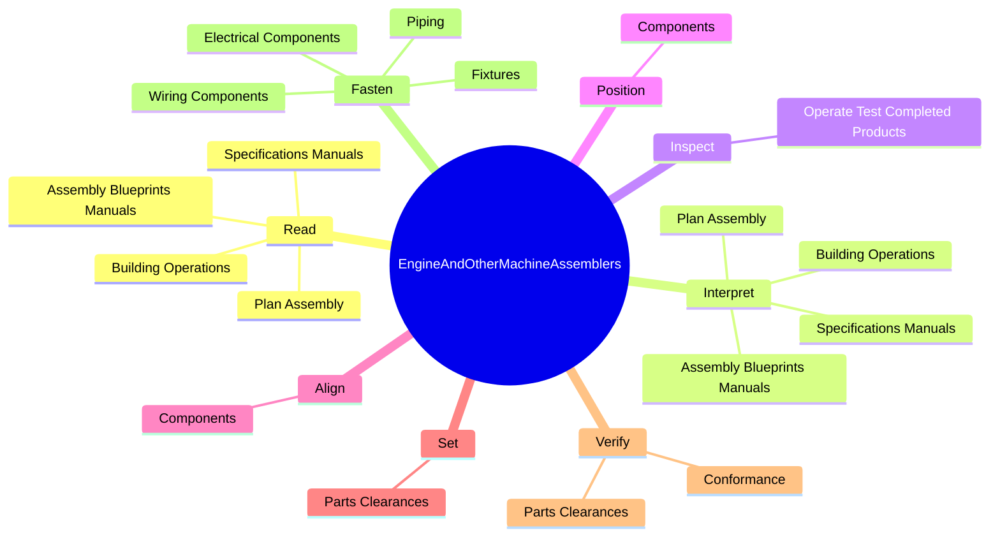
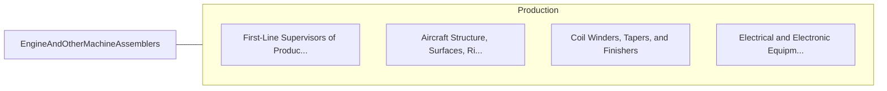

# Engine and Other Machine Assemblers

> Construct, assemble, or rebuild machines, such as engines, turbines, and similar equipment used in such industries as construction, extraction, textiles, and paper manufacturing.

## Overview

Engine and Other Machine Assemblers is classified under Production (SOC 51). Construct, assemble, or rebuild machines, such as engines, turbines, and similar equipment used in such industries as construction, extraction, textiles, and paper manufacturing.

## Classification Hierarchy

## Key Statistics

| Metric | Value |
|--------|-------|
| SOC Code | 51-2031.00 |
| Category | [Production](/occupations/Production) |
| Task Count | 98 |
| Source | O*NET |

## Core Tasks

### read.AssemblyBlueprintsManuals

Engine and Other Machine Assemblers read assembly blueprints manuals as part of their core responsibilities.

**Actions:**
- `read.AssemblyBlueprintsManuals`
- `read.SpecificationsManuals`
- `read.PlanAssembly`
- `read.BuildingOperations`

### interpret.AssemblyBlueprintsManuals

Engine and Other Machine Assemblers interpret assembly blueprints manuals as part of their core responsibilities.

**Actions:**
- `interpret.AssemblyBlueprintsManuals`
- `interpret.SpecificationsManuals`
- `interpret.PlanAssembly`
- `interpret.BuildingOperations`

### inspect.OperateTestCompletedProducts

Engine and Other Machine Assemblers inspect operate test completed products as part of their core responsibilities.

**Actions:**
- `inspect.OperateTestCompletedProducts.to.verify.FunctioningMachineCapabilitiesConformanceToCustomerSpecifications`

## Skills & Competencies

### Technical Skills
- **Machine Operation** - Advanced
- **Quality Control** - Advanced
- **Production Processes** - Advanced

### Soft Skills
- **Communication** - Essential
- **Problem Solving** - Essential
- **Critical Thinking** - Important
- **Teamwork** - Important
- **Adaptability** - Important

## Related Occupations

## Industries

This occupation is found across multiple industries. See [Industries](/industries) for sector-specific employment data.

## Career Progression

---

*Source: O*NET 51-2031.00 - ONETOccupation*
