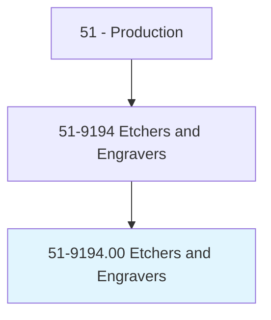
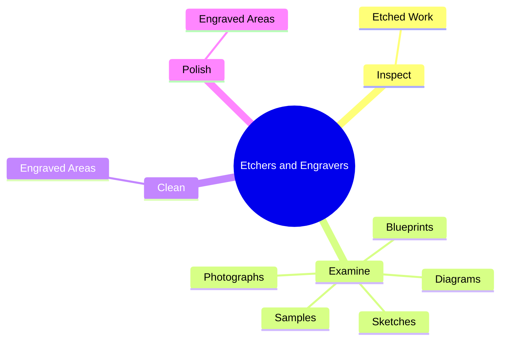
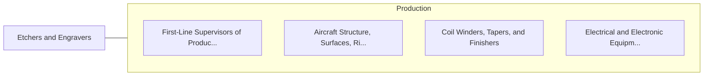

# Etchers and Engravers

> Engrave or etch metal, wood, rubber, or other materials. Includes such workers as etcher-circuit processors, pantograph engravers, and silk screen etchers.

## Overview

Etchers and Engravers is an occupation within the Production category. Engrave or etch metal, wood, rubber, or other materials. 

## Classification Hierarchy

## Key Statistics

| Metric | Value |
|--------|-------|
| SOC Code | 51-9194.00 |
| Category | [Production](/occupations/Production/index) |
| Task Count | 197 |
| Source | O*NET |

## Core Tasks

### inspect.EtchedWork

Etchers and Engravers inspect etched work as part of their core responsibilities.

**Actions:**
- `inspect.EtchedWork.for.Depth.of.Etching`
- `inspect.EtchedWork.for.Uniformity`
- `inspect.EtchedWork.for.Defects`
- `inspect.EtchedWork.for.UsingCalibratedMicroscopes`

### examine.Sketches

Etchers and Engravers examine sketches as part of their core responsibilities.

**Actions:**
- `examine.Sketches.to.decide.HowDesignsAreToBeEtched`
- `examine.Sketches.to.cut`
- `examine.Sketches.to.engraved.OntoWorkpieces`
- `examine.Diagrams.to.decide.HowDesignsAreToBeEtched`

### clean.EngravedAreas

Etchers and Engravers clean engraved areas as part of their core responsibilities.

**Actions:**
- `clean.EngravedAreas`

## Skills & Competencies

### Technical Skills
- **Machine Operation** - Advanced
- **Quality Control** - Advanced
- **Production Processes** - Advanced

### Soft Skills
- **Communication** - Essential
- **Problem Solving** - Essential
- **Critical Thinking** - Important
- **Teamwork** - Important
- **Adaptability** - Important

## Related Occupations

## Industries

This occupation is found across multiple industries. See [Industries](/industries) for sector-specific employment data.

## Career Progression

---

*Source: O*NET 51-9194.00 - ONETOccupation*
