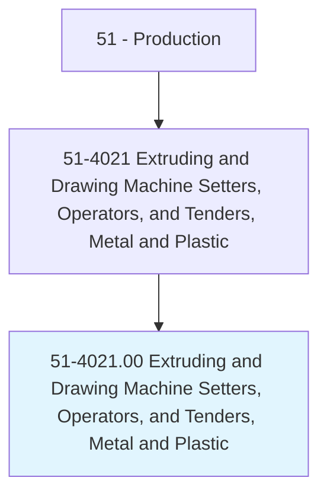
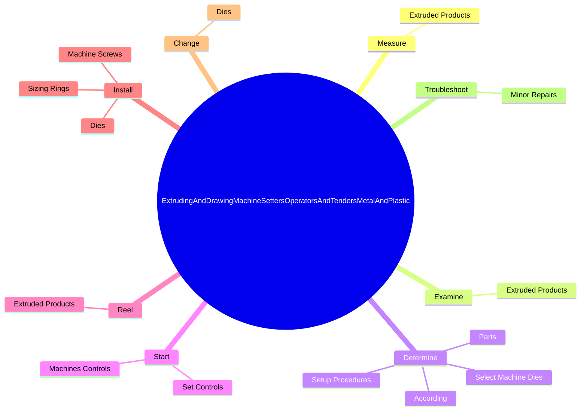
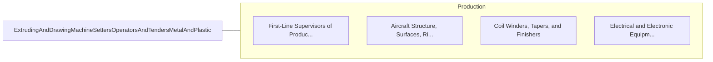

# Extruding and Drawing Machine Setters, Operators, and Tenders, Metal and Plastic

> Set up, operate, or tend machines to extrude or draw thermoplastic or metal materials into tubes, rods, hoses, wire, bars, or structural shapes.

## Overview

Extruding and Drawing Machine Setters, Operators, and Tenders, Metal and Plastic is classified under Production (SOC 51). Set up, operate, or tend machines to extrude or draw thermoplastic or metal materials into tubes, rods, hoses, wire, bars, or structural shapes.

## Classification Hierarchy

## Key Statistics

| Metric | Value |
|--------|-------|
| SOC Code | 51-4021.00 |
| Category | [Production](/occupations/Production/index) |
| Task Count | 57 |
| Source | O*NET |

## Core Tasks

### measure.ExtrudedProducts

Extruding and Drawing Machine Setters, Operators, and Tenders, Metal and Plastic measure extruded products as part of their core responsibilities.

**Actions:**
- `measure.ExtrudedProducts.to.locate.DefectsCheckForConformanceToSpecificationsAdjustingControlsAsNecessaryToAlterProducts`
- `measure.ExtrudedProducts.to.ToCheckForConformanceToSpecificationsAdjustingControlsAsNecessaryToAlterProducts`

### examine.ExtrudedProducts

Extruding and Drawing Machine Setters, Operators, and Tenders, Metal and Plastic examine extruded products as part of their core responsibilities.

**Actions:**
- `examine.ExtrudedProducts.to.locate.DefectsCheckForConformanceToSpecificationsAdjustingControlsAsNecessaryToAlterProducts`
- `examine.ExtrudedProducts.to.ToCheckForConformanceToSpecificationsAdjustingControlsAsNecessaryToAlterProducts`

### determine.SetupProcedures

Extruding and Drawing Machine Setters, Operators, and Tenders, Metal and Plastic determine setup procedures as part of their core responsibilities.

**Actions:**
- `determine.SetupProcedures.to.Specifications`
- `determine.SelectMachineDies.to.Specifications`
- `determine.Parts.to.Specifications`
- `determine.According.to.Specifications`

## Skills & Competencies

### Technical Skills
- **Machine Operation** - Advanced
- **Quality Control** - Advanced
- **Production Processes** - Advanced

### Soft Skills
- **Communication** - Essential
- **Problem Solving** - Essential
- **Critical Thinking** - Important
- **Teamwork** - Important
- **Adaptability** - Important

## Related Occupations

## Industries

This occupation is found across multiple industries. See [Industries](/industries) for sector-specific employment data.

## Career Progression

---

*Source: O*NET 51-4021.00 - ONETOccupation*
