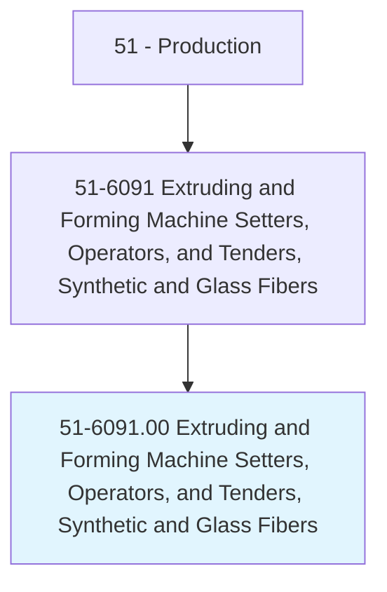
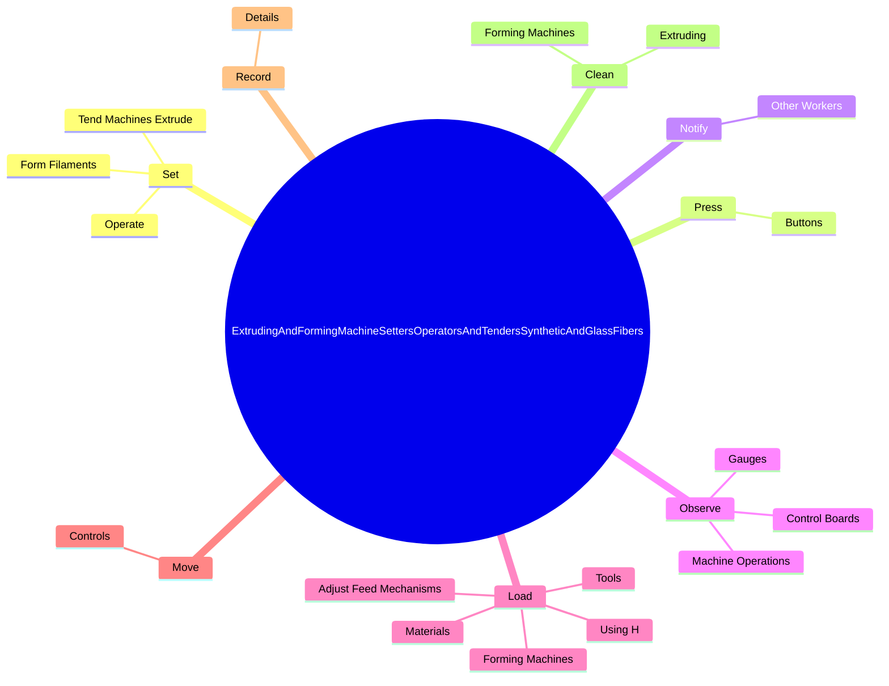

# Extruding and Forming Machine Setters, Operators, and Tenders, Synthetic and Glass Fibers

> Set up, operate, or tend machines that extrude and form continuous filaments from synthetic materials, such as liquid polymer, rayon, and fiberglass.

## Overview

Extruding and Forming Machine Setters, Operators, and Tenders, Synthetic and Glass Fibers is classified under Production (SOC 51). Set up, operate, or tend machines that extrude and form continuous filaments from synthetic materials, such as liquid polymer, rayon, and fiberglass.

## Classification Hierarchy

## Key Statistics

| Metric | Value |
|--------|-------|
| SOC Code | 51-6091.00 |
| Category | [Production](/occupations/Production) |
| Task Count | 67 |
| Source | O*NET |

## Core Tasks

### set.Operate

Extruding and Forming Machine Setters, Operators, and Tenders, Synthetic and Glass Fibers set operate as part of their core responsibilities.

**Actions:**
- `set.Operate.from.SyntheticMaterials`
- `set.Operate.from.Rayon`
- `set.Operate.from.Fiberglass`
- `set.Operate.from.LiquidPolymers`

### press.Buttons

Extruding and Forming Machine Setters, Operators, and Tenders, Synthetic and Glass Fibers press buttons as part of their core responsibilities.

**Actions:**
- `press.Buttons.to.stop.MachinesWhenProcessesAreCompleteMalfunctionsAreDetected`
- `press.Buttons.to.WhenMalfunctionsAreDetected`

### notify.OtherWorkers

Extruding and Forming Machine Setters, Operators, and Tenders, Synthetic and Glass Fibers notify other workers as part of their core responsibilities.

**Actions:**
- `notify.OtherWorkers.of.Defects`
- `notify.OtherWorkers.of.DirectThem.to.adjust.Extruding`
- `notify.OtherWorkers.of.FormingMachines`

## Skills & Competencies

### Technical Skills
- **Machine Operation** - Advanced
- **Quality Control** - Advanced
- **Production Processes** - Advanced

### Soft Skills
- **Communication** - Essential
- **Problem Solving** - Essential
- **Critical Thinking** - Important
- **Teamwork** - Important
- **Adaptability** - Important

## Related Occupations

## Industries

This occupation is found across multiple industries. See [Industries](/industries) for sector-specific employment data.

## Career Progression

---

*Source: O*NET 51-6091.00 - ONETOccupation*
