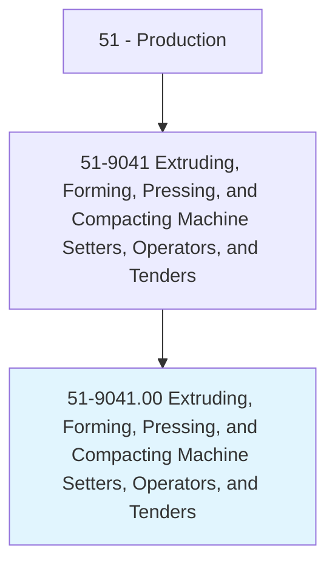
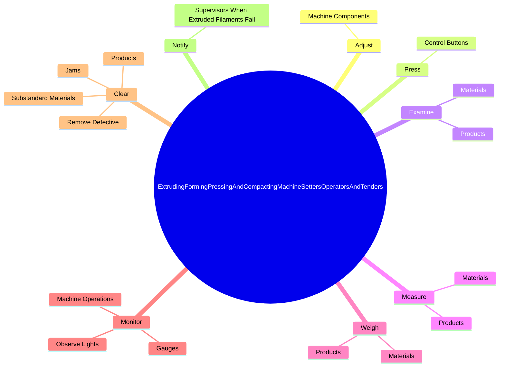

# Extruding, Forming, Pressing, and Compacting Machine Setters, Operators, and Tenders

> Set up, operate, or tend machines, such as glass-forming machines, plodder machines, and tuber machines, to shape and form products such as glassware, food, rubber, soap, brick, tile, clay, wax, tobacco, or cosmetics.

## Overview

Extruding, Forming, Pressing, and Compacting Machine Setters, Operators, and Tenders is classified under Production (SOC 51). Set up, operate, or tend machines, such as glass-forming machines, plodder machines, and tuber machines, to shape and form products such as glassware, food, rubber, soap, brick, tile, clay, wax, tobacco, or cosmetics.

## Classification Hierarchy

## Key Statistics

| Metric | Value |
|--------|-------|
| SOC Code | 51-9041.00 |
| Category | [Production](/occupations/Production) |
| Task Count | 179 |
| Source | O*NET |

## Core Tasks

### adjust.MachineComponents

Extruding, Forming, Pressing, and Compacting Machine Setters, Operators, and Tenders adjust machine components as part of their core responsibilities.

**Actions:**
- `adjust.MachineComponents.to.regulate.Speeds`
- `adjust.MachineComponents.to.Pressures`
- `adjust.MachineComponents.to.Temperatures`
- `adjust.MachineComponents.to.Amounts`

### press.ControlButtons

Extruding, Forming, Pressing, and Compacting Machine Setters, Operators, and Tenders press control buttons as part of their core responsibilities.

**Actions:**
- `press.ControlButtons.to.activate.Machinery`
- `press.ControlButtons.to.Equipment`

### examine.Materials

Extruding, Forming, Pressing, and Compacting Machine Setters, Operators, and Tenders examine materials as part of their core responsibilities.

**Actions:**
- `examine.Materials.to.verify.ConformanceToStandards`
- `examine.Materials.to.Templates`
- `examine.Products.to.verify.ConformanceToStandards`
- `examine.Products.to.Templates`

## Skills & Competencies

### Technical Skills
- **Machine Operation** - Advanced
- **Quality Control** - Advanced
- **Production Processes** - Advanced

### Soft Skills
- **Communication** - Essential
- **Problem Solving** - Essential
- **Critical Thinking** - Important
- **Teamwork** - Important
- **Adaptability** - Important

## Related Occupations

## Industries

This occupation is found across multiple industries. See [Industries](/industries) for sector-specific employment data.

## Career Progression

---

*Source: O*NET 51-9041.00 - ONETOccupation*
